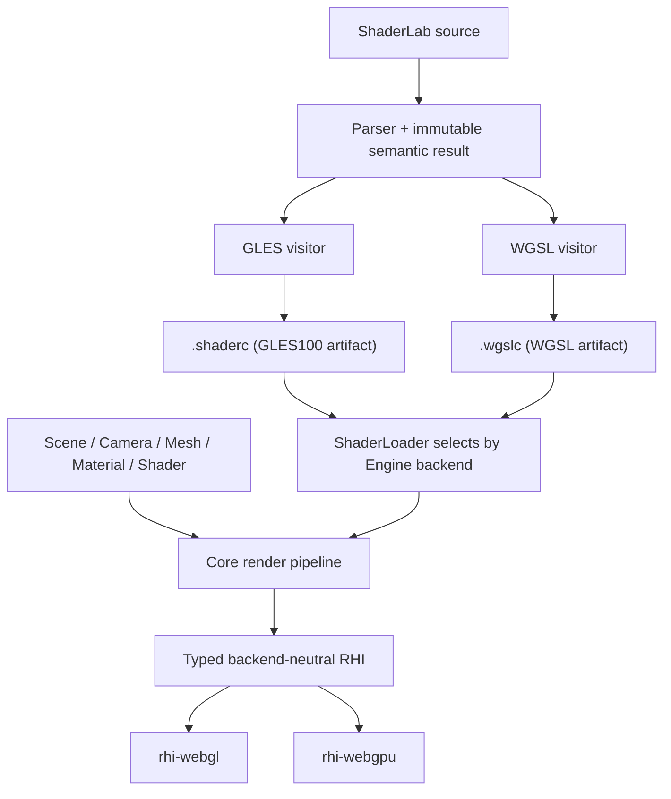
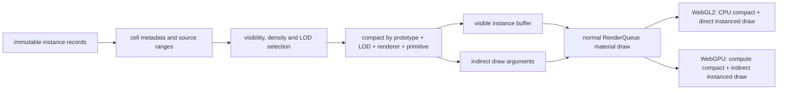

# Galacean WebGPU 多后端设计

状态：实现契约 v0.3
首批范围：`world-gallery/demos/terrain` 的地形、树木、天空、阴影、HDR 与后处理
默认后端：WebGL2

## 不变量

1. 用户只在初始化时选择后端：

   ```ts
   const engine = await WebGLEngine.create(configuration);
   const engine = await WebGPUEngine.create(configuration);
   ```

2. `Scene`、`Camera`、`Mesh`、`Material`、`Shader`、`ShaderData`、资源加载和 ShaderLab 源码不因后端改变。
3. 示例通过 `?backend=webgl2|webgpu` 选择 Engine，并刷新页面；不在同一个 canvas 上创建两个图形上下文。
4. ShaderLab 是唯一 shader 源。GLES 与 WGSL 都由 Galacean shader compiler 直接生成；不提交手写的第二份 WGSL，也不在生产路径调用外部 GLSL 翻译器。
5. WebGPU 初始化失败时返回带原因的错误，不自动回退 WebGL2。
6. 未实现能力必须在调用边界显式报错，不能静默降级、跳过 draw 或伪造成功。

这些约束来自 `/Users/shensi/Git/galacean/webgpu-upstream-research/RESEARCH_MATRIX.md` 中固定源码快照与当前 world 调用面的证据。

## 设计比较

### Engine 选择

| 方案 | 用户接口 | canvas 生命周期 | 结果 |
| --- | --- | --- | --- |
| 单个 `Engine.create({ backend })` | 每次创建都暴露 backend 配置 | 容易诱导同页热切换 | 不采用 |
| 一个 Engine 内同时持有 WebGL/WebGPU | 上层看似统一 | 同一 canvas 不能同时承载两个上下文，资源所有权也会分裂 | 不采用 |
| 独立 `WebGLEngine.create` / `WebGPUEngine.create` | 只有初始化类不同 | 一个页面、一个 canvas、一个 device | 采用 |

### Shader 产物

| 方案 | 优点 | 代价 | 结果 |
| --- | --- | --- | --- |
| Engine 创建时覆盖全局 target | 改动少 | 全局 Shader 与 Engine 生命周期耦合；预注册 built-in shader 早于 Engine | 不采用 |
| 运行时只保存 ShaderLab 源，每个 variant 重新 parse/codegen | 产物小 | 移动端首帧解析与 codegen 成本高；release 必须携带 compiler | 不作为默认 release 路径 |
| 一个 artifact 只保存一个 target；同一 ShaderLab 默认输出相邻的 `.shaderc` 与 `.wgslc` | API 不变；浏览器只请求当前后端产物；artifact 可独立缓存和审计 | 构建需要执行两次 target codegen；同页不可混用两种 Engine | 采用 |

运行时 `Shader.create(source)` 仍使用同一个入口；Engine 在创建时内部选择默认 codegen target，调用者不传 backend/target。构建脚本为每个 target 单独调用 compiler，并要求 GLES/WGSL visitor 对同一 ShaderLab 语义使用一致的 binding、stage IO 与可达性规则。

### 命令与 pass

| 方案 | 结果 |
| --- | --- |
| 在 core 中模拟 WebGL 的隐式 framebuffer/state machine | 无法表达 WebGPU attachment load/store、resolve 与 pipeline state，且继续泄漏 GL | 不采用 |
| 首期引入完整 RenderGraph | 超出 terrain 首批范围，增加资源生命周期与调度概念 | 暂不采用 |
| core 使用显式 frame/render-pass 边界，RHI 内部映射到 WebGL/WebGPU | 能表达 shadow → scene → post/final 的现有固定顺序 | 采用 |

## 模块边界



- core 只持有中立资源、pass、pipeline、binding 和 capability 语义。
- WebGL context、GL enum、texture unit、FBO、VAO、`WebGLProgram` 与 `WebGLUniformLocation` 只存在于 `rhi-webgl`。
- `GPUDevice`、`GPUTextureView`、`GPURenderPipeline`、`GPUBindGroup` 与 command encoder 只存在于 `rhi-webgpu`。
- target shader module、反射和宏 variant 是 ShaderPass 的内部产物，不增加用户 Shader API。

## Engine 与 device 生命周期

`WebGPUEngine.create` 的顺序固定为：

1. 解析 canvas。
2. 检查 `navigator.gpu`。
3. `requestAdapter`，再 `requestDevice`。
4. 获取并配置 `GPUCanvasContext`。
5. 构造 `Engine`，初始化 built-in resources 和默认 Scene。
6. 监听 `device.lost` 并进入现有 Engine device-lost 生命周期。

`WebGLGraphicDevice.init` 保持同步。`WebGPUGraphicDevice` 通过异步工厂先取得 device，再进入 Engine 的同步资源构造阶段，避免让所有 Engine 构造路径暴露异步半初始化状态。

## RHI 首批契约

### Device 与能力

- `backend`
- `capabilities` 与 `limits`
- `isDeviceLost`
- `beginFrame` / `endFrame`
- `resize` / presentation configure
- `destroy`

首批中立 capability 至少覆盖：

- depth texture
- texture array / cube texture
- float 与 half-float texture/filter/render attachment
- sRGB
- MSAA sample count
- Uint32 index
- instancing
- derivatives / explicit texture LOD
- compressed texture family
- maximum texture size、anisotropy、uniform binding size

### 资源

- Buffer：vertex、index、uniform；create、upload/update、destroy。
- Texture：2D、2D array、cube、depth；upload、sampler state、mipmap、view、destroy。
- RenderTarget：color/depth attachments、mip/cube face、MSAA resolve、destroy。
- Primitive：vertex/index layouts、indexed/non-indexed、instanced draw。

同步 GPU readback、transform feedback、compute、query、indirect draw 和 render bundle 不属于 terrain 首批运行依赖。WebGPU 路径调用这些接口时显式抛出 `UnsupportedError`；离线 ambient 烘焙继续使用 WebGL2，直到异步 readback API 单独设计。

### Render pass 与 pipeline

core 在一次 camera render 中显式打开/关闭 pass：

- attachment view
- load/store operation
- clear color/depth/stencil
- MSAA resolve target
- viewport/scissor
- color/depth format

pipeline key 至少包含：

- shader target + variant
- vertex layouts
- primitive topology
- color/depth formats
- sample count
- blend/depth/stencil/cull/front-face/depth-bias state

WebGL backend 在 `applyRenderState` 时执行状态变更；WebGPU backend 将同一中立 state 纳入 pipeline descriptor。core 不再直接调用 `gl.*`。

## Shader compiler

### Target artifact

`IPrecompiledShader` 保持单个 `platformTarget`；一个 artifact 只包含该 target 的 pass 产物：

- vertex/fragment instructions
- stage IO reflection
- uniform/texture/sampler binding reflection
- source hash 与 target

GLES 产物继续使用 `.shaderc`；WGSL 使用 `.wgslc`。precompile/rollup 默认从同一 `.shader` 生成两份相邻文件。`ShaderLoader` 接收逻辑 `.shaderc` URL 后，WebGL 加载该文件，WebGPU 加载同名 `.wgslc`；文件 target 不匹配必须报错。program/pipeline cache 继续归属于 Engine。

### WGSL lowering

WGSL visitor 必须覆盖 terrain 闭包中的真实语义：

- Attributes/Varyings/MRT 到 `@location` stage IO。
- `gl_Position`、`gl_FragCoord`、vertex/instance index 等 builtin。
- combined sampler 拆为 texture 与 sampler binding。
- 2D、2D array、cube、depth comparison texture。
- implicit、LOD、Grad、texelFetch 与 shadow comparison sampling。
- scalar/vector/matrix、int/uint、bit operation、array 与动态索引。
- `out/inout` 参数的合法 WGSL lowering。
- derivative、discard、动态循环、break、early return。
- GLES 与 WGSL 一致的 clip-space、Y 方向和 depth range。

运行时宏仍由 `ShaderMacroProcessor` 对 target instruction 执行。WGSL visitor 输出的所有 binding 使用稳定编号；variant 只能改变实际使用和数组长度，不能改变同名资源的 binding/type。

### Uniform 布局

首批使用一个 program 级 uniform block，字段来自 compiler reflection：

- WGSL struct 与 CPU packer 使用同一份类型/数组描述。
- offset、alignment、array stride 和 matrix stride 按 WGSL uniform address-space 规则计算。
- 每 draw 使用动态 offset，禁止在同一 command buffer 内让多次 draw 复用同一可写区间。
- 未设置属性从现有 BasicResources/default value 解析，行为与 WebGL ShaderUniform 保持一致。

纹理与 sampler 与 uniform block 位于稳定 bind-group layout；默认纹理由现有 `BasicResources` 提供。

## Terrain 首批闭包

| 场景能力 | 必须验证的后端能力 |
| --- | --- |
| Clipmap terrain | Uint32 index、144 segments、vertex texture sampling、2D array、uint control texture |
| Terrain material | 32 layers、Grad/LOD、derivative、matrix/int/bit operation、动态循环 |
| 树木 | glTF PBR、depth/shadow pass、automatic GPU instancing |
| 环境 | HDR cube、ambient light、skybox、direct light |
| 阴影 | depth texture、comparison sampler、four-cascade atlas、viewport/scissor、depth bias |
| Camera | 4x MSAA、HDR render target、resolve、post-process fullscreen blit、sRGB final output |

验收不能用 hello triangle 替代上述闭包；runtime raw Terrain ShaderLab 与 built-in precompiled PBR 两条路径必须同时通过。

## GPU-driven 地表阶段

### 本地上游代码事实

以下表格只记录固定本地快照中的代码结构，不据此宣称 Galacean 已获得同等性能。

| 引擎 | 本地源码 | 可复用的客观实现 |
| --- | --- | --- |
| Three.js | `/Users/shensi/Git/three.js/src/renderers/webgpu/WebGPUBackend.js` | 可写实例流使用 `STORAGE \| VERTEX`；间接参数使用 `STORAGE \| INDIRECT`；render object 可在同一 draw 分支选择 direct 或 indirect |
| Three.js | `/Users/shensi/Git/three.js/src/renderers/webgpu/utils/WebGPUPipelineUtils.js` | compute pipeline 由 shader module 与已有 bind-group layout 构造，pipeline 归 backend 缓存 |
| Babylon.js | `/Users/shensi/Git/Babylon.js/packages/dev/core/src/Engines/WebGPU/Extensions/engine.computeShader.ts` | render pass 在 dispatch 前结束；compute pass 统一绑定 pipeline/bind groups，并支持 direct/indirect dispatch |
| Babylon.js | `/Users/shensi/Git/Babylon.js/packages/dev/core/src/Engines/Extensions/engine.computeShader.ts` | 不支持 compute 的 ThinEngine 在调用边界抛出明确错误 |
| PlayCanvas | `/Users/shensi/Git/galacean/webgpu-upstream-research/playcanvas-current/src/platform/graphics/webgpu/webgpu-compute.js` | compute、bind group 更新与 dispatch 都封装在 graphics device 内；上层不持有原生 WebGPU 对象 |
| PlayCanvas | `/Users/shensi/Git/galacean/webgpu-upstream-research/playcanvas-current/src/platform/graphics/webgpu/webgpu-graphics-device.js` | indirect commands 是 graphics-device draw 的一种中立输入；当前 WebGPU 仍逐条编码，源码明确等待未来 multi-draw indirect |

### Grasslands 已测瓶颈

固定 1280×720 CSS、DPR 2、默认相机与默认画质的基线记录如下；FPS 仅用于定位，正式结论仍以重复采样和移动真机为准。

| 对象 | 可见实例增量 | draw 增量 | triangle 增量 | 阶段优先级 |
| --- | ---: | ---: | ---: | --- |
| 树木 | 14,878 | 1,180 | 607,116 | 第一批 |
| 岩石 | 3,129 | 675 | 717,140 | 第一批 |
| 灌木 | 492 | 109 | 30,234 | 第二批 |
| 草 | 136,466 | 47 | 2,016 | 第二批，重点验证实例筛选和 overdraw |
| 花 | 14,234 | 29 | 1,040 | 第二批 |

当前 `SurfaceWorld` 以 `cell × prototype × LOD × renderer × primitive` 创建实体、实例 buffer 和 draw。空间 cell 同时成为 draw 边界，Grasslands 默认画面因此有 1,411 个活动 renderer batch 和 2,141 次 draw。GPU-driven 阶段先解除这个结构耦合，再把 CPU compaction 替换为 WebGPU compute；不能直接在 demo 中调用 `GPUDevice` 绕过 Engine/RHI。

### 中立数据流



- cell 继续是 streaming、可见性、LOD 和诊断单位，不再强制成为 draw 单位。
- render batch key 固定为 `prototype + LOD + renderer + primitive + material + render state`。
- 默认 WebGL2 使用同一批次契约的 CPU compaction 和 direct instanced draw。
- WebGPU 使用 storage source、storage/vertex output 和 storage/indirect argument buffer。
- `SurfaceWorld`、shader/material 和 example 不读取 `GPUDevice`，也不提交手写 WGSL。
- compute shader 仍由 ShaderLab 语义树生成 WGSL；编译器未覆盖前，WebGPU GPU-driven capability 必须报告 unsupported，不能退化成隐藏的 raw WGSL demo。

### 分阶段接口

1. **中立批次边界**
   - 将有限地表从每 cell 一个 renderer 改为每 render batch 一个 renderer。
   - CPU compaction 保留 cell culling、density、LOD、cross-fade 和诊断结果。
   - 两个后端截图、实例计数与功能 E2E 一致后才进入 compute。
   - 第一个性能检查点只合并 WebGPU 的单 LOD 树木 impostor；WebGL2 保留原 cell renderer 作为对照。相机级
     compaction 不能替代 shadow cascade 的逐 pass 剔除，统一 WebGL2 路径前必须先补齐逐 pass
     compaction，不能用关闭阴影规避。
2. **RHI compute/storage/indirect**
   - 中立 buffer usage 覆盖 storage、vertex/storage 和 indirect/storage 组合。
   - 中立 compute pass 只接收 shader artifact、binding 和 dispatch；原生对象留在 `rhi-webgpu`。
   - WebGL backend 对 compute/indirect 调用显式抛出 unsupported；SurfaceWorld 的 WebGL 路径不调用它。
3. **ShaderLab compute target**
   - source parser、semantic/type check、WGSL codegen、reflection 和 `.wgslc` 构建产物共同支持 compute entry。
   - compute 与 render stage 共用 binding 分配、宏和 artifact target 校验。
4. **树木/岩石 GPU compaction**
   - 先清空各 batch counter/indirect instance count，再按 source range 执行 cull、density 和 LOD，写入 compacted instance stream。
   - indirect argument 的 index/vertex count 与 first index 来自普通 mesh/submesh，不在 shader 中复制模型常量。
5. **草地高实例数**
   - 在树木/岩石正确性闭包通过后复用相同能力；单独衡量 compute、vertex 与 fragment/overdraw 的占比。

### 树木 impostor 第一检查点

本地 Chromium headless shell 1217、Metal、1280×720 CSS、固定相机、关闭动画；基线
`133a229aa` 与候选 `a6b68509c` 交替运行三轮，每轮预热 1.8 秒后采样 3 秒。表格记录三轮中位数，
不外推为移动端结果。

| 后端与负载 | 基线活动批次 | 候选活动批次 | 基线 FPS | 候选 FPS | 基线/候选 p50 | 基线/候选 p95 |
| --- | ---: | ---: | ---: | ---: | ---: | ---: |
| WebGPU，DPR 2 | 1,411 | 842 | 41.25 | 41.61 | 25.0 / 25.0 ms | 33.3 / 33.3 ms |
| WebGL2，DPR 2 | 1,411 | 1,411 | 39.09 | 40.23 | 25.0 / 25.0 ms | 33.6 / 33.4 ms |
| WebGPU，DPR 1 辅助诊断 | 1,411 | 842 | 46.57 | 53.86 | 24.5 / 16.7 ms | 25.8 / 25.1 ms |

- DPR 2 下批次数减少 40.3%，FPS 与 frame-time 分位没有形成可区分的提升。
- DPR 1 下能观察到 CPU command 压力下降；DPR 2 结果表明默认画面已由像素、几何或阴影成本主导。
- WebGL2 保留相同 cell batch 路径，三轮波动只作为无明显回退检查，不记作性能收益。

### Indirect draw 检查点

本地 Chromium headless shell 1217、Metal、1280×720 CSS、DPR 2、固定相机、关闭动画；direct
基线 `1380ea58f` 与 indirect 候选 `403c395d1` 交替运行三轮，每轮预热 1.8 秒后采样 3 秒。
两组都使用已经压缩的 WebGPU 树木实例流，唯一变量是普通 instanced draw 与
`drawIndexedIndirect`。

| 提交方式 | 活动 renderer batch | indirect renderer batch | FPS 中位数 | p50 | p95 | GPU 诊断 |
| --- | ---: | ---: | ---: | ---: | ---: | --- |
| direct | 842 | 0 | 30.45 | 33.2 ms | 41.6 ms | 0 |
| indirect | 842 | 1 | 29.42 | 33.5 ms | 41.8 ms | 0 |

- 当前 indirect argument 由 CPU 更新 instance count；实例压缩、cell culling 和 density 选择仍在 CPU。
- 两组总活动 batch 相同，只有 1 个树木 renderer batch 改为 indirect；三轮数据没有显示性能收益。
- 该检查点只证明 storage/indirect buffer、renderer binding 和原生 WebGPU command encoding
  能在 Grasslands 真实材质、阴影和后处理路径中正确运行。
- compute 生成 instance stream 与 indirect argument 之前，不把 indirect draw 单独记作性能提升。

### 草地与花地表第二检查点

Grasslands 有 5 个单 LOD、无 cross-fade、无投影阴影的草/花 prototype，共 272,570 个实例和
290 个 cell range。候选 `cc6faaef7` 复用同一个 `SurfaceStaticBatcher`，没有新增 category
分支、shader 或材质。

本地 Chromium headless shell 1217、Metal、1280×720 CSS、DPR 2、固定相机、关闭场景动画；
树木 indirect 基线 `e289ffba5` 与草/花 indirect 候选交替运行三轮，每轮预热 1.8 秒后采样
3 秒。

| 提交范围 | 可见实例 | 活动 renderer batch | indirect renderer batch | FPS 中位数 | p50 | p95 | GPU 诊断 |
| --- | ---: | ---: | ---: | ---: | ---: | ---: | --- |
| 仅树木 | 169,199 | 842 | 1 | 40.55 | 25.0 ms | 33.4 ms | 0 |
| 树木 + 草/花 | 169,199 | 693 | 6 | 41.67 | 25.0 ms | 33.3 ms | 0 |

- 活动 renderer batch 减少 149（17.7%）；FPS 中位数增加 2.8%，p50/p95 未形成可区分变化。
- 双页面正确性对照关闭云影和 surface wind；grass、flower、tree、rock、shrub 可见计数逐项相同。
- 1280×720 截图降采样到 320×180 后，RGB 平均绝对通道差为 0.00025，通道差大于 2
  的像素比例为 0，最大通道差为 2。
- 该结果记录 CPU compaction 加中立批次边界的当前收益，不归因为 compute；每次可见性变化仍会
  由 CPU 重写 compacted instance stream。

### 多 LOD 地表第三检查点

候选将同一个 prototype 的 cell range 按 LOD 合并，树木、岩石和灌木与单 LOD 草/花共用
`SurfaceStaticBatcher`。cross-fade 的正负 fade 与 cell debug hue 编码在原 64-byte instance
record 的第四个 float 中；24-bit 整数保持 f32 精确表示，不增加移动端已达上限的 vertex buffer
数量。WebGL2 继续使用原 cell renderer 和 uniform fade。

本地 Chromium headless shell 1217、Metal、1280×720 CSS、DPR 2、固定相机、关闭场景动画；
候选在基线前后三轮运行，基线 `015f7e20c` 运行三轮。每轮预热 1.8 秒后采样 3 秒。

| 提交范围 | 可见实例 | 活动 renderer batch | indirect renderer batch | FPS 范围 | FPS 中位数 | p50 范围 | p95 范围 | GPU 诊断 |
| --- | ---: | ---: | ---: | ---: | ---: | ---: | ---: | --- |
| 单 LOD 草/花/假树合批 | 169,199 | 693 | 6 | 37.35–42.16 | 39.56 | 25.0 ms | 33.3–33.7 ms | 0 |
| 全部有限地表按 prototype + LOD 合批 | 169,199 | 76 | 76 | 42.88–45.40 | 44.68 | 24.7–25.0 ms | 25.9–33.4 ms | 0 |

- 活动 renderer batch 减少 617（89.0%）；六轮候选 FPS 中位数相对三轮基线增加 12.9%。
- LOD distance scale 每 400 ms 在 0.5/1.5 间切换的持续 churn 中，103 个 range 保持过渡：
  基线 825 batch、35.70–36.90 FPS（中位数 36.14），候选 89 batch、40.11–41.67 FPS
  （中位数 40.38，增加 11.7%）。
- 同一实时基线页面关闭云影和 surface wind 后，WebGL2 截图降采样的 RGB 平均绝对通道差为
  0.00007、通道差大于 2 的像素比例为 0、最大通道差为 1；WebGPU 分别为 0.00546、
  0.00694%、3。两后端的 category、LOD 和可见实例计数一致。
- E2E 覆盖 WebGL2 到 WebGPU 的刷新切换、settled LOD、双 LOD indirect 过渡、最终非零高 LOD
  计数及 GPU validation；不支持共享 canvas 上下文。
- 实例筛选、compaction、LOD 选择和 indirect argument 更新仍在 CPU。该检查点证明降低提交批次
  的收益，不代表 compute culling 或 GPU-generated indirect 已完成。

### GPU compaction 第四检查点

候选 `49d8f5b5e` 保留 CPU cell culling、density prefix 和 LOD 选择；ShaderLab compute pass
读取静态实例与可见 range command，在 GPU 上生成 compacted instance stream、cross-fade metadata
和所有 indirect instance count。WebGL2 路径不创建该 batcher，也不执行 compute。

同机 A/B 使用候选父提交 `b5ced1e89` 作为 CPU compaction 基线。Chromium 147.0.7727.15
（Playwright headless shell 1217）、Metal、1280×720 CSS、DPR 2、固定相机、关闭场景动画；
每组交替运行三轮，预热 1.8 秒后采样 3 秒。

| 场景 | compaction | 可见实例 | renderer batch | FPS 中位数 | p50 | p95 | GPU 诊断 |
| --- | --- | ---: | ---: | ---: | ---: | ---: | ---: |
| settled | CPU | 169,199 | 76 | 48.20 | 21.6 ms | 27.9 ms | 0 |
| settled | GPU | 169,199 | 76 | 48.25 | 21.7 ms | 27.0 ms | 0 |
| LOD churn | CPU | 214,943 | 89 | 45.45 | 22.2 ms | 30.6 ms | 0 |
| LOD churn | GPU | 214,943 | 89 | 44.52 | 22.9 ms | 30.9 ms | 0 |

- settled FPS 变化 +0.10%，未超出波动；LOD distance scale 每 400 ms 在 0.5/1.5 间切换时
  FPS -2.05%、p50 +3.15%、p95 +0.98%。当前数据不支持“GPU compaction 已提升总帧率”
  的结论，持续更新场景还有可复现回退。
- settled 的 1,208 个可见 range 全量变脏时，CPU instance upload 从 10,828,736 bytes
  降到 109 个 batcher header 加 range command 的 21,072 bytes，减少 99.81%；indirect
  instance count 不再由 CPU 上传。静态源实例另有一次性上传。
- 按显式分配量计算，新增静态 source storage 及其 WebGPU shadow 各 18.08 MiB；移除旧的
  per-LOD `_instanceOutput` 和 range data 引用后，host retained data 净减少约 17.77 MiB，
  GPU buffer memory 增加约 18.08 MiB。该项是分配量分析，不是设备峰值内存实测。
- 当前每个 `SurfaceStaticBatcher` 仍创建一个 compute pipeline，并独立 begin/end compute pass。
  在把 fine culling 或每帧 LOD 迁入 GPU 前，应先共享 pipeline 并合并连续 dispatch，再复测
  camera movement、host time 和 GPU timestamp。
- `world-gallery/demos/terrain/e2e/gpu-compaction-benchmark.mjs` 固化上述 A/B 顺序和采样窗口；
  `BASELINE_URL`、`CANDIDATE_URL` 可替换两台服务，`BENCHMARK_LOD_CHURN=1` 开启持续 LOD
  变化，`BENCHMARK_BROWSER_EXECUTABLE` 固定浏览器二进制。

### Compute pipeline 与 pass 复用第五检查点

候选 `01c1226e3` 不改变 `ComputePass`、terrain 或 ShaderLab 用户接口。`ShaderPass` 按 Engine
缓存设备限制解析后的 compute WGSL，WebGPU device 按完整生成源码缓存 pipeline 和 bind-group
layout；连续 dispatch 保持在同一个 native compute pass，遇到 render、flush、render target
切换或销毁边界时结束。

同机 A/B 使用 `6313a656b` 作为每 batcher 独立 pipeline/pass 的基线。浏览器、Metal、画布、
相机、预热和采样窗口与第四检查点相同；每组交替运行三轮。

| 场景 | 实现 | 可见实例 | renderer batch | ready 中位数 | FPS 中位数 | p50 | p95 | GPU 诊断 |
| --- | --- | ---: | ---: | ---: | ---: | ---: | ---: | --- |
| settled | 每 batcher pipeline/pass | 169,199 | 76 | 2,041 ms | 48.98 | 20.5 ms | 26.5 ms | 0 |
| settled | 共享 pipeline/pass | 169,199 | 76 | 2,098 ms | 49.30 | 19.9 ms | 25.8 ms | 0 |
| LOD churn | 每 batcher pipeline/pass | 214,943 | 89 | 2,084 ms | 45.53 | 22.3 ms | 30.9 ms | 0 |
| LOD churn | 共享 pipeline/pass | 214,943 | 89 | 2,128 ms | 45.50 | 22.6 ms | 31.6 ms | 0 |

- settled FPS 变化 +0.65%，LOD churn 变化 -0.08%，均未形成可区分收益。ready 中位数分别
  增加 2.83% 和 2.11%；当前数据不支持启动时间改善。
- 在相同 settled 场景中，对原生 WebGPU 接口计数：`createComputePipeline` 从 109 降到 1，
  `beginComputePass` 从 1,857 降到 24，`dispatchWorkgroups` 均为 1,857。计数时两个页面的
  可见实例、renderer batch 和 GPU 诊断相同。
- pipeline/pass 状态冗余已消除，但工作提交粒度没有改变。后续性能工作应减少每次可见性更新的
  109 个 dispatch，而不是继续优化 pipeline 创建；合并 dispatch 必须先解决不同 batcher
  storage range 的中立寻址和设备 buffer 上限。
- RHI 测试覆盖两个同源 `ComputePass` 共享 native pipeline/pass、flush 结束 pass 及两份
  storage 输出顺序正确；Grasslands E2E 覆盖刷新切换、类别、LOD、indirect、有效截图和零
  GPU validation error。

### Storage atlas 与 flattened dispatch 第六检查点

候选 `8c7414f78` 将 44 个 prototype、109 个 prototype LOD batcher 的 source、output、
command 和 indirect buffer 合并为一组 atlas。CPU 仍负责 cell culling、density prefix 和
LOD 选择；所有 dirty batch header 与 visible range copy command 由一个 ShaderLab compute
dispatch 消费。WebGL2 保持原 cell renderer 路径。

`VertexBufferBinding.offset` 是两个后端共用的字节偏移：WebGL2 将其加到 attribute pointer，
WebGPU 将其传给 `setVertexBuffer`。indirect argument 的 `firstInstance` 保持为 0，因此不要求
可选的 [`"indirect-first-instance"`](https://gpuweb.github.io/types/types/GPUFeatureName.html)
device feature，也不把 WebGPU 特例暴露给 surface mesh 或 example。

Atlas 创建前通过 `Engine.computeCapabilities` 校验每个 storage binding 与 dispatch 维度。
Grasslands 的 source binding 为 17.77 MiB、output binding 为 18.08 MiB，最大 dispatch 为
2,157 workgroups；均低于 WebGPU 规范的最低
[`maxStorageBufferBindingSize` 128 MiB 和 `maxComputeWorkgroupsPerDimension` 65,535](https://gpuweb.github.io/gpuweb/)。
当前不实现 paging；超过实际 device limit 时显式抛出 `RangeError`，不拆成隐藏的临时路径。

同机最终提交 A/B 使用父提交 `a20e02fe8` 作为每 batcher dispatch 基线。Chromium
140.0.7339.16、Metal、1280×720 CSS、DPR 2、固定相机、关闭场景动画；每组交替运行三轮，
预热 1.8 秒后采样 3 秒。

| 场景 | 实现 | ready 中位数 | FPS 中位数 | p50 | p95 | GPU 诊断 |
| --- | --- | ---: | ---: | ---: | ---: | --- |
| settled | 每 batcher dispatch | 1,855 ms | 46.48 | 23.0 ms | 33.3 ms | 0 |
| settled | flattened dispatch | 1,906 ms | 46.14 | 23.1 ms | 33.3 ms | 0 |
| LOD churn | 每 batcher dispatch | 1,844 ms | 41.66 | 24.8 ms | 33.4 ms | 0 |
| LOD churn | flattened dispatch | 1,880 ms | 43.21 | 23.7 ms | 33.2 ms | 0 |

- settled FPS 为 -0.74%，LOD churn 为 +3.73%；另一次 Chromium 147 六样本复测分别为
  +0.84% 和 +1.28%。不同运行的收益幅度不稳定，当前证据只记录整帧没有明显回退，不记录
  可泛化的 FPS 提升。
- ready 中位数分别增加 2.77% 和 1.94%；另一次复测增加 2.01% 和 4.71%。该实现没有启动
  时间收益。
- 在 settled 页面加载并继续运行一秒的相同窗口中，原生 `dispatchWorkgroups` 从 869 降到
  10（-98.85%）；`createComputePipeline` 均为 1，`beginComputePass` 为 11/10。两个页面均为
  169,199 个可见实例、76 个活动 indirect renderer batch。
- compaction 相关 storage buffer 从 436 个、37,958,184 bytes 降到 4 个、
  37,627,192 bytes：对象数 -99.08%，分配字节 -0.87%。减少的是 command/buffer 对象，
  不是实例容量。
- 五轮、每轮 40 次同步 LOD distance 切换中，host 总耗时中位数从 8.5 ms 降到 6.2 ms
  （-27.1%）；单次结果落在 0.1 ms 计时粒度附近，只把总量方向作为证据。
- 关闭 wind 与场景动画后，基线和候选的 category、LOD、可见实例逐项相同；截图 RGB 平均
  绝对通道差为 0.0089，通道差大于 2 的比例为 0，最大通道差为 2。最终 E2E 另行验证
  WebGL2→WebGPU 刷新、LOD 过渡、indirect、有效像素和零 validation diagnostic。
- 该检查点消除了 CPU command encoding 中的 per-batcher dispatch 循环，但可见性与 LOD
  决策仍在 CPU。将 cell culling/LOD 迁入 atlas compute 才能检验每帧 GPU-driven 收益；
  不能把本检查点描述为已经完成 GPU culling。

### 实例级精确裁剪第七阶段设计

本阶段只改变满足以下能力谓词的 finite prototype：只有一个 LOD、不启用 LOD cross-fade，且
所有 renderer 都不投影阴影。谓词来自渲染语义，不读取 `grass`、`flower` 等 category。多 LOD、
cross-fade 或 shadow caster 继续使用第六检查点的 range 级 CPU 选择与 GPU copy，避免相机裁剪
删除相机外但仍会进入 shadow cascade 的实例。

Grasslands 当前资产中，该谓词覆盖 3 个草、2 个花和 `tree-fake-tree`，共 6 个 prototype、
286,937 个候选实例、860 个 cell range。下表只统计草/花：按 demo authored camera 的实例位置
到相机距离离线计数，不加入 prototype radius 和视锥保守量时，当前 range 级选择与实例点距离
选择的差异如下。该表只说明这 5 个 prototype 的候选裁剪空间，不是最终可见数或性能结果。

| category | 总候选 | 当前 range 选择 | 实例点距离选择 | 相对当前减少 |
| --- | ---: | ---: | ---: | ---: |
| grass | 254,518 | 136,466 | 104,016 | 23.78% |
| flower | 18,052 | 14,234 | 13,101 | 7.96% |
| 合计 | 272,570 | 150,700 | 117,117 | 22.28% |

`tree-fake-tree` 另有 14,367 个候选实例、570 个 range，authored max distance 为 2,400。
固定相机下，CPU 视锥/range 选择保留的 3,898 个实例全部通过实例距离判定；它验证能力谓词不能
等同于“值得执行 fine cull”。是否执行由每帧 range 边界关系继续收窄。

实现沿用 atlas 与单次 flattened dispatch：

1. CPU 继续做 cell conservative culling、density prefix 和能力谓词判断；以 range placement
   radius、prototype sphere、最大实例 scale 和动态 category scale 计算 conservative farthest
   distance，将完全位于距离边界内的 range 直接复制为 output safe prefix。
2. 只有跨越距离边界的 range 才切成不超过实际 workgroup size 的 command tile；一个 workgroup
   消费一个 tile，每个 invocation 检查一个实例的位置、动态 category scale、prototype sphere
   与相机 max distance。
3. workgroup 内存中的 atomic counter 分配局部 survivor slot；leader 对该 render batch 的
   storage counter 每 tile 只执行一次全局 `atomicAdd`，counter 从 safe-prefix count 开始，随后
   survivor 追加到同一连续 output slice。
4. finalize ShaderLab compute pass 将 batch counter 写入对应 indirect record 的 instance
   count；没有边界 range 的 batch 只运行原有 copy。counter reset、fine cull 与 finalize 不读取
   或暴露原生 `GPUDevice`。

该算法直接参考 PlayCanvas
[`compute-gsplat-projector.js`](https://github.com/playcanvas/engine/blob/332a922d2dcf48bf3c774d296c999c69581d3d2c/src/scene/shader-lib/wgsl/chunks/gsplat/compute-gsplat-projector.js)
和
[`compute-gsplat-shadow-cull.js`](https://github.com/playcanvas/engine/blob/332a922d2dcf48bf3c774d296c999c69581d3d2c/src/scene/shader-lib/wgsl/chunks/gsplat/compute-gsplat-shadow-cull.js)
的 workgroup 聚合模式：局部 atomic compaction，每 workgroup 一次全局 atomic reservation；
后者还将 coarse candidate 和六平面 conservative fine cull 分为独立阶段。ShaderLab 先补
`shared int/uint` 的 `atomicAdd`、`atomicLoad`、`atomicStore` WGSL codegen 与 `.wgslc`，
terrain shader 才能使用该模式；不在 example 内嵌手写 WGSL。

首个落地切片只做 max-distance fine cull。相同 ShaderLab surface vertex 在 WebGL2 中把距离外
实例移出 clip space，WebGPU compute 使用同一 sphere 判定，因此两后端保持像素语义一致，
WebGPU 额外省去 survivor 之外的 vertex/primitive 工作。六平面 fine cull 暂缓：Grasslands
草/花存在 vertex wind deformation，当前 prototype contract 没有可证明的最大位移界；
在该界进入中立资产契约前直接使用静态 mesh sphere 会在视锥边缘产生假阴性。

固定相机真实 WebGPU 读回中，强制 6 个 prototype 的全部可见 range 执行 fine cull 时，一次
compaction flush 的 workgroup 分布为 copy/reset/fine/finalize = `646/1/1269/6`。加入上述
边界分流后为 `857/1/411/5`：fine-cull workgroup 减少 67.61%，四个 pass 合计减少 33.71%。
草/花的 5 个 counter 仍为 `5037/3469/44431/3193/4444`，`tree-fake-tree` 的 3,898 个实例
改走 direct copy，合计 survivor 仍为 64,472；浏览器未产生 WebGPU validation diagnostic。

Chromium 140 / Metal、1280×720 CSS、DPR 2、每项 3 秒采样、三轮交替顺序的整帧结果：

| 场景 | backend/实现 | FPS 中位数 | p50 | p95 | GPU 诊断 |
| --- | --- | ---: | ---: | ---: | --- |
| settled | 当前 WebGL2 cell batch | 37.00 | 25.7 ms | 34.3 ms | 0 |
| settled | 当前 WebGPU compact/indirect + fine cull | 49.65 | 17.5 ms | 26.5 ms | 0 |
| LOD churn | 当前 WebGL2 cell batch | 35.28 | 25.6 ms | 34.7 ms | 0 |
| LOD churn | 当前 WebGPU compact/indirect + fine cull | 42.00 | 24.9 ms | 33.3 ms | 0 |

同一分支跨 backend 的 settled FPS 为 +34.20%，LOD churn 为 +19.06%，但它同时包含前几阶段
WebGPU compact/indirect 合批与本阶段 fine cull，不能把全部差值归因于实例裁剪。以
`edd39d2a9` 的 WebGPU compact/indirect 为隔离基线时，两次 settled 复测一次为 +2.54%，
另一次为 -3.00%，方向相反；两次 LOD churn 分别为 -0.35% 和 -0.26%。本阶段目前只形成
明确的 workgroup/vertex 候选减少，没有形成可泛化的独立整帧收益。

新增 cull parameter 与 batch counter 后，compaction 同一 pass 最多绑定 6 个 storage buffer，
不超过 WebGPU 最低 `maxStorageBuffersPerShaderStage = 8`。workgroup size 继续由
`Engine.computeCapabilities` 和 `GALACEAN_COMPUTE_WORKGROUP_SIZE_X` 派生。range 数超过设备
`maxComputeWorkgroupsPerDimension` 或任何 atlas binding 超过实际 device limit 时显式失败；
本阶段不加入 paging、subgroup 或 prefix-sum fallback。

### 投影树木与岩石的距离裁剪设计

#### 本地源码事实

下表只记录本地仓库在对应 commit 的实现，不据此推断未出现于源码的能力。

| 引擎 | commit | 源码事实 | 对本阶段的约束 |
| --- | --- | --- | --- |
| Unity SRP Core | `4c8e8d3ed16eb59bdc6399f9beb12eb19a740f02` | `InstanceCuller.CullingJob` 接收 `BatchCullingViewType`，Camera 与 Light 分别执行 visibility/LOD；dither cross-fade 被量化后编码进 visible instance index | 逐 view 裁剪需要独立可见实例结果；cross-fade 属于实例流数据，不能在 compaction 时丢失 |
| PlayCanvas | `332a922d2dcf48bf3c774d296c999c69581d3d2c` | `GSplatShadowRenderer` 为每盏方向光维护独立 visible-index、atomic count、compute 与 indirect args；`MeshInstance.setIndirect(camera, ...)` 支持按 camera 取 draw command | 未来的 shadow frustum/occlusion 不能复用主相机 count；renderer/RHI 需要 per-view indirect binding |
| Three.js | `c6620cee323838ead14035b37008f401edbc2ea1` | `IndirectStorageBufferAttribute` 提供间接参数；`WebGPUBackend` 在已有 render object 上执行 `drawIndexedIndirect` / `drawIndirect`；本次检索未发现通用实例 LOD/逐 light compaction | 可参考间接参数的 backend 封装，不能把它当作逐 view culling 参考 |
| Babylon.js | `d9ae931f9eb24fc5a5c152b33923e5015311b0ad` | WebGPU draw context 持有 indirect buffer，compute extension 支持 indirect dispatch；本次检索到的通用 LOD 仍由 `ObjectRenderer` 按 camera 在 CPU 选择 | 可参考 indirect/compute command 接入，不能据此宣称已有通用 GPU instance LOD |

Grasslands finite surface 的资产构成是：岩石 3,129 个、真实树木 511 个、灌木 492 个；假树另有
14,367 个。真实岩石、树木和灌木都有 2–3 级 LOD、启用 cross-fade 且投影。当前 authored
camera 的 runtime 统计中，稀疏层主要已经落在 LOD1/2（约 3.2K / 915），因此单纯把现有
range LOD 计算搬到 GPU 不代表会减少几何量。

Galacean 当前 `MeshRenderer` 每个 submesh 只有一组 indirect buffer/offset，ShadowCaster 的
四级 cascade 与 Forward 会消费同一组实例流。直接对这组流做主相机六平面 fine cull，会删除
camera frustum 外但仍可能进入 shadow slice 的实例；该方案在补齐 per-view binding 前不成立。

当前 Surface Forward 与 ShadowCaster vertex pass 都用 `camera_Position` 和同一
`renderer_SurfaceFineCullDistance + instanceRadius` 判定 max distance。Shadow pass 只替换
view/projection matrix，不改写 `camera_Position`，所以该距离谓词始终以主相机为中心；WebGPU
compute 使用的也是同一个主相机位置、distance scale、prototype sphere 与实例 scale。与六平面
裁剪不同，这个谓词可以在 Forward/Shadow 共用的实例流上提前执行，而不改变现有像素语义。

#### 方案比较

| 方案 | 收益 | 语义与代价 | 决策 |
| --- | --- | --- | --- |
| 关闭岩石/树木阴影或 LOD cross-fade 后复用第七阶段 | 改动小 | 改变资产语义与画面，只为 benchmark 绕过约束 | 不采用 |
| 立即实现每 cascade/per-camera visible stream | 可继续做 frustum、occlusion、独立 shadow LOD | 需要扩展 RenderContext、renderer binding、compute 调度时机与 buffer 生命周期；不是一个可独立验收的小切片 | 后续 RHI 阶段 |
| 保留 range LOD 与 shadow 语义，只把共同的 max-distance predicate 扩到全部 finite prototype | 可提前删除距离外的高顶点岩石/树木及其所有 raster pass 工作 | fine-cull command 必须携带 LOD fade；不能加入 camera frustum 条件 | 本阶段采用 |

#### 第八阶段数据契约

1. CPU 继续决定 category、density、range frustum、LOD 与 transition；同一 transition range 仍同时
   写入 from/to 两个 LOD batch。
2. fine-cull command 的低 16 bit 保存 batch index，高 16 bit 保存该 range 的量化 signed LOD
   fade；batch metadata 标记该 prototype 是否使用 packed LOD metadata。batch 数超过 65,536
   时显式失败，不能静默截断。
3. compute survivor 写入 output 时，cross-fade prototype 按 direct-copy 路径相同的公式保留
   8-bit cell hue 与 16-bit LOD fade；非 cross-fade prototype 保留源 metadata。
4. only-boundary 策略不变：完全位于 max-distance 内的 range 直接复制，完全位于外部的 range
   由 CPU 拒绝，只有跨边界 range 逐实例执行 compute。
5. 相机移动只使当前含 boundary command 的 batch 失效；新进入或离开 boundary 的 batch 由
   `setRangeVisibleCount` 状态变化触发，避免让全部 109 个 LOD batch 每帧重做 compaction。
6. 本阶段不加入 camera/shadow frustum plane、occlusion、每实例 LOD 或新的资产阈值。

验收必须同时覆盖：

- settled 与 LOD transition 截图；WebGPU candidate 对修改前 WebGPU baseline 做像素比较。
- ShadowCaster 保持启用，树木/岩石/灌木类别与 LOD 计数和 baseline 一致。
- 至少一个 cross-fade boundary range 进入 fine-cull，生成的 output metadata 保留正负 fade。
- WebGPU validation/page error 为 0；WebGL2 仍为默认后端且行为不变。
- 修改前后 WebGPU 的 settled、LOD churn 与相机移动 A/B 分开报告；若帧率方向不稳定，只记录
  workload/vertex 候选减少，不宣称整帧收益。

验收分别报告：

- ShaderLab 生成源码、`.wgslc`、原生 WebGPU validation，以及至少两个 workgroup 的完整
  survivor 集合，证明不是只编译未执行。
- 固定相机的实例/category、renderer/indirect batch、截图像素差和 GPU diagnostics。
- 静态 settled 与连续相机移动的 WebGL2/WebGPU FPS、frame p50/p95、host update time、
  dispatch 数、全局 atomic 次数和实际输出实例数。
- 若减少实例仍没有形成稳定 frame-time 收益，保留正确性能力与数据，不把它描述为大世界
  性能提升。

#### 第八阶段实验检查点

上述“全部 finite prototype 共用 max-distance stream”的实现只作为未提交实验运行，随后已从
工作区撤销。Chromium 147.0.7727.15、Metal、1280×720 CSS、DPR 2；父提交
`63ba2ea8b` 与候选交替采样三轮，每轮预热后记录 3 秒：

| 场景 | 基线 FPS 中位数 | 候选 FPS 中位数 | 差值 | GPU 诊断 |
| --- | ---: | ---: | ---: | ---: |
| settled | 40.20 | 40.55 | +0.86% | 0 |
| LOD churn | 35.33 | 35.14 | -0.55% | 0 |

- 两个场景的方向相反，差值落在运行噪声内，没有形成可分离的整帧收益。
- 关闭 wind、cloud、cloud shadow、post-process 与 fog 后，候选相对父提交的 RGB 平均绝对
  通道差为 0.180，变化像素占 0.557%，最大通道差为 178。原因是候选让原先 range 级近似
  max-distance 的多 LOD prototype 改用逐实例精确边界；它不是零像素语义改动。
- Grasslands 的真实岩石、树木与灌木合计只有 4,132 个 finite 实例，且大部分已经处于低 LOD。
  在没有 per-view stream 的前提下，该实验增加 metadata packing 与更广的 compaction 范围，
  但不能做 camera/shadow 独立视锥裁剪。

因此本阶段只保留源码事实、数据契约与实测记录，不提交这份实现。per-view indirect stream
仍是投影实例继续做 frustum/occlusion 的前置 RHI 能力。

### 非投影密集地表的六平面实例裁剪设计

本切片继续使用第七阶段的能力谓词：单 LOD、无 cross-fade、所有 renderer 不投影。它不扩大到
真实树木、岩石或灌木，因此主相机 visible stream 仍不会删除 shadow cascade 所需实例。
Grasslands 中该谓词覆盖 286,937 个候选：草 254,518、花 18,052、假树 14,367。

CPU 对每个 range 使用现有 `BoundingFrustum` 和 `CollisionUtil.frustumContainsBox` 分类：

| range 关系 | 执行 |
| --- | --- |
| `Disjoint` | instance count 置 0，不生成 compute command |
| `Contains` 且完全位于 max-distance 内 | 继续走 atlas direct copy |
| `Intersects` 或跨越 max-distance | 按实际 workgroup size 切 tile，进入同一个 fine-cull pass |

fine-cull parameter storage 由一个 camera/distance `vec4` 扩为 8 个 `vec4`：camera position 与
distance scale、6 个单位化 world-space plane，以及 live wind magnitude/frustum enabled。
plane 使用 Galacean `Plane` 的 `dot(normal, point) + distance >= -radius` 约定。相机只旋转时
plane 也会变化，不能继续只用 camera position 判断 parameter 是否失效。

每个 batch 的第四个 float 记录风位移比例；负值表示该 batch 只允许 distance fine cull，不执行
frustum fine cull。保守球半径为：

```text
prototypeOriginRadius * max(abs(instanceScale)) * runtimeCategoryScale
+ abs(materialBaseWindForce * liveWindStrength)
```

该增量直接对应 `Surface.shader` 的现有位移：
`flow * windWeight * material_WindForce * 100 * material_GlobalWindForce`；当前
`flow = pow(noise, density) * 0.01`、global force 为 1。Grasslands 的 5 个草/花 glTF 经本地
GLB accessor 检查均无 `COLOR_0`，所以 `vertexWindWeight()` 恒为 1；假树虽有归一化
`COLOR_0.r = 1`，但材质 wind 关闭。为避免把尚未验证的 vertex-color 范围变成隐式资产契约，
未来“启用 wind 且含 `COLOR_0`”的 batch 保持 distance-only，不进入六平面裁剪。

本阶段不改变 Surface ShaderLab、WebGL2 renderer、阴影、LOD、density 或 category API。
WebGPU 只在 CPU 已认定为可见的边界 range 内减少 indirect survivor；无边界 command 时沿用
direct copy。验收必须对父提交交替测试 settled、相机连续旋转与移动，并报告：

- 相同 camera/category/LOD/runtime tuning 下的截图像素差和 GPU/page diagnostic；
- copy/fine workgroup 数、fine survivor 与 indirect batch 数；
- FPS、frame p50/p95；方向不稳定时不保留实现，只保留本检查点；
- WebGL2 默认路径的截图、可见计数和 E2E，证明 backend 切换仍通过刷新完成。

#### 六平面实验检查点

该设计已完成未提交实现并在 Chromium 147 / Metal 实际运行，随后从工作区撤销。固定 hero
相机下，6 个 prototype 的 indirect survivor 从 64,472 降到 35,611（-44.76%）；其中前
5 个草/花 batch 从 `5037/3469/44431/3193/4444` 降到
`3436/1756/23304/2176/2201`，假树从 3,898 降到 2,738。runtime ShaderLab compute
编译、dispatch、counter readback 和 indirect draw 均执行，GPU/page diagnostic 为 0。

关闭 wind、cloud、cloud shadow、post-process 与 fog 后，候选对父提交的 canvas 截图中，
通道差大于 2 的像素为 0.0032%，RGB 平均绝对通道差为 0.00044，最大通道差为 58。CPU
可见实例、category、LOD 与 renderer/indirect batch 计数逐项相同。

整帧 A/B 没有形成收益：

| 场景 | 基线 FPS 中位数 | 候选 FPS 中位数 | 差值 | 采样 |
| --- | ---: | ---: | ---: | --- |
| Grasslands settled | 24.13 | 23.66 | -1.96% | 三轮交替，每轮 3 秒 |
| 关闭非地表动画特效 | 24.96 | 24.00 | -3.85% | ABBA 顺序，四轮每项 3 秒 |

六平面只删除主相机外、原本不会进入 fragment 的实例；在本场景中，增加 boundary compaction
范围和重排实例流的成本高于被省去的 clip-stage vertex 工作。因此不提交该实现，也不把
survivor 降幅描述为性能提升。草地后续优化需要命中实际可见的 alpha overdraw、几何 LOD 或
遮挡工作量；投影树木/岩石仍应先补 per-view indirect stream，不能复用本实验的主相机流。

### Shadow cascade GPU stream 设计

#### Grasslands 瓶颈事实

关闭 cloud、cloud shadow、post-process、fog、wind 与场景动画后，同一 WebGPU 页面按
`shadow on/off/off/on/on/off` 顺序各采样 4.5 秒。shadow on 的 FPS 中位数为 43.09，
shadow off 为 49.78；关闭阴影为 +15.51%，三组 GPU/page diagnostic 均为 0。

prototype 级 manifest 拦截实验显示，关闭 14,367 个 12-index 假树后 FPS 基本不变；
关闭约 500 个真实树后从 42.4–43.2 FPS 提升到 45.0 FPS，关闭大部分真实岩石后提升到
46.3 FPS。该数据只用于定位高几何稀疏层，不把不同页面的单轮差值当作最终收益。

真实树、岩石与灌木共 4,132 个实例。按现有 `SurfaceWorld.selectLod` 与实际 glTF accessor
索引数离线复算，当前 cell LOD 的单次 raster 索引工作为 3,858,981；改成逐实例 LOD 只降到
3,698,970（-4.15%），且 4,132 个实例中只有 69 个改变 LOD。该方向在进入实现前淘汰，避免
为有限几何降幅改写 temporal cross-fade 语义。

当前 WebGPU static atlas 将每个 prototype LOD 的全部 range 合并成一个 renderer bounds。
`CascadedShadowCasterPass` 对每级 cascade 调用 `ShadowUtils.shadowCullFrustum`，它只能测试
这个全局 bounds；进入队列后，`MeshRenderer` 仍把 Forward 使用的同一 indirect buffer/count
写进 `RenderElement`。因此 renderer 级 shadow culling 无法剔除 cascade 外实例，每级
cascade 会重复消费主相机 stream 中的整批索引。

#### 方案比较

| 方案 | 结果 | 决策 |
| --- | --- | --- |
| 关闭树木/岩石阴影或降低 cascade 数 | 直接省时，但改变 world 资产与画质语义 | 不采用 |
| 按 cell 恢复 shadow renderer | 引擎现有 bounds culling 可用，但重新引入上千 draw/renderer | 不采用 |
| Forward stream 不变；四级 cascade 共用一个 shadow output，每级 compute 后立即 draw | shadow-only output 实测只有 595,456 B | 实测淘汰，见下方检查点 |
| Forward stream 不变；四级 cascade 使用四个长期驻留的 shadow-only slot | 4 份 output 共约 2.27 MiB；每级有独立参数、counter 与 indirect 区域，可缓存静止视图 | 实测淘汰，见下方检查点 |
| 先生成全部 cascade 描述与四份 stream，再开始 shadow render | 保留四份参数快照；compute 可连续编码，避免四次 compute/render 交替 | 本阶段实验 |

实验方案沿用 Unity Camera/Light 分离 visibility 与 PlayCanvas per-light visible-index/count 的
源码结论，并只落地 Galacean directional cascade 所需的最小契约：

1. `Renderer` 增加 protected camera-view 与 shadow-view preparation hook。默认 renderer 行为不变；
   GPU-driven renderer 在 shadow queue 构建时得到 cascade index，以及引擎已经计算好的最多
   10 个 `ShadowSliceData.cullPlanes`。Engine 创建方式、材质、ShaderLab 和用户渲染 API 不变。
2. 新建等价 shadow-only renderer/primitive 的版本出现可见差异；最终实验复用原 Forward
   renderer 及其同一个 `Primitive`，通过每次 indirect draw 的 internal binding 覆盖选择
   cascade instance-buffer offset 与 indirect-record offset，不修改再恢复 renderer 的共享
   Forward stream。WebGL2 保持原 renderer 路径。
3. CPU 仍决定 category、density、主相机 max-distance、cell LOD 与 temporal cross-fade。
   shadow command 只消费这些已选择 range 的 source prefix，因此首版不会扩大或缩小当前主
   相机可见集合；它只在每级 cascade 内按实例保守球再裁剪。
4. shadow sphere 使用 prototype-origin radius、instance scale、runtime category scale，
   再加实时 `abs(materialBaseWindForce * liveWindStrength)`。本地 34 个树/岩石/灌木 glTF 的
   90 个 `COLOR_0` accessor 均为 normalized `UNSIGNED_SHORT`，实际 red 最大值为 1；无
   vertex color 时 shader wind weight 也为 1。
5. 一个 ShaderLab compute 模块执行 counter reset、最多 10 平面 workgroup compaction 和
   indirect finalize。同一个 workgroup 只读取一次 source instance，再分别写入最多四个
   cascade slot；LOD fade 与 cell hue 使用 Forward direct-copy 相同的 packed metadata，
   不写原生 WGSL。
6. shadow output 只按 cast-shadow prototype LOD 容量分配。四级 cascade 在一个大 output、
   parameter、counter 和 indirect buffer 中各占固定且不重叠的区域；CPU range、四级 planes、
   wind 与 renderer tuning 都未改变时，复用全部 slot，不重复 dispatch。
7. 参数不能靠同一 frame 内连续 `GPUQueue.writeBuffer` 覆盖同一地址：这些写入发生在
   command buffer 执行前，多个 dispatch 会读到最终值。最终实现只上传一次包含四个不重叠
   slice block 的 parameter buffer，并在一次 cull dispatch 中同时消费四级快照。
8. 任一 storage binding、workgroup 数或 batch 数超过实际 device limit 时显式失败，不退回
   隐藏的 per-cell 路径。

#### 单 output 检查点

第一版单 output 原型在实际产物中完成 ShaderLab runtime compile、四级
`reset → cull → finalize → indirect draw`，GPU/page diagnostic 为 0。修复 indirect
renderer 被 CPU instancing 吞掉的问题后，core 层 200 ms 内观察到 2,118 次
`drawPrimitiveIndirect`；相邻 indirect element 均不再合批。

`hero` 固定相机关闭云、雾、后处理、建筑、动画和风，只保留方向光、阴影、地形与地表。
shadow command 的 3,078 个候选最初被切成 344 个 workgroup；合并源地址连续且 fade 相同的
range 后降为 146 个（-57.56%）。最后一级 cascade survivor 为 1,523，剔除 50.52%，29 个
prototype/LOD batch 非零。shadow-only 资源实测如下：

| 资源 | 单 output 实测 | 四 slot 预算 |
| --- | ---: | ---: |
| instance output | 595,456 B | 2,381,824 B |
| indexed indirect | 2,960 B | 11,840 B |
| atomic counter | 412 B | 1,648 B |
| 参数 | 176 B | 704 B |

单 output 与父实现的 ABBA 稳定段约为 31.5 FPS 对 31 FPS，未形成稳定收益；Frame P95 约
50 ms 对 42.7 ms，compute/render pass 交替增加了尾延迟。更重要的是，同一参数 buffer 在
四级 cascade 间连续 `writeBuffer` 不提供逐 dispatch 参数快照，因此该原型不满足正确性门。
实现不以单 output 形态提交，后续实验改为四个长期驻留 slot。

#### 四 slot 检查点

新建等价 `BufferMesh`/`Primitive` 的 shadow-only renderer 即使逐 draw 的 shader、uniform、
texture、render state、vertex layout、indirect argument 与实例 multiset 均相同，截图仍有约
6.9% 像素超过 2% 通道差异。复用原 Forward renderer 与原 `Primitive`，仅重绑 instance stream
和 indirect record 后，`hero` 固定相机候选相对父提交的归一化 RGB RMSE 为 0.000338387，
921,600 个像素中 15 个超过 2% 通道差异；GPU/page diagnostic 为 0。该结果只证明重绑方式的
渲染等价性，不把未定位的 primitive identity/state 差异解释为具体引擎机制。

性能测试使用 Chromium 147、Metal ANGLE、1280×720 CSS viewport、device scale factor 2；
关闭建筑、云、云影、雾、后处理、风和场景动画，保留方向光、环境光、天空、四级阴影、地形
与地表。父提交与候选各交替采样三轮，每轮稳定后采 4.5 秒，Surface 快照均为 169,199 个可见
实例和 76 个 indirect renderer batch：

| 场景 | 父提交 FPS 中位数 | 候选 FPS 中位数 | FPS 差值 | 父提交 P95 | 候选 P95 |
| --- | ---: | ---: | ---: | ---: | ---: |
| `hero` 固定相机 | 35.96 | 36.67 | +1.98% | 40.2 ms | 33.9 ms |
| first-person 连续前移 | 37.55 | 35.05 | -6.68% | 33.5 ms | 50.1 ms |

12 次页面采样的 GPU/page diagnostic 均为 0。固定相机缓存能降低尾延迟，但相机移动会让四级 cascade
平面每帧变化，四组 `reset → cull → finalize` 无法复用；移动场景的整帧 FPS 与 P95 均退化。
该实现未通过性能门，代码撤销，仅保留本检查点。再次进入实现前必须先证明能够减少每帧
per-cascade compute/pass 提交成本，并保持四组参数在同一 command buffer 内的快照语义。

#### 全级联预计算设计

同一 WebGPU 页面关闭环境光没有形成可分辨收益；关闭整套方向光 shadow render/receive 的
两组配对为 `37.11 → 45.61 FPS` 和 `36.91 → 45.39 FPS`。临时跳过 Forward shadow receive
后，再关闭 caster render 的两组配对为 `37.78 → 43.39 FPS` 和
`36.38 → 38.81 FPS`。这些 ablation 会改变画面，只用于确认 caster pass 是结构性成本来源，
不作为候选收益或验收结果。

业界固定源码快照给出的共同边界是“先准备 view/split，再消费 draw stream”，而不是在每次
cascade render 之间改写同一个 renderer：

| 引擎 | 固定源码 | 客观行为 |
| --- | --- | --- |
| Unity URP | `4c8e8d3ed16eb59bdc6399f9beb12eb19a740f02` 的 `Runtime/ShadowCulling.cs`、`Runtime/Passes/MainLightShadowCasterPass.cs` | `ComputeShadowCasterCullingInfos` 先构造所有 light/split 的 `ShadowSplitData`，随后一次调用 `ScriptableRenderContext.CullShadowCasters`；Main Light pass 再按已生成的 cascade slice 渲染 |
| PlayCanvas | `332a922d2dcf48bf3c774d296c999c69581d3d2c` 的 `shadow-renderer-directional.js`、`mesh-instance.js`、`shadow-renderer.js` | directional renderer 的 PASS 1 先遍历并裁剪所有 cascade；`MeshInstance.setIndirect(camera, ...)` 与 `getDrawCommands(camera)` 让 shadow camera 读取自己的 indirect command |
| WebGPU | [GPUWeb specification](https://gpuweb.github.io/gpuweb/) 的 `GPUQueue.submit` 与 command-buffer 执行模型 | 同一 CPU buffer 的连续 `writeBuffer` 不能表达每个未执行 dispatch 的独立参数快照；四组参数必须使用不重叠的稳定区域或独立 buffer |

本阶段只引入内部多 view draw 契约，不改变 `MeshRenderer`、材质、ShaderLab 或 Engine 的用户
API：

1. `CascadedShadowCasterPass` 先计算全部 `ShadowSliceData`、matrix、split sphere 与 viewport，
   然后把只读 slice 描述一次性交给本帧出现的唯一 GPU-driven preparer；所有 preparer 完成后
   才绑定、清理并渲染 shadow target。
2. `RenderContext` 增加 internal `shadowCascadeIndex`，非 shadow 阶段固定为 `-1`。它只标识当前
   消费的 view，不负责持有 Surface 资源。
3. `MeshRenderer` 的默认 draw binding 保持现状；可选 internal provider 按 cascade 返回
   `Primitive + indirect buffer/offset + vertex-buffer binding overrides`。ShadowCaster
   复用原 Forward `Primitive`，仅在本次 draw 替换实例 binding；Forward 继续读取现有
   primitive 与 indirect binding，不再通过“重绑后恢复”修改 renderer 的共享状态。
4. provider 由共享它的 renderers 持有；pass 按对象 identity 去重后只调用一次
   `prepareShadowViews`。core 不知道 Surface category、range、instance layout 或 compute
   shader。
5. Surface provider 为四级 cascade 使用四组稳定 parameter/counter/output/indirect 区域。
   一组 `reset → cull → finalize` 在第一个 shadow render 前同时产生四个 slot；RHI
   instrumentation 必须证明三个 dispatch 合并在一个 native compute pass 中。
6. 任一 cascade 缺少已完成的 stream 时显式报错，不复用 Forward count，不静默退回 per-cell
   renderer。

core 切片的验收门是默认 direct/indirect draw 不变、同一 provider 只准备一次、四级 cascade
分别选择自己的 binding，且 WebGL2/WebGPU Grasslands 截图与父提交一致。Surface 切片额外报告
native `beginComputePass`、dispatch、四级 survivor、实际索引工作与 fixed/moving ABBA；
移动场景 FPS 或 P95 退化时撤销 Surface 实现，保留中立 core 契约的前提是它没有运行时成本且
有独立单元测试覆盖。

验收分三层：

- Core/RHI：默认 renderer 的 camera/shadow 队列不变；hook 收到每级实际 cull plane count。
- 功能：四级 cascade 各自读回 survivor/indirect count，LOD transition 正负 fade 保留；
  固定相机、移动相机和 wind 最大 inspector 值截图对父提交；GPU/page diagnostic 为 0。
- 性能：父提交/候选按 settled 与连续相机移动交替采样；同时报告每级 survivor、实际索引工作、
  dispatch、frame p50/p95。若整帧没有稳定收益，撤销实现并保留实验记录。

#### 全级联预计算实现检查点

实际实现没有新建 renderer、mesh 或 shader source。Core shadow binding 在单次 indirect draw
上覆盖实例 vertex buffer，WebGPU RHI 使用原 Forward `Primitive` 的 vertex layout 与
pipeline；Surface ShaderLab compute 以一次 source read 同时判定四组 plane，生成四个
output/indirect slot。四级 shadow 更新只编码 `reset → cull → finalize` 三个 dispatch，
固定相机、range、light、wind 强度与 scale 均不变时复用已有 slot，不再 dispatch。

Chromium 147、Metal ANGLE、1280×720 CSS viewport、device scale factor 2 下，最终候选相对
独立父提交的固定相机归一化 RGB RMSE 为 0.000270020；921,600 个像素中 8 个超过 2% 通道
差异（0.000868%）。Surface 总数 291,069、可见数 169,199、76 个 indirect renderer batch、
category/LOD 计数均一致，GPU/page diagnostic 为 0。WebGL2 固定相机对父提交逐像素一致。
E2E 观察到 7 个 ShaderLab compute pipeline；多个 dispatch 共用 native compute pass，
settled 后的额外 250 ms 没有新增 dispatch。

父提交与候选按页面顺序交替采样三轮，每轮稳定后采 4.5 秒：

| 场景 | 父提交 FPS 中位数 | 候选 FPS 中位数 | FPS 差值 | 父提交 P95 | 候选 P95 |
| --- | ---: | ---: | ---: | ---: | ---: |
| `hero` 固定相机 | 38.97 | 39.11 | +0.38% | 41.4 ms | 41.6 ms |
| first-person 连续前移 | 39.12 | 39.48 | +0.94% | 41.7 ms | 41.6 ms |

六组配对的方向并不一致，两个中位差值都小于该环境的页面间波动，因此这里只确认当前
Grasslands 3,078 个 shadow 候选规模没有可分辨的整帧提升，也没有观察到旧四 slot 原型的
移动 P95 退化；不能把该结果写成性能胜出。实现作为多 view GPU stream、per-draw binding 与
ShaderLab compute 基础能力保留，后续性能结论必须增加 shadow-caster 规模并补移动真机 GPU
timestamp，不能用本表外推。

第一版不引入 occlusion culling、Hi-Z、mesh shader、多 draw indirect 或 render bundle。这些能力必须有独立设计、移动端限制检查和 benchmark 证据后再进入范围。

### Opaque Surface shadow-caster specialization 设计

#### 本地源码与资产事实

`BaseMaterial._setAlphaCutoff` 已按 `alphaCutoff != 0` 启用
`MATERIAL_IS_ALPHA_CUTOFF`，并同步维护 Forward、ShadowCaster 和 DepthOnly queue。引擎内置
`Shaders/Pipeline/ShadowCaster.shader` 只在该 macro 存在时读取 base texture alpha 和
discard；这说明 macro 同时表达材质语义与 shadow queue 契约，不是只为某个 backend 定义的
资源开关。

`Terrain/Surface` 的 ShadowCaster pass 尚未使用该契约：所有材质都声明
`material_Albedo`、向 fragment 传递 UV，并无条件采样 alpha。Grasslands 38 个投影
prototype 共 4,132 个实例，使用 20 个材质；其中 15 个材质的 `alphaCutoff` 为 0，覆盖所有
岩石材质以及树干 bark 材质。不透明 fragment 的纹理采样和 discard 判定不影响深度结果。

#### 本阶段实现契约

1. 只修改同一份 `Surface.shader`：ShadowCaster pass 在
   `MATERIAL_IS_ALPHA_CUTOFF` 存在时才声明 albedo sampler、输出 UV、采样 alpha 和 discard。
   vertex position、wind、shadow bias、LOD dither、render queue、材质和用户 API 均不变。
2. 不删除材质的 albedo texture 资源或 ShaderData binding，不修改 Forward pass，避免把资源
   生命周期或主相机 shading 混入该切片；`.shaderc` 与 `.wgslc` 仍由同一构建脚本产出。
3. WebGL2 与 WebGPU 都使用相同 macro 语义；性能结果分别报告，不能把跨后端 shader
   specialization 写成 WebGPU 独占能力。移动端价值只描述为减少不透明 shadow fragment 的
   texture/interpolator 工作，是否转化为整帧收益以真机后续复测为准。
4. 验收要求两个后端的固定相机截图、Surface category/LOD/count 与 GPU/page diagnostic
   保持一致；WebGPU 对父提交执行固定相机和连续移动 ABBA。任一画面差异或 WebGPU 整帧没有
   稳定收益时撤销实现，只保留检查点。

#### 实验检查点：不保留

候选只在 `MATERIAL_IS_ALPHA_CUTOFF` 存在时声明 albedo sampler、输出 UV 和执行 alpha
discard。固定相机截图对父提交的 WebGPU normalized RMSE 为 0.000192，921,600 个像素中
6 个超过 2% 通道差异；WebGL2 逐像素一致。两个后端的 Surface category、LOD、可见实例与
renderer batch 计数一致，GPU/page diagnostic 为 0。

WebGPU 固定相机三轮 ABBA 中，候选/父提交中位 FPS 为 35.65/36.82（-3.19%），P50 为
26.2/25.7 ms，P95 为 40.4/34.5 ms（+17.10%）。六个候选样本中五个低于配对附近的父提交；
固定场景已经未通过性能门，因此不追加移动或 WebGL2 性能测试来稀释失败结果。现有证据不能
定位回退来自 shader variant、resource layout 或 GPU 调度中的哪一项，也不能仅凭静态指令
减少推断实际更快。实现代码全部撤销，仅保留本检查点。

### Alpha-test vegetation range ordering 设计

#### Grasslands 上限与现状

`hero` 固定相机保持四级阴影，关闭建筑、云、云影、雾、后处理、风和动画；同一 WebGPU 页面
按 `on/off/off/on` 切换 category，每项稳定后采样 3 秒。关闭 136,466 个可见 grass 实例的
两组配对 FPS 分别从 39.99 到 54.33（+35.88%）、从 37.33 到 54.37（+45.64%）。关闭 tree、
rock、shrub 的两组配对分别为 65.31 到 89.66（+37.29%）、39.56 到 53.04（+34.09%）。
所有 GPU/page diagnostic 为 0。绝对 FPS 受连续采样期间系统负载影响，因此这里只把配对区间
作为整层成本上限，不归因为某一种 shader、vertex、fragment 或 shadow 工作。

Grasslands 的三个 grass prototype 共 136,466 个当前可见实例，均为单 LOD、不投影，材质
`alphaCutoff` 为 0.15 或 0.3，使用双面 vegetation pass。Forward fragment 依次采 albedo、
metallic-smoothness、occlusion，执行可选颜色噪声后才 discard；normal、直接光、IBL 和阴影接收
位于 discard 之后。WebGPU static atlas 已按 prototype LOD 合并为 indirect instanced draw，但
direct-copy command 仍按 manifest range 顺序写 output stream，batch 内没有相机相关的
near-to-far 顺序。

#### 业界源码边界

| 引擎 | 本地版本 | 客观实现 |
| --- | --- | --- |
| Three.js | `c6620cee323838ead14035b37008f401edbc2ea1` | `BatchedMesh.onBeforeRender` 默认按 object sphere 的 camera-space `z` 对 opaque range 升序，再更新 multi-draw start/count 与 indirect texture |
| Babylon.js | `d9ae931f9eb24fc5a5c152b33923e5015311b0ad` | `RenderingGroup.frontToBackSortCompare` 按 `_distanceToCamera` 升序；该距离由 bounding-sphere center 到 camera position 的欧氏距离生成 |
| PlayCanvas | `332a922d2dcf48bf3c774d296c999c69581d3d2c` | `Layer` 提供 `SORTMODE_FRONT2BACK`，按 draw bucket 与相机 forward 投影距离生成 dynamic sort key；opaque 默认仍是 material/mesh 排序 |
| Unity URP | `4c8e8d3ed16eb59bdc6399f9beb12eb19a740f02` | `UniversalRenderPipeline` 默认使用 `SortingCriteria.CommonOpaque`，但 GPU 声明 hidden-surface removal 时会去掉 front-to-back 标志 |

这些源码只证明前向排序是现成策略，也证明 tile/hidden-surface-removal GPU 不保证受益；不能直接
推导 Grasslands 或移动 WebGPU 会变快。

#### 本阶段实验契约

1. Engine、ShaderLab、材质和用户 API 不变；WebGL2 继续使用原 cell renderer。只重排 WebGPU
   已有 static compaction 的 source-range copy command，不增加 draw、dispatch、buffer 或
   shader variant。
2. 是否排序从 renderer 实际绑定的 `SurfaceMaterial.alphaCutoff > 0` 推导，不按 grass/tree
   category 写特例；同一 prototype LOD 只要有 alpha-test primitive，就共享同一实例顺序。
3. range 使用 manifest world bounds center 到当前 camera position 的平方距离升序，offset
   作为稳定 tie-breaker。只在 batch 因 visibility、density、LOD、tuning 或已有 fine-cull
   camera invalidation 而需要 compact 时重排；排序本身不额外触发 compaction。
4. visibility、density prefix、LOD 正负 fade、fine-cull boundary、indirect count 和 renderer
   bounds 不变。首版不做 per-instance sort、GPU radix sort、深度 prepass、alpha-to-coverage
   或额外 near/far draw bin。
5. 验收对父提交做固定相机与连续移动 ABBA；报告排序 range 数、CPU frame p50/p95、FPS 与
   GPU/page diagnostic。固定相机截图须保持像素等价，WebGL2 E2E 不变。若整帧无稳定收益或
   移动尾延迟退化，撤销实现并保留实验记录。

#### Range ordering 检查点

实验版本在 `hero` 相机排序 403 个 alpha-test range，first-person 连续前移时排序 355–356 个；
没有增加 draw、dispatch、buffer 或 shader variant。固定相机截图相对父提交的归一化 RGB RMSE
为 0.000237292，921,600 个像素中 6 个超过 2% 通道差异；实例、category、LOD 和 indirect
renderer count 相同。

Chromium 147、Metal ANGLE、1280×720 CSS viewport、device scale factor 2 下，父提交与候选
各交替采样三轮，每轮稳定后采 4.5 秒：

| 场景 | 父提交 FPS 中位数 | 候选 FPS 中位数 | FPS 差值 | 父提交 P95 | 候选 P95 |
| --- | ---: | ---: | ---: | ---: | ---: |
| `hero` 固定相机 | 38.67 | 38.15 | -1.33% | 33.6 ms | 34.6 ms |
| first-person 连续前移 | 38.75 | 38.44 | -0.78% | 33.6 ms | 33.7 ms |

12 次页面采样的 GPU/page diagnostic 均为 0。该设备上的 batch 内 range 顺序没有形成 hidden
surface removal 收益，排序本身也未改善整帧尾延迟；不能把 category 消融上限归因为可由排序
消除的 overdraw。实现未通过性能门，代码撤销，仅保留本检查点。

### Optional Surface texture specialization 设计

#### Fragment 成本事实

同一 `hero` WebGPU 页面保持实例、draw、alpha discard、normal/metallic/occlusion 采样和 shadow
caster 不变，只把 `SurfaceWorld.debugView` 在完整 `surface` 与跳过 `shadeSurface` 的
`category` 间按 `surface/category/category/surface` 切换。两组配对 FPS 分别从 37.46 到
48.33（+29.02%）、从 38.00 到 48.86（+28.59%），GPU/page diagnostic 为 0。该结果证明
Forward PBR lighting 是显著成本上限，但不授权用简化 lighting model 改变画面。

Grasslands 25 个 Surface material 中，5 个没有 normal、12 个没有 metallic-smoothness、18 个
没有 occlusion；9 个 vegetation material 全部没有 metallic-smoothness 和 occlusion，其中
5 个没有 normal。`grass-2` 与 `grass-2-small` 共 245,637 个编译实例，三张可选图都缺失。
当前加载器仍为缺失资源绑定 1×1 fallback，Surface fragment 对每个存活 fragment 无条件采样
normal、metallic-smoothness 与 occlusion。

Galacean 内置 `BaseMaterial`/`PBRMaterial` 已使用 `MATERIAL_HAS_NORMALTEXTURE`、
`MATERIAL_HAS_ROUGHNESS_METALLIC_TEXTURE` 和 `MATERIAL_HAS_OCCLUSION_TEXTURE` 控制同类可选
资源；`FragmentPBR.glsl` 在宏关闭时使用常量材质值。这是本阶段直接复用的引擎内契约，不另造
backend-specific material API。

#### 本阶段实现契约

1. `SurfaceMaterial` 按 manifest URL 是否存在启用上述三个已有 macro；`Surface.shader` 只在
   对应 macro 存在时声明并采样 texture。Engine 创建、用户 API、ShaderLab source 和材质
   参数不变，`.shaderc`/`.wgslc` 仍由同一构建脚本产出。
2. 缺失 metallic-smoothness 时使用 `vec4(1)`，缺失 occlusion 时使用 1；这与现有
   `WHITE_PIXEL` fallback 完全一致。缺失 normal 时保留现有 `FLAT_NORMAL_PIXEL` 的
   `128/255 * 2 - 1` XY 偏移及相同 TBN 变换，只把 texture fetch 替换为编译期常量。
3. 不删除 fallback texture 加载或 ShaderData binding，避免把资源生命周期改动混入 shader
   性能切片；无用 binding 是否被 WGSL reflection 删除以实际产物为准。
4. 这是跨后端中立 shader 优化。验收分别对父提交做 WebGL2 与 WebGPU 的固定相机、连续移动
   ABBA，并报告 FPS、frame p50/p95、program/bind-group diagnostic；不能把 WebGL2 同样获得
   的收益写成 WebGPU 独占提升。
5. WebGL2 与 WebGPU 固定相机截图都须保持像素等价，Surface category/LOD/count 不变；构建
   产物必须同时验证 runtime ShaderLab 与 `.wgslc`。任一后端无稳定收益或出现画面差异时撤销。

#### 实验检查点：不保留

首个实现直接复用 `MATERIAL_HAS_*` 时，included PBR shader library 也会读取这些 macro 并切换
额外材质语义；它们不是单纯的 Surface resource-presence 开关，不能复用。改用
`MATERIAL_SURFACE_HAS_*` 隔离语义后，三路同时专用化的 WebGPU 固定相机截图仍有 147,943 /
921,600 像素超过 2% 阈值（16.05%）。逐路二分确认偏差只在缺失 normal texture 的分支：
恢复现有 1×1 normal fallback 采样、只专用化 metallic-smoothness 与 occlusion 后，WebGPU
截图仅 5 个像素超过 2%（normalized RMSE 0.000143），WebGL2 为 0 个像素超过 2%
（normalized RMSE 0.00000236）。该结果只定位到 normal specialization 边界；尚无证据区分
常量 normal 与 texture sample 的数值语义差异、以及条件资源布局差异，不能把任一项写成根因。

在只专用化 metallic-smoothness 与 occlusion 的画面等价版本上，WebGPU 固定相机 3 轮 ABBA
候选/父提交中位 FPS 为 43.92/43.78（+0.33%），P95 为 33.4/33.7 ms；连续移动 2 轮 ABBA
中位 FPS 为 37.93/36.91（+2.76%），但 P95 为 40.5/34.9 ms（+16.05%）。所有页面
diagnostic 为 0，实例、category、LOD 与 renderer batch 计数一致。固定场景收益低于波动且移动
尾延迟恶化，未通过性能门；实现代码全部撤销，仅保留本检查点。因为 WebGPU 已失败，不再把
WebGL2 性能测量误写成通过依据。

### GPU timestamp profiling 设计

#### 为什么先补测量边界

Grasslands 现有 A/B 只能从 `requestAnimationFrame` 计算整页 frame time。全级联 stream 的
固定/移动 FPS 中位差分别只有 +0.38%/+0.94%，且配对方向不一致；六平面裁剪虽然删除
44.76% 的 indirect survivor，整帧反而退化。仅靠 CPU 可见的帧间隔无法区分 GPU
fragment/vertex/compute 成本、CPU submission 和浏览器调度噪声，继续选择草地优化会缺少可证伪
的 GPU 边界。

`timestamp-query` 是 WebGPU optional feature。当前规范要求设备创建时显式请求；render 和
compute pass descriptor 都通过 `timestampWrites` 写入 query set。规范同时说明该能力并非所有
实现都支持，且实现会因安全与隐私降低时间精度。因此它只能作为可选 profiler，不能成为渲染
正确性或 WebGPU Engine 创建的前置条件。

#### 业界源码事实

| 实现 | 本地版本 | 客观实现 |
| --- | --- | --- |
| webgpu-samples | `4181da1b8d4e3d4fe5ea52fc1150fe5200b87515` | `timestampQuery` 先检查 adapter feature，支持时才请求；pass 前后写两个 query，经 resolve buffer 复制到 MAP_READ buffer 后异步读取 |
| PlayCanvas | `332a922d2dcf48bf3c774d296c999c69581d3d2c` | 每个 pass 分配 begin/end pair；readback buffer 池避免同步等待；frame time 取所有 pass 最早 begin 到最晚 end 的 span，不把可能重叠的 pass duration 相加 |
| Three.js | `c6620cee323838ead14035b37008f401edbc2ea1` | `WebGPUTimestampQueryPool` 为 render/compute context 分配 query pair，批量 resolve 后异步 map；pending resolve 不重复发起 |
| Babylon.js | `d9ae931f9eb24fc5a5c152b33923e5015311b0ad` | timestamp 由 Engine option 与 runtime enable 双重控制；pass descriptor 注入 begin/end query，unsupported 时不启用 |
| Dawn tests | `ab59f06a8b755646aeb156dfad9270fa2265918a` | validation tests 明确允许不同 render/compute pass 重写相同 query index，但禁止同一 pass 的 begin/end 使用同一 index |

这些实现共同证明 feature gate、pass descriptor、resolve/copy/map 和异步 readback 的完整链路；
它们没有证明某个固定 query 容量或逐 pass duration 求和适合移动端。

#### Galacean 契约

1. `WebGPUGraphicDeviceOptions.enableGPUTiming` 默认 `false`。仅当调用方开启且 adapter 支持
   `timestamp-query` 时才把 feature 加入 `requestDevice`；不支持时 Engine 仍正常创建。
2. `IHardwareRenderer` 暴露后端中立 `gpuTiming` 状态与 `requestSample()`，`Engine.gpuTiming`
   原样转发。WebGL2 当前返回 `supported=false`、`enabled=false` 和空 sample，且请求返回
   `false`；页面无需访问 `_hardwareRenderer` 或判断具体 RHI class。
3. WebGPU 只为调用方显式请求的下一次 command submission 使用两个 timestamp slot。首个 pass
   写 begin/end，后续 pass 只重写 end，因此最终值是首 pass begin 到末 pass end 的 GPU span；
   同时记录实际 pass count。该边界包含 pass 间 GPU idle，但不会把 tile/pipelined GPU 上重叠
   的 pass duration 重复相加。没有 render/compute pass 的空提交不会吞掉在途请求。
4. query 先 resolve 到 GPU-only buffer，再复制到有限的 MAP_READ staging pool。所有 staging
   都在映射时则丢弃该次 measurement，不等待 GPU、不阻塞 render loop，并递增
   `droppedSampleCount`。
5. readback 完成后才原子替换 latest immutable sample；timestamp 结束值小于开始值时视为
   invalid sample，不把负值或零值混入统计。销毁 Engine 时 query、resolve 和空闲/在途 staging
   都释放。
6. 启用 profiler 本身不自动注入 timestamp descriptor，也不自动读取启动期提交；只有
   `requestSample()` 成功后才测量一帧。该约束避免固定采样节奏改变浏览器/GPU 队列，也避免把
   shader、纹理或 mipmap 上传提交误报为完整渲染帧。
7. benchmark 继续只显示 `backend` 与 `candidates` 两个控件；inspect API 增加 WebGPU GPU-time
   median/P95、sample count、pass count 和 dropped count，自动化通过非 UI API 逐次请求。
   Grasslands 只在显式 `?gpuTiming=1` 时请求 optional feature，并在场景 ready 后由调试 API
   逐次请求样本。

#### 验收

- 单元测试验证首 pass begin/end、后续 pass 只更新 end、resolve/copy、staging 饱和丢样、
  invalid timestamp 和 destroy。
- 浏览器 E2E 使用真实 `timestamp-query` device，在场景 ready 后逐次请求并要求得到正数 GPU
  span、递增 submission id、pass count 大于 0、页面/GPU diagnostic 为 0；feature 不可用时
  明确 skip GPU 数值断言而不是伪造结果。
- WebGL2 默认页和 WebGPU 未启用 profiler 页保持原创建与渲染结果；benchmark 控件数量不变。
- Grasslands 后续优化同时报告 rAF frame p50/p95 与 GPU span p50/p95。只有 GPU 时间和整帧
  时间在固定/移动场景都形成可重复方向，才宣称某项 GPU 优化带来收益。

#### 实现验证检查点（2026-07-29）

固定 hero 相机、1280×720 CSS、DPR 2、关闭场景动画与 surface wind 的 Chromium 147 / Metal
实测暴露了自动采样的扰动，不把失败方案留在实现中：

| 采样方式 | 140 帧 rAF p50 / p95 | GPU 样本 | 客观结果 |
| --- | --- | --- | --- |
| profiler 关闭，对照两轮 | 26.7 / 41.7 ms；25.1 / 40.7 ms | 0 | 对照 |
| 每次 submission 自动采样，两轮 | 25.1 / 58.3 ms；25.2 / 58.6 ms | 93、99 | P95 相对对应对照增加，且 staging 丢样 63、62 |
| 每 4 次 submission 自动采样，两轮 | 8.4 / 99.9 ms；8.4 / 108.3 ms | 各 40 | 无丢样，但出现周期性短帧与长帧，改变呈现节奏 |
| 显式 one-shot，未发请求的四轮 ABBA | 18.3 / 50.0 ms；18.2 / 42.4 ms；23.2 / 43.5 ms；23.2 / 43.4 ms | 0 | 开启 optional feature 但空闲时没有固定方向的尾延迟变化，diagnostic 为 0 |

曾让构造函数自动排队首个样本时，Grasslands 两轮只得到 1 pass、0.140/0.074 ms；它命中启动期
提交而非稳态渲染帧，因此删除。改为场景 ready 后显式请求后，Grasslands 样本覆盖 5 个 native
pass；benchmark WebGL2/WebGPU E2E 3/3、Grasslands WebGPU E2E 1/1、profiler 单测 6/6，浏览器
diagnostic 为 0。

同一页面顺序切换 category 并各取 12 个 one-shot 样本时，全部 category 的 GPU span 中位数首轮
16.76 ms、复测 19.10 ms；关闭全部 category 为 9.55 ms，pass count 从 5 降到 4。仅树木、仅岩石
等样本存在明显跨轮波动，且出现非加性结果。该批数据不足以对草、树、岩石排序，也不足以据此
选择优化实现；它只验证 submission span 能识别有无 Surface pass。

随后用 10 个 block 轮换 `all/none/no_grass/no_tree/no_rock` 顺序，每个 condition 取 7 个样本并
以 block 内中位数配对。`all - none` 的配对差中位数为 9.34 ms，10 组中 9 组为正；`all -
no_grass` 为 3.25 ms，10 组中 6 组为正，IQR 为 -0.18–7.62 ms；`all - no_tree` 为 2.09 ms，
10 组中 7 组为正，IQR 为 -0.43–3.49 ms；`all - no_rock` 为 -0.29 ms，正负各 5 组。所有页面
diagnostic 为 0。只有整体 Surface pass 形成较一致方向；单 category 的区间仍跨 0，因此本检查点
不裁定草、树、岩石的 GPU 成本排序，也不据此提交某个 category 特例。

### Alpha-test early rejection ordering 设计

#### 当前源码与资产事实

`Terrain/Surface` Forward fragment 先采样 albedo、metallic-smoothness 和 occlusion，再执行可选
2D/3D color variation，随后构造 `baseColor` 并按 `material_AlphaCutoff` discard。当前
`baseColor.a` 只来自 `textureColor.a`，不受颜色变化、实例颜色或材质参数影响，因此把同一
alpha 判定移到 albedo sample 后不会改变当前材质语义。LOD cross-fade discard 仍保持在 fragment
入口，不与本切片合并。

Grasslands 实际加载的 `data/grasslands/surface-manifest.json` 有 25 个材质。10 个材质的
`alphaCutoff` 大于 0：1 个 impostor、9 个 vegetation，覆盖 grass、flower、shrub、tree leaf
和 branch；其中 7 个同时启用 color variation。其余 15 个 PBR 材质的 cutoff 为 0，覆盖全部
岩石与树干，可作为不透明负对照。

#### 业界源码边界

| 引擎 | 本地版本 | 客观实现 |
| --- | --- | --- |
| Unity URP | `4c8e8d3ed16eb59bdc6399f9beb12eb19a740f02` | `LitInput.hlsl` 的 `InitializeStandardLitSurfaceData` 先采 albedo 并通过 `Alpha` 调用 `AlphaDiscard`，之后才采 metallic/specular、normal 与 occlusion |
| Three.js | `c6620cee323838ead14035b37008f401edbc2ea1` | `meshphysical.glsl.js` 的 main 依次执行 map/color/alpha-map、alpha-test，再执行 roughness、metalness、normal、lighting 与 AO |
| PlayCanvas | `332a922d2dcf48bf3c774d296c999c69581d3d2c` | GLSL/WGSL `stdFrontEnd.js` 都在 `evaluateFrontend` 起始处执行 opacity 与 alpha-test，之后才进入 parallax、albedo、normal、metalness、gloss、AO 与 emission |
| Babylon.js | `d9ae931f9eb24fc5a5c152b33923e5015311b0ad` | WGSL PBR 的 albedo/opacity block 内执行 alpha-test；main 取得该 block 结果后才采 ambient occlusion 与 reflectivity。block 内仍可能先执行 detail/decal/opacity 组合，不能等同为只采一次 albedo |

这些源码证明提前 alpha-test 是现有跨 API shader 排序方式，但不证明 Grasslands 在当前 GPU
上的收益；WebGPU 仍可能受 discard、tile rendering、纹理 cache 和 early depth 行为影响。

#### 本阶段实现契约

1. 只调整同一份 `Surface.shader` Forward fragment：albedo sample 后立即按
   `textureColor.a < material_AlphaCutoff` discard，再执行 metallic-smoothness、occlusion、
   color variation、normal 与 lighting。不得增加 category、backend 或 demo 特例。
2. `applyLodCrossfade`、alpha cutoff 数值、材质 render queue、双面状态、资源声明与 binding、
   ShaderLab API、`.shaderc`/`.wgslc` 生成方式均不变。
3. 预编译产物必须证明 GLES 与 WGSL 都把 alpha discard 放在 metallic-smoothness、occlusion
   和颜色噪声之前；不能只验证运行时源码路径。
4. WebGL2 与 WebGPU 固定相机截图、Surface category/LOD/实例/renderer count 和 diagnostic
   必须与父提交一致。WebGPU 另做 alpha-test 植被负载与不透明负对照；不得用关闭阴影、降低
   画质或改变候选数制造收益。
5. 性能比较使用父提交与候选提交的独立页面、相同 hero 相机和查询参数。rAF frame time 与
   one-shot GPU submission span 分开采集，按交替顺序配对；GPU 配对差中位数必须为正且四分位
   区间不跨 0，frame P50/P95 不得出现超过 2% 的稳定退化。未通过时撤销实现，只保留检查点。

#### 实验检查点：不保留

候选只把 Forward 的 alpha discard 从 metallic-smoothness、occlusion 与 color variation 之后
移动到 albedo sample 之后。预构建 `.shaderc` 和 `.wgslc` 都确认两种目标语言使用该顺序；
WebGL2 与 WebGPU 运行时的 Surface category、LOD、可见实例和 renderer count 均与父提交一致，
所有 Shader/GPU/page diagnostic 为 0。

固定 hero 相机关闭建筑、云、云影、雾、后处理、风和场景动画，保留方向光、阴影、环境光、
天空、地形与地表。WebGPU 候选对父提交的 normalized RGB RMSE 为 0.000163，3,686,400 个像素
中 18 个超过 2% 通道差异；WebGL2 逐像素一致。

WebGPU 父提交与候选使用独立页面，交替执行 10 个配对区块。每个区块分别为 alpha-test 植被
和纯岩石负对照取 7 个 one-shot GPU 样本，并在区块内以样本中位数配对：

| 负载 | 父提交 GPU span 中位数 | 候选 GPU span 中位数 | 配对差中位数 | 配对差 IQR | 正向区块 |
| --- | ---: | ---: | ---: | ---: | ---: |
| grass/flower/shrub/tree | 8.903 ms | 8.896 ms | +0.013 ms | -0.062～+0.064 ms | 6/10 |
| rock only | 6.475 ms | 6.520 ms | -0.029 ms | -0.101～+0.018 ms | 5/10 |

两种负载均为 3 个 native pass，所有页面 diagnostic 为 0。植被负载的区间跨 0，且没有与不透明
负对照形成可区分的收益。另以 3 组交替页面、每页 180 个稳态 rAF frame 验证植被负载：父提交
与候选的 P50 中位数均为 8.4 ms，P95 中位数均约 16.8 ms；三组方向一负、一平、一正。

该实现未通过预先定义的 GPU 配对门槛，代码撤销，仅保留源码事实、双目标正确性和测量结果。
现有证据不能证明提前 alpha-test 在该 Metal/Chromium 设备的 Grasslands Forward pass 上带来
可分辨收益，也不能外推其他移动 GPU。

### One-shot per-pass GPU timing 设计

#### 当前缺口与规范边界

现有 `WebGPUTimingProfiler` 只创建两个 timestamp query：首个 native pass 写 begin，所有后续
pass 重写同一个 end，因此 `GPUTimingSample` 只有 submission span 和 pass count。它可以比较
整个 Surface 开关，却不能区分 shadow、depth prepass、forward、final blit 或 compute；前述
alpha-test 实验的 +0.013 ms 配对差也无法定位到 Forward。

[WebGPU 规范](https://gpuweb.github.io/gpuweb/#dom-gpurenderpassdescriptor-timestampwrites) 为每个
render/compute pass descriptor 提供一个可选 begin index 和一个可选 end index，timestamp 值以
纳秒表示但其确定方式由实现定义。当前规范要求 index 小于 query-set count，并限制一个 query
set 最多 4096 项。规范没有保证连续 pass 不重叠，因此 pass duration 之和不能替代 submission
span。

#### 业界源码事实

| 实现 | 本地版本 | 客观实现 |
| --- | --- | --- |
| PlayCanvas | `332a922d2dcf48bf3c774d296c999c69581d3d2c` | `WebgpuGpuProfiler` 为最多 1024 个命名 slot 各分配 begin/end pair；异步读取每个 duration，同时用全部 pair 的最早与最晚 timestamp 计算 frame span，明确不累加可能重叠的 pass |
| Three.js | `c6620cee323838ead14035b37008f401edbc2ea1` | render/compute 各有 `WebGPUTimestampQueryPool`，默认 2048 个 query；每个 render context 分配一对 index，批量 resolve 后异步 map |
| Babylon.js | `d9ae931f9eb24fc5a5c152b33923e5015311b0ad` | `WebGPUDurationMeasure` 默认创建 2000 个 query；前两个用于 frame，后续按 pass 分配 begin/end pair，并把结果写入对应 performance counter |
| webgpu-samples | `4181da1b8d4e3d4fe5ea52fc1150fe5200b87515` | `timestampQuery` 展示 feature gate、pass pair、resolve、copy 与异步 map 的完整最小链路，不提供引擎 pass 命名层 |

这些实现证明 per-pass pair、异步批量读取与独立 frame span 是现成结构；固定容量、持续采样和
自动聚合同名 pass 并不是 Galacean 首版必须照搬的策略。

#### Galacean 契约

1. `GPUTimingSample` 保留 `submissionId`、`passCount` 与 `durationMs`，新增只读
   `passes: readonly GPUTimingPassSample[]`。每项包含 backend-neutral `name`、`kind`（render
   或 compute）和 `durationMs`；用户渲染 API、材质、ShaderLab 与 backend 选择不变。
2. core 在现有 `RenderContext.setRenderTarget` 调用点附带内部诊断名：`shadow`、
   `depth-prepass`、`forward`、`ui` 与具体 blit 名。WebGL2 忽略该名称；WebGPU 只把它写入
   native descriptor label 和 timing metadata，不能据此改变 pass 合并、load/store 或 draw。
3. 连续 compute dispatch 继续共享当前 native compute pass，统一报告为 `compute`。首版不为
   每个 ShaderLab compute program 强制结束 pass，否则测量会改变待测调度结构。
4. 一次 one-shot 最多记录 64 个 native pass，即 128 个 query、1 KiB resolve 数据。超过容量
   时丢弃整份 measurement 并增加 `droppedSampleCount`；禁止返回缺少尾部 pass 的 span。
5. 每个 pass 使用独立 begin/end pair。`durationMs` 取全部合法 timestamp 的最早值到最晚值，
   不累加 pass duration；单个 end 不大于 begin 时该 pass duration 为 0，整份 span 非正时不发布
   sample。
6. metadata 在 resolve 时快照，异步 map 完成后冻结 sample、passes 数组和每个 pass item；
   staging pool 仍最多 3 个。没有显式 `requestSample()` 时不分配 metadata、不写 query、不
   resolve，也不增加每帧工作。

#### 验收与保留门槛

- 单元测试覆盖 render/compute 名称与 query pair、span 不等于 pass 求和、无效 pair、64-pass
  overflow、staging 饱和、one-shot 重置和 destroy。
- design/core/WebGL/WebGPU 类型构建通过；WebGL2 的 `latestSample` 仍为 null。
- WebGPU benchmark 与 Grasslands E2E 要求 `passes.length === passCount`、每项名称非空、
  duration 非负，且 sample span 大于等于每个单 pass duration。
- Grasslands 固定 hero 页面分别切换阴影、DepthTextureMode 和 Surface category，使用 pass
  名称验证对应 native pass 的存在与消失；页面、Shader 与 GPU diagnostic 必须为 0。
- profiler 空闲状态不得改变现有渲染与帧时间。逐 pass sampling 只用于显式 one-shot 诊断，
  不把采样帧本身当作正常运行性能；若空闲仍有固定开销或采样结果无法稳定映射到真实 pass，
  撤销实现并保留检查点。

#### 实现检查点（2026-07-29）

实现按上述契约为每个 native pass 分配独立 query pair，并保留 submission span。默认 Grasslands
构成在 Chromium 147 / Metal 上实测得到 6 个 pass：`shadow`、`depth-prepass`、`forward`、
`grasslands-exposure`、`post-process-uber`、`final-srgb`。关闭阴影后 `shadow` 消失；关闭
post-process 后两个 post-process pass 消失；再关闭使用内置 PBR 的建筑后 `depth-prepass`
消失，而自定义 Terrain/Surface shader 仍没有 DepthOnly pass。该结果来自真实 native pass
是否被编码，不为满足测试伪造空 pass。

固定 hero 相机、1280×720 CSS、DPR 2，关闭建筑、云、云影、雾、后处理、风和动画，保留方向光、
阴影、环境光、天空、地形与地表。10 个区块轮换 `all/none/no_grass/no_tree/no_rock` 顺序，
每个条件取 7 个 one-shot 样本并先求区块内中位数。共 350 个样本，丢样和页面/GPU diagnostic
均为 0：

| 条件 | submission span 中位数 | Forward 中位数 | Shadow 中位数 |
| --- | ---: | ---: | ---: |
| all | 11.411 ms | 10.215 ms | 1.444 ms |
| none | 5.716 ms | 5.659 ms | 无 native pass |
| no grass | 8.752 ms | 7.719 ms | 1.446 ms |
| no tree | 10.532 ms | 9.963 ms | 0.812 ms |
| no rock | 10.706 ms | 10.112 ms | 0.887 ms |

| 配对差（all - condition） | submission span | Forward | Shadow |
| --- | ---: | ---: | ---: |
| none | +5.781 ms，IQR +5.252～+6.053，10/10 正 | +4.641 ms，IQR +4.254～+5.046，10/10 正 | +1.444 ms，IQR +1.443～+1.466，10/10 正 |
| no grass | +2.355 ms，IQR +2.121～+2.787，10/10 正 | +2.345 ms，IQR +1.963～+2.786，10/10 正 | +0.007 ms，IQR -0.088～+0.023，6/10 正 |
| no tree | +0.912 ms，IQR +0.780～+1.106，10/10 正 | +0.343 ms，IQR -0.127～+0.976，7/10 正 | +0.633 ms，IQR +0.626～+0.641，10/10 正 |
| no rock | +0.848 ms，IQR +0.516～+1.473，9/10 正 | +0.341 ms，IQR -0.019～+0.715，6/10 正 | +0.563 ms，IQR +0.557～+0.578，10/10 正 |

数据把此前混合的 category 成本定位到不同 native pass：草的可重复差异集中在 Forward；树和
岩石的可重复差异集中在 Shadow，二者的 Forward 区间仍跨 0。pass timestamp 可能重叠，不能
把表中 Forward、Shadow 与 final pass 相加，也不能把 final pass 随前序负载变化的 duration
解释为独立 blit 成本。

空闲开销用 profiler 关闭/开启但不发请求的 3 组交替页面验证，每页 180 个稳态 rAF frame。
关闭时 P50 为 8.55/8.40/8.40 ms、P95 为 16.80/16.70/16.71 ms；开启时 P50 均为 8.40 ms、
P95 为 16.71/16.70/16.80 ms，所有页面 `latestSample` 仍为 null，未出现固定方向变化。

最终重跑时，benchmark 原 2^24 个 candidates 上限仍出现 59.88 FPS，没有放宽低帧率断言。
滑块上限扩到 2^26 后，同一 WebGL2 页面 60 帧窗口实测 P50 为 14.90 FPS、frame P95 为
75.40 ms，页面仍可交互且 diagnostic 为 0；随后 benchmark E2E 3/3 重新通过。

profiler 单测 8/8、13 个 package 类型构建、module 构建、benchmark E2E 3/3 和 Grasslands
WebGPU E2E 1/1 通过。固定页恢复 169,199 个可见实例、76 个 indirect renderer batch，截图和
diagnostic 验证没有发现渲染回归。

### 半精度实例顶点流设计

#### 现有瓶颈与移动端边界

逐 pass timestamp 已把 Grasslands 的稳定 category 成本定位到草地 Forward，以及树木、岩石
Shadow。现有 finite surface 的 source、Forward output 和四级 Shadow output 都使用 64-byte
实例记录：四个 `vec4<f32>` 分别保存位置/metadata、旋转、缩放/wind 和颜色。位置与 packed
metadata 需要保持 f32；后三组数值分别是单位四元数、有限缩放/wind 和颜色，允许单独验证
binary16 精度。

把 Surface 加入现有 depth-prepass 不能形成 depth priming：Galacean `DepthOnlyPass` 写入独立
depth texture，Forward 随后清理并使用 camera color target 自己的 depth attachment。Unity URP
固定源码 `4c8e8d3ed16eb59bdc6399f9beb12eb19a740f02` 也把 MSAA 列为 depth priming 的不支持条件，
并明确 Android、iOS、Apple TV 只有 Forced 模式才执行。Grasslands 默认 4x MSAA，因此本阶段
不增加一个无法被 Forward early depth 消费的 Surface pass。

WebGPU 规范的
[`GPUVertexFormat`](https://gpuweb.github.io/gpuweb/#enumdef-gpuvertexformat) 原生包含
`float16x2`/`float16x4`，并允许 float vertex format 输入到同分量数的 `vecN<f32>`；不要求
`shader-f16` optional feature。WGSL
[`pack2x16float`](https://gpuweb.github.io/gpuweb/wgsl/#pack2x16float-builtin) 将两个 f32
转换为一个包含 IEEE-754 binary16 位模式的 u32。固定本地上游中，Three.js
`c6620cee323838ead14035b37008f401edbc2ea1` 的 `WebGPUAttributeUtils`、PlayCanvas
`332a922d2dcf48bf3c774d296c999c69581d3d2c` 的 `WebgpuVertexBufferLayout` 和 Babylon.js
`d9ae931f9eb24fc5a5c152b33923e5015311b0ad` 的 WebGPU constants 都直接映射
`float16x2`/`float16x4`。

#### 方案比较

| 方案 | 模块边界 | 每实例字节 | 代价 | 决策 |
| --- | --- | ---: | --- | --- |
| 保持四个 f32 vec4 | 不改接口 | 64 | 继续支付完整 storage 写入和实例顶点读取 | 基线 |
| 三组数据改成 u32 attributes，vertex shader 手动 unpack | 不新增 vertex format | 40 | Surface ShaderLab 输入改成 backend packing 细节，每个 raster pass 增加解包代码 | 不采用 |
| 新增中立 float16 vertex format，compute 写 packed storage | ShaderLab attribute 仍为 vec4；packing 留在数据生产与 RHI layout | 40 | 旋转/缩放/颜色产生 binary16 量化 | 实验 |

采用方案只增加 `Float16Vector2`、`Float16Vector4` 两个中立 vertex format。WebGPU 分别映射
`float16x2`、`float16x4`；WebGL2 映射 `HALF_FLOAT`，WebGL1 在绑定边界显式报不支持。该
format 不改变 ShaderLab attribute 类型或 public renderer/material API。

#### 实现契约

1. finite WebGPU static source atlas 继续保存 64-byte f32 authoring record，避免把编译数据、
   CPU culling 与本阶段混在一起。compute Forward/Shadow output 改为 40 bytes：
   `vec4<f32>` position/metadata 加三个 `vec4<f16>` vertex attribute。
2. ShaderLab compute 通过现有 `packHalf2x16` 语义写入 `array<uint>`；WGSL codegen 必须映射为
   `pack2x16float`。不得提交手写 WGSL。GLES artifact 和 WebGL2 direct surface 不调用该
   compute builtin。
3. `SurfaceInstancedMesh` 显式接收 f32 或 f16 layout。WebGL2、streamed/coverage surface 和
   非 static renderer 继续使用原 64-byte layout；只有 WebGPU finite static compaction
   选择 40-byte layout。Engine 初始化、example backend query、材质和 Surface ShaderLab
   render pass 不变。
4. position xyz、24-bit packed metadata、LOD fade 和 cell hue 保持 f32；只量化旋转、原始实例
   scale/wind 与颜色。runtime category scale 和材质参数仍使用 uniform f32。
5. capacity 校验分别使用 source 64-byte stride 与 output 40-byte stride。Forward 和四级
   Shadow override 必须共享相同 packed layout；禁止依赖 `shader-f16` 或桌面专有 feature。
6. 单元测试覆盖两个后端 format 映射、WebGL1 显式失败、WGSL pack builtin 和 40-byte storage
   地址。`.wgslc` 必须含合法 `pack2x16float`，Grasslands runtime ShaderLab 也必须真实编译。
7. 正确性门为 WebGL2 父提交逐像素不变；WebGPU 固定/移动/wind 最大截图、category/LOD/count、
   四级 shadow indirect 和 diagnostic 保持一致，并单独报告量化像素差。
8. 性能使用父提交与候选的独立页面，按 `all/no_grass/no_tree/no_rock` 读取 Forward/Shadow
   pass timestamp，并报告 storage 预算。配对差中位数必须为正且 IQR 不跨 0，frame P95 不得
   稳定退化超过 2%；未通过则撤销 Surface consumer，只保留有独立测试的中立 RHI format 与
   ShaderLab codegen 能力。

#### 实验检查点：Surface consumer 未保留

实验把 WebGPU finite static 的 Forward 与四级 Shadow output 从 64-byte 改为 40-byte，
source atlas 仍为 64-byte。按既有显式分配量折算，Forward output 预算可从约 18.08 MiB 降到
11.30 MiB，Shadow output 从约 2.27 MiB 降到 1.42 MiB，二者均减少 37.5%；source atlas
17.77 MiB 不变。

首次真实 Grasslands 启动暴露了 ShaderLab WGSL codegen 的通用缺陷：标量 swizzle 传入
`floatBitsToUint` 时，generic return type 退化为 `TypeAny`，产物包含非法
`bitcast<3000>`。修复改为按 GLSL bit reinterpretation builtin 和输入向量宽度推导 WGSL
target；修复后 Grasslands WebGPU E2E 1/1 通过，compute dispatch、GPU timing、LOD、截图
像素门和 diagnostic 均恢复。

固定 1024×576 hero camera、关闭 animation/wind/architecture/cloud/post-process 后，独立
baseline/candidate 页面各执行两轮、每轮 10 组 enable/disable 配对。下表为重复轮的 category
增量；`paired improvement` 为 baseline 减 candidate，正数表示候选更快。

| workload / pass | baseline 中位数 | candidate 中位数 | paired improvement 中位数与 IQR | 正样本 |
| --- | ---: | ---: | ---: | ---: |
| grass / Forward | 1.526 ms | 2.093 ms | -0.032 ms，-1.007～+0.678 | 10/20 |
| tree / Shadow | 1.385 ms | 1.145 ms | -0.065 ms，-0.650～+0.511 | 9/20 |
| rock / Shadow | 1.172 ms | 0.825 ms | -0.016 ms，-0.502～+0.540 | 9/20 |
| all / total | 5.335 ms | 3.962 ms | +0.608 ms，-0.937～+3.021 | 13/20 |
| all / Forward | 3.958 ms | 3.077 ms | +0.763 ms，-0.891～+2.308 | 13/20 |
| all / Shadow | 2.165 ms | 1.860 ms | +0.288 ms，-0.569～+0.835 | 15/20 |

第一轮配对聚合曾显示 all/total -31.6%、all/Forward -30.7%，但重复轮中 grass 方向反转，
且所有目标 pass 的 improvement IQR 都跨 0，因此不能形成稳定性能结论。

静态截图肉眼一致；像素审计在默认 0.1 color threshold 下差 979 像素（0.1660%），开启
antialias filtering 后为 926 像素（0.1570%）；差异集中在量化后植被和岩石边缘。性能门未
通过，所以已撤销 40-byte Surface consumer。中立 `Float16Vector2/Float16Vector4` RHI
format、`packHalf2x16`/`unpackHalf2x16` WGSL lowering 和 bit reinterpretation 修复保留，
不改变当前 Grasslands 64-byte output。

### WebGPU render bundle 命令复用设计

#### 目标与适用边界

Grasslands 稳态帧当前有 76 个 active indirect renderer batch。每个 WebGPU draw 仍在 JavaScript
侧重复编码 pipeline、带 dynamic offset 的 draw uniform bind group、可选 renderer-instance
bind group、viewport/scissor/blend constant/stencil reference、vertex/index buffer 和
`drawIndirect`/`drawIndexedIndirect`。pipeline 与 bind group 已缓存，但这些 native command
调用没有跨帧复用。

本阶段只验证 render bundle 能否减少稳定 indirect draw 的 JavaScript 到 native 命令编码成本。
它不减少 vertex/fragment 工作量、可见实例、draw 数或 GPU pass 数，因此不能把 GPU timestamp
波动包装成该能力的主要收益。只有主线程 encode/frame time 出现可重复改善且 GPU pass 不退化，
才保留 Grasslands consumer。

[WebGPU 规范](https://gpuweb.github.io/gpuweb/#render-bundles) 把 render bundle 定义为可在
render pass 中重复执行的预编码命令。bundle encoder 可以记录 pipeline、bind group、
vertex/index buffer、direct draw 和 indirect draw，但不能记录 viewport、scissor、blend
constant 或 stencil reference。bundle 的 color format、depth-stencil format 和 sample count
必须与执行它的 render pass 兼容。`executeBundles` 后，render pass 的 pipeline、bind group、
vertex/index buffer 状态被清空，而不是恢复为执行前状态；后续 direct draw 必须完整重绑。

#### 业界源码事实

| 实现 | 本地版本 | 客观实现 |
| --- | --- | --- |
| Babylon.js | `d9ae931f9eb24fc5a5c152b33923e5015311b0ad` | non-compat fast path 在 draw context 缓存单 draw `fastBundle`；instance count 通过 bundle 引用的 indirect buffer 更新；`WebGPUBundleList` 把连续 bundle 合成一次 `executeBundles`，viewport/scissor/stencil/blend 作为 bundle 之外的独立命令项 |
| Three.js | `c6620cee323838ead14035b37008f401edbc2ea1` | 用户通过 `BundleGroup.static` 和 `needsUpdate` 显式声明可缓存范围；backend 缓存整个 group 的 bundle，render context 在结束时统一执行 |
| PlayCanvas | `332a922d2dcf48bf3c774d296c999c69581d3d2c` | 当前固定版本没有 render bundle 缓存或执行策略 |
| LayaAir | `722a2847902909c952257d6dd50e5e32f5b07bff` | WebGPU command encoder 只有 `executeBundles` 包装和 TODO，没有缓存、分组或失效策略 |

这些源码证明 per-draw bundle 加连续合并、显式静态 group 是两种已存在的策略；它们不证明
Galacean Grasslands 在当前浏览器和移动 GPU 上一定更快。

#### 方案比较

| 方案 | 模块边界 | 优点 | 风险 | 决策 |
| --- | --- | --- | --- | --- |
| 公开 `BundleGroup`，由用户标记静态对象 | core scene/render API + WebGPU backend | 生命周期显式，接近 Three.js | 初始化之外出现 WebGPU 专用使用方式；world renderer、材质和 example 都要感知 | 不采用 |
| 缓存完整 RenderQueue/pass 快照 | core queue 或 WebGPU pass | 单个 bundle 覆盖更多 draw | 透明排序、camera mask、shadow view、动态状态与资源失效范围过大；一次变化重录整队列 | 不采用 |
| WebGPU RHI 内缓存单个稳定 indirect draw，连续同状态 bundle 合并执行 | `WebGPUShaderProgram`、`WebGPUPrimitive`、`WebGPUGraphicDevice` | 不改 public API；indirect 参数内容可更新；失效可限定到单 draw | cache key 和资源销毁必须完整；零散 bundle 可能抵消收益 | 实验 |

#### RHI 契约

1. 首版只缓存已有 indirect buffer 的 draw。direct draw 继续原路径，并在编码前执行所有 pending
   bundle；WebGL2、core RenderQueue、renderer/material、ShaderLab 和 engine 初始化不变。
2. bundle 记录 pipeline、0/1 号 bind group 及其 dynamic offset、vertex/index buffer 和
   indirect buffer/offset。每帧仍打包并上传 draw uniform 与 renderer-instance 数据；bundle
   复用的是绑定和 draw 命令，不缓存数据内容。
3. 当前 program 的 draw 顺序在 `_resetFrame()` 后令 uniform/instance cursor 从 0 重用，因此
   稳态 dynamic offset 可作为 cache key。容量扩张会替换 uniform/instance buffer，必须使该
   program 的全部 bundle 失效后才能退休旧 buffer。
4. cache key 必须覆盖 program、pipeline、bind group、两个 dynamic offset、primitive、
   sub-primitive、vertex/index binding、override binding、indirect buffer/offset、attachment
   format 和 sample count。buffer 使用已有稳定 `_bindingId`；不能用 WGSL 文本或对象
   `toString()` 猜测资源身份。
5. primitive destroy 清空由它持有的 bundle；program destroy、uniform/instance buffer generation
   变化清空引用该 program 的 bundle；buffer identity、texture bind group 或 pipeline 改变通过
   key miss 重录。不得让已销毁或已退休资源继续被 cache 强引用。
6. device 只合并连续、attachment 相同且动态状态快照相同的 bundle。动态状态快照包含裁剪后的
   viewport、scissor、blend constant 和 stencil reference；值变化、direct draw、compute
   开始、render pass 结束、clear、render target 切换、flush 和 destroy 都是强制执行边界。
7. 一组 pending bundle 只调用一次 `executeBundles`。执行后不假设 pipeline/bind group/
   vertex/index 状态仍有效；后续 direct draw 必须从 `setPipeline` 开始完整编码。
8. 首版不加入启发式静态帧计数、magic threshold 或公开开关。是否使用 bundle 只由
   “indirect draw 且 cache key 完整”决定；性能不成立时整体撤销 consumer，不留环境特例。

#### 验收与保留门槛

- 单元测试用 fake GPU 记录 bundle encoder 与 render pass 命令，覆盖首次录制、跨帧复用、
  两个连续 bundle 合成一次执行、动态状态分段、direct draw 强制执行与完整重绑、uniform/
  instance capacity 增长失效、primitive/program destroy。
- 真实 Chromium WebGPU 页面必须证明 `createRenderBundleEncoder` 只出现在 warm-up/cache miss，
  稳态 76 个 indirect batch 被复用；报告每帧 bundle 数、`executeBundles` 次数、cache hit/miss
  和 direct indirect command 数。页面、ShaderLab、GPU validation 和 device-lost 均为 0。
- Grasslands 使用父提交与候选的独立页面、相同 hero camera、分辨率、DPR、manifest 与开关，
  分别测 `all/no_grass/no_tree/no_rock`。报告 rAF frame P50/P95、WebGPU RHI CPU encode
  P50/P95，以及 Forward/Shadow GPU timestamp；树、岩石和草的实例/category/LOD/indirect
  count 与截图必须一致。
- 保留条件是 RHI encode time 和 frame time 的配对改善中位数为正且 IQR 不跨 0；Forward/
  Shadow GPU time 不得稳定退化超过 2%。若 CPU 改善在 frame time 中不可分辨，或 bundle
  cache/execute 开销抵消编码收益，撤销实现并只保留本检查点。

#### 实验检查点：Render Bundle consumer 未保留

真实命令探针首先发现了与 bundle 无关的 indirect 路由缺陷：`RenderQueue` 传给
`WebGPUGraphicDevice` 的对象是 core `Primitive`，但 WebGPU device 把它当成
`WebGPUPrimitive` 调用带六个参数的 `draw`。core `Primitive.draw` 只接收两个参数，JavaScript
静默丢弃了 indirect buffer、offset 和 override vertex binding。修复前页面虽然报告 76 个
indirect renderer batch，native render pass 实际每次提交有 451 个 `drawIndexed`，没有
`drawIndexedIndirect`。

修复增加中立 `IPlatformPrimitive.drawIndirect` 契约，由 core `Primitive` 显式转发到 platform
primitive。修复后相同 Grasslands 状态每次提交有 353 个 `drawIndexedIndirect`，其中 Shadow
277 个、Forward 76 个；另外 98 个非 Surface draw 继续使用 `drawIndexed`。这项修复不改变
renderer、material、ShaderLab 或 example API。

Render Bundle 候选在 warm-up 期间录制 1,167 次 bundle；稳态没有再次调用
`createRenderBundleEncoder`，并把每次提交的 `setPipeline` 从 454 降到 101、
`setBindGroup` 从 496 降到 143、`setVertexBuffer` 从 2,813 降到 277，同时以 9 次
`executeBundles` 执行缓存的 indirect draw。真实 Chromium/ANGLE Metal 页面没有 GPU
validation、console error 或 page error，说明缓存与失效路径在该固定场景下可运行。

相同浏览器上下文、关闭 scene animation、等待 LOD 稳定后，按无 bundle→bundle、
bundle→无 bundle、无 bundle→bundle 交替执行三轮，每页采样 3 秒。两端每轮都保持
291,069 个实例、169,199 个可见实例、76 个 indirect renderer batch；category、LOD 和
diagnostic 相同。

| 轮次 | indirect 无 bundle FPS | Render Bundle FPS | bundle 相对差值 | 两端 frame P50 |
| ---: | ---: | ---: | ---: | ---: |
| 1 | 20.110 | 19.942 | -0.8% | 50.0 ms |
| 2 | 20.551 | 19.945 | -2.9% | 50.0 ms |
| 3 | 20.165 | 20.306 | +0.7% | 50.0 ms |
| 中位数 | 20.165 | 19.945 | -1.1% | 50.0 ms |

候选减少了 JavaScript 到 native 的编码调用，但 frame P50 没有正改善，FPS 中位数更低，三轮
方向也不一致。开启 GPU timestamp 的单次页面还受到明显探针扰动，因此不把该组 GPU duration
用于保留判断。实验未通过“frame time 可重复正改善”门槛，已撤销 Render Bundle runtime
consumer；保留本设计检查点、真实命令探针和中立 indirect 路由修复。

### WebGPU draw-uniform 合并上传设计

#### 当前源码与实测边界

`WebGPUShaderProgram` 当前为每次 draw 分配一个按
`minUniformBufferOffsetAlignment` 对齐的 dynamic offset，打包一份 draw uniform，并立即调用
`GPUQueue.writeBuffer`。renderer-instance uniform 和 core constant buffer 也各自立即上传。

固定 Grasslands hero 相机、关闭 scene animation、等待 LOD 稳定后的真实命令探针显示，每次
submission 有 538 次 `writeBuffer`、509,392 bytes：

| 来源 | 调用数 | 说明 |
| --- | ---: | --- |
| draw uniform | 454 | 与 454 次 pipeline/draw 编码一一对应 |
| renderer-instance uniform | 42 | 只在需要 automatic instancing 数据的 program 上传 |
| core constant buffer | 42 | 保持现有 `WebGPUBuffer.setData` 路径 |

稳态写入分布在 43 个 GPU buffer。若简单把每个 buffer 的最小到最大 offset 整段上传，调用数可
降到 43，但由于 dynamic-offset padding，传输量会从 509,392 增至 2,769,104 bytes，约为
5.4 倍；其中 renderer-instance ring 的 block stride 远大于实际有效数据。该方案不符合移动端
带宽优先约束。

[WebGPU Explainer](https://gpuweb.github.io/gpuweb/explainer/) 说明浏览器通常把 WebGPU 对象和
校验放在 GPU process，JavaScript 调用需要跨进程转发；同时 mappable GPU buffer 需要额外的
ownership transfer 或 staging。调用数和传输字节必须一起度量，不能只减少 API 次数。

#### 固定上游源码对照

| 引擎 | 固定版本 | 客观实现 |
| --- | --- | --- |
| PlayCanvas | `332a922d2dcf48bf3c774d296c999c69581d3d2c` | `DynamicBuffers` 用对齐 bump allocator 写入 mapped staging buffer；提交前编码 `copyBufferToBuffer` 到 GPU uniform buffer，提交后异步 remap 并复用 staging buffer |
| Three.js | `c6620cee323838ead14035b37008f401edbc2ea1` | `UniformsGroup.update` 逐值比较，只在真实变化时由 `Bindings` 调用 WebGPU backend 的整 buffer `writeBuffer` |
| Babylon.js | `d9ae931f9eb24fc5a5c152b33923e5015311b0ad` | `UniformBuffer` 用 `_needSync` 和 CPU buffer 比较跳过未变化上传；实际 WebGPU buffer 更新仍由 `WebGPUBufferManager` 直接调用 `queue.writeBuffer` |
| LayaAir | `722a2847902909c952257d6dd50e5e32f5b07bff` | `WebGPUBuffer.setData/setDataEx` 直接调用 `queue.writeBuffer`；固定版本未发现 draw-uniform ring 的合并提交层 |

这些源码证明 mapped staging、值变化过滤和直接 `writeBuffer` 都是现存策略，不证明任一种在
Grasslands/移动端一定更快。

#### 方案比较

| 方案 | 调用数 | 传输与同步 | 结论 |
| --- | ---: | --- | --- |
| 所有 43 个 buffer 按覆盖范围整段上传 | 约 43 | 约 2.77 MB/submission，renderer-instance padding 占主导 | 不采用 |
| PlayCanvas 式 mapped staging + GPU copy | 少量 submit/copy | 需要 staging 生命周期、mapAsync 和额外 copy；按当前 layout 仍会复制 padding | 不作为首个切片 |
| 只合并 per-program draw-uniform ring | 约 120 | 预计约 561 KB；instance/constant 继续紧凑上传 | 实验 |
| 按 ShaderData/version 跳过或复用相同 uniform | 取决于值变化 | 需要 core 提供跨 scene/camera/renderer/material 的中立版本契约 | 后续独立设计 |

第三种方案直接命中 454 次 draw-uniform 上传，同时避免 renderer-instance stride 的大块空洞。
它只改变 WebGPU RHI 内部提交时机，不改变 WebGL2、renderer、material、ShaderLab 或用户 API。

#### 本阶段实现契约

1. `WebGPUShaderProgram` 为当前 draw-uniform GPU ring 持有等容量 CPU staging
   `ArrayBuffer`；uniform pack 直接写入对应 dynamic offset，不再为每 draw 创建临时
   `ArrayBuffer`。
2. 每个被使用的 program 在 `GPUQueue.submit` 前最多执行一次 draw-uniform
   `writeBuffer`。上传范围从 0 到最后一个有效 uniform 结束，允许包含 alignment padding。
3. renderer-instance uniform、core constant/storage/vertex/index buffer 保持原上传路径，避免
   用调用数换取大块 padding 带宽。
4. ring 在 submission 内扩容时，先把旧 ring 的 pending staging 上传到旧 GPU buffer，再创建
   新 ring 并从 offset 0 继续分配；旧 buffer 继续按现有 submitted-work 生命周期退休。
5. program 未编码 draw 时不上传；提交完成后只重置 cursor/pending range，不清空已分配
   staging。program destroy 释放 GPU buffer，CPU staging 交给 GC。
6. 不增加 runtime threshold、category 特例、example 开关或 public API。WebGL2 仍为默认后端。

#### 验收与性能门

- fake GPU 单元测试覆盖同 program 多 draw 只上传一次、多个 program 独立上传、连续
  submission、submission 内扩容先上传旧 ring，以及无 draw 不上传。
- 真实命令探针报告调用数、字节数和目标 buffer；目标是 `writeBuffer` 从 538 降到约 120，
  总字节不得超过父提交 15%。
- Grasslands WebGPU E2E 必须保持 291,069 个实例、169,199 个可见实例、76 个 indirect
  renderer batch、category/LOD、四级 shadow、固定相机截图和零 GPU/page diagnostic。
- 无注入 A/B 按 `all/no_grass/no_tree/no_rock` 交替采样。只有 frame-time 配对差中位数为正、
  IQR 不跨 0，且 P95 没有超过 2% 的稳定退化才保留 runtime consumer；否则撤销实现并只保留
  本设计与探针检查点。

#### 实验检查点：consumer 未保留

候选实现把 draw-uniform 上传合并到每个 program、每次 submission 一次。固定命令探针对比：

| 指标 | 基线 | 候选 | 差异 |
| --- | ---: | ---: | ---: |
| `queue.writeBuffer` 调用 | 538 | 119 | -77.9% |
| 写入字节 | 509,392 | 562,224 | +10.4% |
| 总实例 | 291,069 | 291,069 | 0 |
| 可见实例 | 169,199 | 169,199 | 0 |
| indirect renderer batch | 76 | 76 | 0 |
| native `drawIndexedIndirect` | 353 | 353 | 0 |
| GPU/page diagnostic | 0 | 0 | 0 |

候选 checkout 的真实 WebGPU Grasslands E2E 通过，页面由 WebGL2 reload 到 WebGPU 后保持可见
terrain/surface 渲染、category/LOD、四级 shadow、compute culling 和零 diagnostic。

同机、同页面、同 hero 相机的无探针短采样结果如下。每个单元格为
`基线 FPS → 候选 FPS（变化）`：

| 场景 | 第 1 轮 | 第 2 轮 | 第 3 轮 | 配对变化中位数 |
| --- | --- | --- | --- | ---: |
| all | 18.512 → 18.462（-0.27%） | 19.173 → 18.563（-3.18%） | 14.795 → 16.203（+9.52%） | -0.27% |
| no_grass | 18.969 → 19.292（+1.70%） | 10.437 → 12.300（+17.85%） | 20.501 → 20.610（+0.54%） | +1.70% |
| no_tree | 37.123 → 36.037（-2.93%） | 36.464 → 36.465（+0.00%） | 36.333 → 35.802（-1.46%） | -1.46% |
| no_rock | 27.770 → 21.139（-23.88%） | 29.333 → 18.232（-37.85%） | 30.581 → 31.405（+2.69%） | -23.88% |

`all` 三轮方向不一致，`no_tree` 和 `no_rock` 的配对变化中位数为负，且 P95 未形成稳定正向
证据。实验没有通过预先定义的保留门槛，runtime consumer 已撤销；直接紧凑
`queue.writeBuffer` 路径保持不变。

### Surface hybrid direct/indirect 提交设计

#### 正确 indirect 后的基线

core 到 platform 的 indirect 路由修复后，Grasslands 每次提交真实执行 353 个
`drawIndexedIndirect`。固定页面的 category ablation 把命令来源拆成：

| category | Forward indirect | Shadow indirect | 合计 |
| --- | ---: | ---: | ---: |
| grass | 3 | 0 | 3 |
| tree | 45 | 174 | 219 |
| rock | 23 | 91 | 114 |
| flower、shrub 与其他 Surface | 5 | 12 | 17 |
| 合计 | 76 | 277 | 353 |

树和岩石只占 18,007 个可见实例，却产生 333/353 个 indirect draw；草有 136,466 个可见实例，
只产生 3 个 Forward indirect draw 且不投射阴影。因此草的后续目标仍是 vertex/fragment 和实例
带宽，树和岩石的当前目标是提交与 Shadow。

同一 Chromium 140、ANGLE Metal、1280×720 CSS viewport、DPR 2、hero camera 和
291,069 个总实例下，按 WebGL2→WebGPU、WebGPU→WebGL2、WebGL2→WebGPU 交替三轮：

| backend | FPS 中位数 | frame P50 中位数 | 可见 renderer batch | 实际 indirect |
| --- | ---: | ---: | ---: | ---: |
| WebGL2 | 66.31 | 16.60 ms | 1,411 | 0 |
| WebGPU | 30.66 | 33.30 ms | 76 | 353 |

第三轮两端都出现系统级降频，但 WebGPU 仍约为 WebGL2 的一半；逻辑 renderer batch 从
1,411 降到 76 没有形成端到端提升。WebGPU 稳态另有每次提交 538 次 `writeBuffer`、约
509,392 bytes，其中大部分是逐 draw uniform ring 写入；本阶段 direct 与 indirect 的 draw
数量不变，因此不能把 uniform upload 优化混入本实验。

#### 业界源码与标准接口事实

| 实现 | 固定版本 | 客观实现 |
| --- | --- | --- |
| WebGPU 标准接口 | [`GPURenderPassEncoder`](https://gpuweb.github.io/types/interfaces/GPURenderPassEncoder.html) | `drawIndexedIndirect` 每次读取一个由五个 u32 组成的 20-byte record；接口列出 direct/indirect 单 draw，没有 multi-draw 方法 |
| Unity URP/Core | `7657c7f26638` | `InstanceCuller` 同时产生 `BatchDrawCommandType.Direct` 与 `Indirect` range；是否 indirect 取决于 range 支持与 indirect allocation，分配越界会重试并回退 direct |
| PlayCanvas | `332a922d2dcf48bf3c774d296c999c69581d3d2c` | `BatchManager.prepare` 按 material、layer、vertex-format hash、index 兼容、shader defs、AABB、scale sign、castShadow、shadowCascadeMask 和参数拆组；`create` 的输入契约是一个 draw，static batch 把 world transform 烘进顶点 |
| Babylon.js | `d9ae931f9eb24fc5a5c152b33923e5015311b0ad` | `Mesh.MergeMeshes` 合并变换后的 vertex/index；不同 material 可保留 MultiMaterial/submesh，保留 submesh 时仍有分段 draw |
| Three.js | `c6620cee323838ead14035b37008f401edbc2ea1` | `mergeGeometries` 要求 index 与 attributes 兼容；`useGroups` 保留 material groups；`InstancedMesh` 限定同 geometry 与 material(s) |
| Godot | `30a0296cc25d7d62fd16e6f9ed5977c6c0ec0e3c` | `MultiMesh` 绑定一个 Mesh，并提供 instance buffer 与 visible instance count；它不是异构 geometry 的单 draw 合并 |
| LayaAir | `1c6512779b957208a42ea8fa50b56fb967f33cd1` | `StaticBatchMesh` 烘焙 world-space vertex/index，按 Material 建 `StaticBatchSubMesh`；每个 sub-info 保留 bounds 和 draw params，视锥通过后仍逐段提交 |
| Unreal Engine | `7deeb413d3dc1fc034f48d1aacc0861301829d32` | Landscape Grass 按 GrassVariety 创建 HISM，分别设置 mesh、cull distance、dynamic/contact shadow 与 shadow cache 行为；没有把异构 grass/tree/rock 变成一个 draw |

这些实现共同证明 direct/indirect 混合、同 geometry instancing、兼容状态内的静态 geometry merge
都是真实路径；它们不证明哪条路径在 Galacean WebGPU 上更快。

#### 方案比较

| 方案 | Forward | Shadow | 代价 | 决策 |
| --- | --- | --- | --- | --- |
| 全部 compute + indirect | GPU copy/fine-cull 后 76 indirect | 自定义四级 per-instance compaction 后 277 indirect | 移动端驱动需处理 353 个 record，且 Shadow 与 WebGL2 结果不一致 | 错误基线 |
| 全部 conservative direct | CPU 已知 batch count 直接提交 | Forward stream 在四级 cascade 重复 direct | 不需要 GPU-only count，但草失去已有 distance fine-cull | 不采用 |
| CPU 已知 count direct，GPU-only count indirect | tree/rock 等 legacy copy 走 direct，grass 等 fine-cull 继续 indirect | 保留自定义 per-cascade compaction | Forward 减少 70 个 indirect，但继承错误 Shadow 结果 | 中间检查点 |
| 上述 Forward hybrid + default direct Shadow | 同上 | caster 使用已 compact 的 Forward stream 和 CPU count | Shadow 由既有 cascade raster clipping；与 WebGL2 shadow effect 等价 | 保留 |
| 先做跨 mesh/material mega-batch | 合并 geometry/material 后再提交 | 同步重做 shadow geometry | 资产 attributes、alpha clip、材质贴图和 bounds 语义同时变化，无法单独定位 indirect 成本 | 后续独立实验 |

#### 模块与正确性契约

1. 策略只存在于 `SurfaceStaticBatchGroup`。Engine 初始化、renderer/material public API、
   ShaderLab source、WebGL2 路径和通用 RHI 不变；已经验证的 `drawIndirect` 能力继续保留。
2. `fineCulling=false` 的 static batch 已由 CPU 得到准确可见 count，compute 只负责把可见 range
   复制到共享 output。其 renderer 不绑定 indirect record，使用 `BufferMesh.instanceCount`
   direct draw。
3. `fineCulling=true` 的 batch count 只能在 compute 后确定，继续绑定 indirect record。当前
   eligibility 要求单 LOD、无 crossfade、所有 renderer 不投射阴影。
4. Shadow 不安装自定义 override provider。所有 caster 都是 `fineCulling=false`，使用与
   Forward 相同的 compact instance stream 和 CPU 已知 count；cascade 仍由 core 的 renderer
   bounds culling、shadow view-projection clipping、alpha clip 和 depth test 处理。
5. 删除 shadow counter/output/indirect buffer、provider 和三个专用 compute pass；不留
   `null` provider、死 shader、隐藏开关、平台型号名单、magic threshold 或 category 特例。
6. `inspectSurface().indirectRendererBatches` 改为实际绑定 Forward indirect record 的 active
   renderer 数；不能继续把全部 WebGPU static renderer 计为 indirect。

#### 验收与保留门槛

- E2E 覆盖 legacy batch 不绑定 indirect、fine-cull batch 仍绑定、debug count 与 renderer
  active/LOD transition 状态；RHI indirect 路由测试继续通过。
- 真实命令探针预期 Forward 只剩 GPU fine-cull 的 6 个 indirect，Shadow 为 0 indirect，
  总计 6；`drawIndexed` 为 443。不得以减少逻辑计数代替 native prototype 观测。
- 固定 wind/animation/camera 后，必须以 WebGL2 为裁判比对 tree、rock、grass、四级 shadow、
  category/LOD/count 和截图；旧 WebGPU provider 结果不是正确性基线。移动相机、LOD churn、
  阴影开关与 category 开关必须无 validation、console error、page error 或 device lost。
- 性能按 `all/no_grass/no_tree/no_rock` 交替页面报告 frame P50/P95、FPS、Forward/Shadow
  timestamp 和 native direct/indirect count。保留条件是完整场景 frame time 配对改善中位数
  为正且 IQR 不跨 0，P95 不退化；category ablation 只用于归因，不把单类波动包装成收益。
- 若 hybrid 不成立，整体撤销 Surface consumer 改动，只保留本检查点与通用 indirect 修复。

#### 实验检查点：Forward hybrid

候选只移除 70 个 CPU 已知 count 的 Forward indirect binding，Shadow provider 未变：

| 每 submission 命令 | 基线 | 候选 | 差异 |
| --- | ---: | ---: | ---: |
| Forward `drawIndexedIndirect` | 76 | 6 | -70 |
| Shadow `drawIndexedIndirect` | 277 | 277 | 0 |
| 总 `drawIndexedIndirect` | 353 | 283 | -70 |
| 总 `drawIndexed` | 98 | 168 | +70 |
| `writeBuffer` | 538 | 538 | 0 |
| GPU/page diagnostic | 0 | 0 | 0 |

独立 worktree、同一父提交、同一 Chromium/ANGLE Metal 交替三轮的完整 Grasslands：

| 指标 | 基线中位数 | 候选中位数 | 变化 |
| --- | ---: | ---: | ---: |
| FPS | 16.72 | 18.51 | +10.7% |
| frame P50 | 58.60 ms | 56.80 ms | -3.1% |
| frame P95 | 66.90 ms | 59.80 ms | -10.6% |
| 可见实例 | 169,199 | 169,199 | 0 |
| Forward indirect renderer | 76 | 6 | -70 |

完整场景三轮 FPS 配对变化均为正。`no_tree`、`no_rock`、`no_grass` 的三轮方向并不一致，
因此当前证据只能说明完整树木+岩石+草地组合下有收益，不能把收益单独归因给某一 category。
每 400 ms 切换 LOD distance 的压力测试也没有形成稳定提升，候选只作为稳态提交优化保留。

固定相机并关闭 wind、cloud、cloud shadow、fog 和 post-process 后，候选相对父提交的归一化
RGB RMSE 为 0.027773；同一父提交两次独立运行 RMSE 为 0.030204。这只能证明 Forward
direct 没有增加旧 WebGPU 基线内的差异，不能证明旧 provider 的 Shadow 结果正确。

#### 正确性更正：Shadow 必须对照 WebGL2

首次比较把旧 WebGPU provider 当作基线，因此把更亮的 default direct Shadow 错判为漏投影。
同相机、同实例/category/LOD，关闭 wind、cloud、cloud shadow、fog 和 post-process 后，
以同一 backend 关闭 shadow 的截图衡量 shadow effect：

| shadow 路径 | 开/关 shadow 归一化 RGB RMSE |
| --- | ---: |
| WebGL2 default renderer | 0.042248 |
| WebGPU default direct | 0.041637 |
| WebGPU custom per-cascade provider | 0.147057 |

跨 backend 结果进一步区分基础着色差异与 Shadow 差异：

| WebGL2 ↔ WebGPU | 归一化 RGB RMSE |
| --- | ---: |
| shadow 关闭 | 0.076469 |
| default direct Shadow | 0.075728 |
| custom provider Shadow | 0.162960 |
| 所有 Surface category 关闭、保留场景 Shadow | 0.012522 |

default direct 没有增加 WebGL2/WebGPU 的既有差异；custom provider 把 Surface shadow effect
放大到 WebGL2 的约 3.5 倍。根因边界落在 `SurfaceStaticShadowViewProvider` 自建的
per-cascade instance/count stream，而不是通用 Shadow、场景光照或 WebGPU alpha-clip
codegen。

#### 实验检查点：移除 custom Shadow provider

候选删除 provider、四级 shadow instance/counter/indirect buffer 和三个专用 compute pass；
default renderer 直接复用 Forward compact stream。独立 worktree 的 native probe：

| 每 submission 命令 | custom provider | default direct | 差异 |
| --- | ---: | ---: | ---: |
| `drawIndexedIndirect` | 283 | 6 | -277 |
| `drawIndexed` | 166 | 443 | +277 |
| 可见实例 | 169,199 | 169,199 | 0 |
| Forward indirect renderer | 6 | 6 | 0 |
| GPU/page diagnostic | 0 | 0 | 0 |

同一父提交、Chromium 140、ANGLE Metal、固定 hero 相机、关闭 wind/cloud/cloud shadow/fog/
post-process 后交替三轮。下表为各自三轮中位数：

| workload | custom provider FPS | default direct FPS | baseline P50 → candidate P50 | baseline P95 → candidate P95 |
| --- | ---: | ---: | ---: | ---: |
| all | 14.90 | 46.32 | 66.6 → 24.5 ms | 82.9 → 33.3 ms |
| no_grass | 19.11 | 62.79 | 50.1 → 16.5 ms | 67.1 → 25.3 ms |
| no_tree | 24.60 | 53.65 | 41.4 → 16.8 ms | 50.5 → 32.9 ms |
| no_rock | 22.99 | 57.14 | 41.9 → 16.7 ms | 56.9 → 25.9 ms |

完整场景和三个 category ablation 的三轮 FPS 均同向改善，P50/P95 没有退化。真实 WebGPU
Grasslands E2E 通过 backend reload、相机移动、LOD transition、阴影开关、compute 计数、
category/LOD/count、可见像素和零 diagnostic。结合 WebGL2 shadow 对照，candidate 同时通过
正确性与性能门，正式移除 custom provider；通用 core Shadow 和 WebGPU indirect RHI 保持不变。

### Render-pass 动态状态去重设计

#### 固定源码与标准事实

| 实现 | 固定版本 | 客观实现 |
| --- | --- | --- |
| WebGPU 标准接口 | [`GPURenderPassEncoder`](https://gpuweb.github.io/types/interfaces/GPURenderPassEncoder.html) | viewport、scissor、blend constant 和 stencil reference 都是 render-pass encoder 命令；blend constant 和 stencil reference 在每个新 pass 分别从全零和 0 开始 |
| PlayCanvas | `332a922d2dcf48bf3c774d296c999c69581d3d2c` | `setStencilState` 比较 `stencilRef`，`setBlendColor` 逐分量比较 `blendColor` 后才编码；viewport/scissor 源码仍保留“仅在变化时执行”的 TODO |
| Three.js | `c6620cee323838ead14035b37008f401edbc2ea1` | 每个 render context 创建自己的 pass 状态；viewport/scissor 在 pass 开始或恢复时设置，draw 路径用 `currentStencilRef` 去重 stencil reference |
| Babylon.js | `d9ae931f9eb24fc5a5c152b33923e5015311b0ad` | bundle list 把四种动态状态保存为独立 command 并在目标 render pass 回放；该结构没有证明等值 command 会自动去重 |

Galacean 当前在 `WebGPUShaderProgram.draw` 的每个 draw 前调用
`WebGPUGraphicDevice._applyDynamicState`。固定 Grasslands hero 相机、关闭动画和非确定性环境后，
每次 submission 的 native 命令如下：

| pass | draw | viewport | scissor | blend constant | stencil reference |
| --- | ---: | ---: | ---: | ---: | ---: |
| Shadow | 323 | 323 | 323 | 323 | 323 |
| Depth prepass | 19 | 19 | 19 | 19 | 19 |
| Forward | 107 | 107 | 107 | 107 | 107 |
| Final sRGB | 1 | 1 | 1 | 1 | 1 |
| 合计 | 450 | 450 | 450 | 450 | 450 |

该数据只证明存在重复编码，不预设去重能改善 frame time。

#### 方案比较

| 方案 | 状态所有者 | 问题 | 决策 |
| --- | --- | --- | --- |
| device 全局保存最后值 | `WebGPUGraphicDevice` | 新 render pass 的动态状态有独立默认值；跨 pass 复用会漏掉首个必要 command | 不采用 |
| 每个 `WebGPUShaderProgram` 保存最后值 | shader program | 同一 pass 会切换 program，状态又不属于 shader；多个 program 无法共享同一 native pass 的最终值 | 不采用 |
| native pass identity + 最终规范化值 | `WebGPUGraphicDevice` | cache 仅在 backend 内多保存一份小状态；新 pass 首次 draw 必须完整编码 | 候选；性能门否决 |

候选方案不增加 core/RHI/public API。`_applyDynamicState` 先按 attachment 尺寸计算最终 viewport 和
scissor，再逐项比较当前 native pass 的最后编码值；只跳过完全相等的 command。cache 以
`GPURenderPassEncoder` identity 隔离，结束 pass 时释放。首个 draw、状态变化和新 pass 都必须
编码；ShaderLab source、pipeline key、bind group、draw 顺序和 WebGL2 路径不变。

#### 验收与保留门槛

- fake pass 测试覆盖首次完整编码、相同值不重复、四种状态分别变化、attachment clamp 后等值和
  新 pass 重新编码。
- Grasslands native probe 必须保持 450 draw、443 direct、6 indirect、169,199 可见实例和
  category/LOD 计数，只减少四种动态状态 command。
- backend reload、Shadow/Depth/Forward/Final pass、固定截图与 E2E 必须无 GPU validation、
  console error、page error 或 device lost。
- 独立父提交基线与候选按 `all/no_grass/no_tree/no_rock` 交替三轮。只有完整场景 FPS 配对变化
  中位数为正、至少两轮同向、P95 中位数不退化时保留；category ablation 只用于归因。

#### 实验检查点：拒绝动态状态 cache

候选实现按 native pass identity 缓存最终值。固定 Grasslands 命令探针对比：

| 每 submission 命令 | 基线 | 候选 | 差异 |
| --- | ---: | ---: | ---: |
| `setViewport` | 450 | 7 | -98.4% |
| `setScissorRect` | 450 | 7 | -98.4% |
| `setBlendConstant` | 450 | 4 | -99.1% |
| `setStencilReference` | 450 | 4 | -99.1% |
| `drawIndexed` | 443 | 443 | 0 |
| `drawIndexedIndirect` | 6 | 6 | 0 |
| 可见实例 | 169,199 | 169,199 | 0 |
| GPU/page diagnostic | 0 | 0 | 0 |

Shadow pass 的 viewport/scissor 从各 323 次降到各 4 次，对应四级 cascade；其他三个 pass 各保留
一次。固定候选与父提交截图的归一化 RGB RMSE 为 0.000274，仅 26 个像素不同。候选阶段的
WebGPU RHI 精确测试 19/19、package 类型检查、完整 module build 和 Grasslands WebGPU E2E
均通过。

同一 Chromium 140、ANGLE Metal、1280×720 CSS viewport、DPR 2、同一 browser context 和
交替顺序的三轮数据如下。每轮列为候选相对基线的 FPS 变化：

| workload | 第 1 轮 | 第 2 轮 | 第 3 轮 | 配对变化中位数 | baseline → candidate P95 中位数 |
| --- | ---: | ---: | ---: | ---: | ---: |
| all | -1.15% | 0.00% | +3.86% | 0.00% | 16.70 → 16.70 ms |
| no_grass | +0.03% | -0.003% | -0.007% | -0.003% | 8.90 → 8.90 ms |
| no_tree | -9.06% | -7.51% | -1.16% | -7.51% | 16.60 → 16.70 ms |
| no_rock | +2.32% | +1.25% | +15.48% | +2.32% | 16.70 → 16.60 ms |

完整场景只有一轮为正、一轮持平，配对变化中位数不是正值；`no_tree` 三轮全部退化。
`no_rock` 的正向结果不能证明完整 workload 受益。候选未通过预先定义的保留门槛，runtime cache
和对应测试已撤销；四种动态状态继续逐 draw 编码。本检查点只保留命令边界和失败数据，不把
native command 减少包装成移动端性能提升。

### Render-pass pipeline identity 去重设计

#### 固定源码与命令事实

| 实现 | 固定版本 | 客观实现 |
| --- | --- | --- |
| WebGPU 标准接口 | [`GPURenderPassEncoder`](https://gpuweb.github.io/types/interfaces/GPURenderPassEncoder.html) | `setPipeline` 设置后续 draw 使用的 current render pipeline；新 pass 没有继承状态，`executeBundles` 后 pipeline/bind-group/vertex/index 状态会被清空 |
| PlayCanvas | `332a922d2dcf48bf3c774d296c999c69581d3d2c` | draw 取得 immutable pipeline 后，仅当 `this.pipeline !== pipeline` 才调用 `passEncoder.setPipeline`；draw group 结束时清空 cache |
| Three.js | `c6620cee323838ead14035b37008f401edbc2ea1` | 每个 render context 持有 `currentSets.pipeline`，仅在 GPU pipeline identity 变化时编码；pass 创建或恢复时重新初始化 `currentSets` |
| Babylon.js | `d9ae931f9eb24fc5a5c152b33923e5015311b0ad` | clear、texture 和 compute 路径直接设置各自 pipeline；所查固定目录没有提供与 draw path 等价的通用 identity cache 证据 |

扩展后的 native probe 按 pass、状态 slot、GPU object identity、offset 和 format 记录等值重发。
固定 Grasslands 的基线结果：

| 命令 | 总数 | 等值重发 | 等值比例 |
| --- | ---: | ---: | ---: |
| `setPipeline` | 450 | 336 | 74.7% |
| `setBindGroup` | 492 | 0 | 0% |
| `setVertexBuffer` | 2,807 | 96 | 3.4% |
| `setIndexBuffer` | 449 | 20 | 4.5% |

pipeline 的等值重发按 pass 分为 Shadow 248、Depth prepass 11、Forward 77；buffer state 的可跳过
比例远低于 pipeline，bind group 还包含逐 draw dynamic offset，因此本阶段不实现通用 binding
cache。

#### 方案比较

| 方案 | 状态所有者 | 问题 | 决策 |
| --- | --- | --- | --- |
| `WebGPUShaderProgram` 保存最后 pipeline | shader program | 同一 pass 会在多个 program 间切换；program-local 值不能代表 native pass 的 current pipeline | 不采用 |
| core 重排 draw 以减少 pipeline transition | render queue | 当前排序已经形成大量相邻等值 pipeline；改变透明、priority、material 与 shadow 顺序超出本实验 | 不采用 |
| native pass + pipeline identity | `WebGPUGraphicDevice` | 需要在 pass 结束时清空两个引用；未来增加 `executeBundles` 时必须同步 invalidation | 候选；性能门否决 |

候选新增一个 internal pipeline binding 方法，由 `WebGPUShaderProgram.draw` 调用。方法只比较当前
`GPURenderPassEncoder` 与 `GPURenderPipeline` identity；新 pass 的第一次调用必定编码，等值
pipeline 才跳过。mipmap 独立 pass、compute pass、pipeline cache key、bind group、buffer、
draw 顺序、ShaderLab、WebGL2 和所有 public API 不变。

#### 验收与保留门槛

- fake pass 测试覆盖首次编码、同 pass 等值跳过、pipeline 切换、切回旧 pipeline 和新 pass
  重新编码；pass 结束后不得保留引用。
- native probe 预期 `setPipeline` 从 450 降到 114，其中 Shadow 75、Depth 8、Forward 30、
  Final 1；其他 command、实例、category 和 LOD 计数必须不变。
- 固定候选与父提交截图执行像素差；Grasslands backend reload、Shadow/Depth/Forward/Final、
  LOD transition、compute 和零 diagnostic E2E 必须通过。
- 独立父提交与候选按 `all/no_grass/no_tree/no_rock` 交替三轮。完整场景 FPS 配对变化中位数
  必须为正、至少两轮同向且 P95 中位数不退化；category ablation 只用于归因。

#### 实验检查点：拒绝 pipeline identity cache

候选严格命中预期的 command 边界：

| 每 submission 命令 | 基线 | 候选 | 差异 |
| --- | ---: | ---: | ---: |
| `setPipeline` | 450 | 114 | -74.7% |
| Shadow `setPipeline` | 323 | 75 | -76.8% |
| Depth prepass `setPipeline` | 19 | 8 | -57.9% |
| Forward `setPipeline` | 107 | 30 | -72.0% |
| Final sRGB `setPipeline` | 1 | 1 | 0% |

`setBindGroup=492`、`setVertexBuffer=2,807`、`setIndexBuffer=449`、`drawIndexed=443` 和
`drawIndexedIndirect=6` 均不变；可见实例仍为 169,199，六个 indirect renderer batch 和 LOD
计数 `[165087, 3197, 915]` 均不变，diagnostic 为 0。

候选阶段的 19 个 focused RHI tests、package typecheck、完整 module build 和 Grasslands WebGPU
E2E 均通过。固定父提交与候选截图的归一化 RGB RMSE 为 0.000209，仅 15 个像素不同。

同一浏览器 context、固定 1280×720 CSS viewport、DPR 2、3 秒采样，按 `B→C / C→B / B→C`
交替三轮。每轮列为候选相对基线的 FPS 变化：

| workload | 第 1 轮 | 第 2 轮 | 第 3 轮 | 配对变化中位数 | frame P95 中位数 |
| --- | ---: | ---: | ---: | ---: | ---: |
| all | -5.11% | -0.79% | +0.26% | -0.79% | 17.0 → 17.1 ms |
| no_grass | -0.33% | +0.65% | +0.62% | +0.62% | 16.7 → 16.7 ms |
| no_tree | +0.027% | -0.246% | +0.007% | +0.007% | 16.8 → 16.7 ms |
| no_rock | +0.36% | +0.05% | -0.20% | +0.05% | 16.7 → 16.7 ms |

完整场景只有一轮为正，配对变化中位数为负且 P95 退化，未通过预先定义的保留门槛。
category ablation 的变化接近采样噪声，不能覆盖完整 workload 的结果。runtime cache 和对应测试
已撤销；native redundancy probe 保留。这个检查点证明 native command 数量减少本身不是
Grasslands 移动端性能提升证据。

### Surface 视锥细筛 compute compaction 设计

#### 当前数据边界

finite Surface 的 CPU 先用扩张后的 cell AABB 做 camera-frustum 相交测试，再把整个可见 range
交给 shared compaction atlas。现有 `FineCull` 只对跨相机距离边界的 range 做逐实例球体距离
测试；与视锥相交但没有完全被视锥包含的 cell，内部视锥外实例仍进入 Forward instance stream。

probe 在固定 Grasslands 页面读取 native `drawIndexedIndirect` 实际使用的 20-byte records。
通过逐 category 关闭页面确定六个 active records 的归属：

| category | indirect records | GPU survivor count |
| --- | ---: | ---: |
| grass | 3 | 52,068 |
| flower | 2 | 8,506 |
| tree | 1 | 3,898 |
| 合计 | 6 | 64,472 |

这些 record 全部属于现有 one-LOD、无 LOD crossfade、无 shadow caster 的 fine-cull 闭包。CPU
inspector 同帧仍按 coarse range 报告 grass 136,466、flower 14,234、tree 14,878；它不是 GPU
survivor count，不能再用来代替 indirect arguments 的真实值。

#### 固定上游源码事实

| 实现 | 固定版本 | 客观实现 |
| --- | --- | --- |
| PlayCanvas GSplat | `332a922d2dcf48bf3c774d296c999c69581d3d2c` | CPU 从 frustum 写入 6 个 `vec4(normal, distance)`；WGSL compute 对 world bounding sphere 逐 plane 测试，`dot(normal, center) + distance <= -radius` 时拒绝 |
| Unity Core GPUDriven | `4c8e8d3ed16eb59bdc6399f9beb12eb19a740f02` | `InstanceCuller` 先用 world AABB 计算 frustum split visibility mask，再在仍可见时执行 receiver-sphere 和 occlusion 测试；camera 与 light view 使用独立 culling view 语义 |
| webgpu-samples | `4181da1b8d4e3d4fe5ea52fc1150fe5200b87515` | `bundleCulling` 元数据明确描述 frustum culling 与 indirect instanced draw；固定本地 sample 只链接外部实现，没有可直接复用的 shader 源码 |

上游结构支持“coarse bounds 后再做细粒度 frustum compaction”，但没有证据允许把 camera frustum
复用于 shadow caster。本阶段仍限定在不投影的既有 fine-cull prototype。

#### 方案比较

| 方案 | GPU 工作 | 正确性边界 | 决策 |
| --- | --- | --- | --- |
| vertex shader 把视锥外实例移出 clip space | 所有实例仍执行 vertex shader | 不减少草地 vertex/attribute 带宽 | 不采用 |
| 引入 depth pyramid 与上一帧 Hi-Z occlusion | 可继续剔除遮挡实例 | 新增深度历史、重投影、迟滞与 false-negative 合同 | 后续独立阶段 |
| 扩展现有 fine-cull compute，range 相交时执行 sphere-frustum test | 只增加 6 个 plane dot tests，并减少 output/Forward 实例 | 保持 coarse AABB 与 conservative sphere 两级边界 | 保留 |

#### 候选契约

1. `SurfaceWorld` 继续以现有 `BoundingFrustum` 判定 range：`Disjoint` 输出 0，`Contains` 且不跨
   距离边界时直接 copy，`Intersects` 或跨距离边界时进入同一个 fine-cull pass。
2. compaction parameter buffer 保存 camera/distance 和六个归一化 world-space plane。只有 camera
   位置、距离倍率、frustum enable 或 plane 数值变化时上传并 invalidates fine-cull batch。
3. 逐实例只有同时通过现有 distance sphere 与六个 frustum plane 才参与 workgroup-local
   atomic compaction。sphere center 使用 instance placement；半径使用已变换 LOD bounds、
   authored instance scale 和 runtime category scale，必须 conservative。
4. 只改变 `isSurfaceFineCullingEligible` 已允许的 one-LOD、无 crossfade、全部 renderer
   `castShadows=false` prototype。tree/rock caster、Shadow pass、LOD transition、WebGL2、
   streamed/coverage Surface、public API 和 ShaderLab 用户源码均不变。
5. compute 仍由同一 ShaderLab 生成 WGSL，不新增 raw WGSL。indirect record 数、draw 顺序和
   buffer ownership 不变，只允许 instance count 下降。

#### 验收与性能门

- package/terrain typecheck、module build 和预编译 `.wgslc` 必须通过；产物中必须存在六平面
  sphere test，不接受只改 CPU 状态。
- native probe 分别记录固定 hero、左右转向与移动相机的六个 indirect instance counts。
  candidate 不得增加任何 record，至少一个稳定视角必须减少 survivor；关闭 camera frustum 后
  必须恢复仅距离筛选的结果。
- 父提交与候选固定相机截图执行逐像素审计；可见像素、category/LOD、Shadow、compute、
  backend reload 和 diagnostic 必须通过。视锥边缘用最大 runtime scale 和 wind 状态做压力测试。
- 独立父提交/候选按 `all/no_grass/no_flower/no_tree` 轮换 10 个区块，每个区块读取 7 个 one-shot
  GPU samples。完整场景 Forward 配对 improvement 中位数必须为正且 IQR 不跨 0；稳态 frame
  P95 不得稳定退化超过 2%。category ablation 只用于归因，不能覆盖完整 workload 失败。
- 若 survivor 没有下降、出现可见像素缺失或性能门失败，撤销 Surface consumer，只保留
  indirect readback probe 与客观检查点。

#### 实现检查点：保留

实现没有增加 pass、draw、indirect record 或 public API。`SurfaceWorld` 把与视锥相交但未完全
包含的 finite range 送入现有 fine-cull dispatch；ShaderLab compute 同时执行距离球体和六平面
球体测试。camera plane、距离倍率或 runtime scale 没有变化时不重新上传参数，也不重复 dispatch。

固定 first-person 页面的真实 indirect arguments：

| category | 基线 survivor | 视锥细筛 survivor | 差异 |
| --- | ---: | ---: | ---: |
| grass | 52,068 | 27,398 | -24,670（-47.4%） |
| flower | 8,506 | 5,144 | -3,362（-39.5%） |
| tree（无阴影 LOD） | 3,898 | 2,738 | -1,160（-29.8%） |
| 合计 | 64,472 | 35,280 | -29,192（-45.3%） |

同一 probe 在三个额外固定相机验证了视角变化后的重新 compaction：

| camera pose | 基线 survivor | 视锥细筛 survivor | 差异 |
| --- | ---: | ---: | ---: |
| hero | 64,490 | 35,409 | -45.1% |
| valley overview | 56,342 | 31,611 | -43.9% |
| terrain horizon | 54,847 | 33,986 | -38.0% |

first-person 和 hero 的独立父提交/候选截图归一化 RGB RMSE 分别为 0.000477、0.000344，非零
像素分别为 77、88；差异是分散的亚像素级值，没有形成缺失植被轮廓。命令仍为 443 个 direct
indexed draw、6 个 indirect draw，category/LOD、169,199 个 coarse visible instance 和 Shadow
路径均不变，页面/GPU diagnostic 为 0。WebGPU E2E 进一步移动真实相机、把 grass runtime scale
增到上限 4、验证 compute 只在状态变化后重新 dispatch，再恢复原场景；测试通过。

性能使用 Chromium 140 / ANGLE Metal、1280×720 CSS、DPR 2、同一 browser context。每个
workload 轮换 10 个区块，每端每区块先取 7 个 one-shot GPU 样本中位数，再取 3 秒稳态 frame
窗口；`Forward/total improvement` 为父提交减候选，正数表示候选更快：

| workload | FPS 配对变化中位数 | 正向区块 | Forward improvement 中位数与 IQR | total improvement 中位数与 IQR | frame P95 中位数 |
| --- | ---: | ---: | ---: | ---: | ---: |
| all | +4.35% | 10/10 | +0.589 ms，+0.525～+0.701 | +0.530 ms，+0.422～+0.626 | 16.95 → 17.00 ms |
| no grass | -0.003% | 5/10 | -0.083 ms，-0.213～+0.043 | -0.047 ms，-0.261～+0.056 | 9.45 → 9.55 ms |
| no flower | +2.98% | 7/10 | -0.065 ms，-0.197～+0.434 | +0.140 ms，-0.296～+0.509 | 16.90 → 17.00 ms |
| no tree | +4.60% | 10/10 | +0.541 ms，+0.516～+0.822 | +0.693 ms，+0.378～+1.012 | 16.80 → 16.80 ms |

完整场景的 Forward 和 total improvement 在 10 个区块中全部为正，IQR 不跨 0；FPS 从
87.30 提升到 90.97，中位数配对改善 4.35%。P95 增加 0.05 ms，约 0.3%，低于 2% 退化线。
`no grass` 完全失去收益而 `no tree` 保持完整方向，证据把本实现的收益归因到草地 Forward，
不能宣称它解决了树木或岩石 Shadow 成本。该 Metal/Chromium 结果满足本阶段保留门；移动真机
性能仍需单独测量。

### 移动端约束与验收

- workgroup size、每批次容量、storage binding 数和 buffer 大小都从 `device.limits` 派生；不写适配桌面显卡的固定大值。
- 第一版允许每 render batch 一个 atomic append counter，但要记录 counter 竞争和 clear 成本；只有数据证明它成为瓶颈时才引入 prefix-sum 多 pass。
- camera、manifest、画质、可见 category、分辨率和采样窗口必须相同；切换 backend 仍通过 query 刷新页面。
- 功能门：实例/category/LOD 计数、cell/debug view、阴影、截图和零 validation error。
- 性能门：draw calls、CPU frame median/p95、FPS median/p5；设备支持 timestamp 时增加等价边界的 GPU time。
- 性能表同时报告 WebGL2 原始 cell batch、WebGL2 中立 compact batch、WebGPU 中立 compact batch、WebGPU compute/indirect，避免把通用合批收益错误归因于 WebGPU。

## Example 与测试契约

Terrain URL：

```text
/demos/terrain/?backend=webgl2
/demos/terrain/?backend=webgpu
```

选择器只更新 query 并刷新页面。页面暴露实际 backend identity，E2E 必须断言请求值、Engine 类型和实际 device 一致。

每个后端执行：

1. 捕获 `pageerror`、console error、uncaptured GPU error 和 device lost。
2. 等待 terrain debug API ready。
3. 固定 canvas、DPR、相机 pose、view、manifest 和 tree placement。
4. 验证 segment、树木实例和 draw 计数。
5. 截图并执行像素差；语义探针继续验证 height/control 数据。
6. 不允许空白画面、只清屏或跳过 shader/draw 仍判通过。

Benchmark 页面只显示：

- backend
- candidates slider

该页面位于 `examples/src/webgpu-benchmark.ts`，由现有 examples 构建流程生成
`/dist/webgpu-benchmark.html`，并出现在 `pnpm examples` 左栏的 `WebGPU / Benchmark`。
candidates 使用对数滑动条，可连续覆盖从流畅区间到 WebGL2 稳定低帧率区间；当前值写入 query。切换 WebGPU 时刷新页面并复用完全相同的 workload、相机和 candidates。页面只暴露上述两个控件；自动化接口记录 warm-up 后的 FPS median、frame time p95、instance 数和错误。只有支持 GPU timestamp 且测量边界等价时才记录 GPU time。

## 移动端性能门槛

- 默认 WebGL2 包体和启动路径不得依赖 WebGPU package。
- WebGPU package 按独立入口导出。
- 分别记录 `.shaderc` 与 `.wgslc` 的 raw/gzip 体积。
- 记录目标移动设备首次 shader/pipeline 创建时间、稳态 frame time、峰值 uniform ring 与 texture memory。
- pipeline、bind group、sampler 和 texture view 必须缓存；每帧创建 GPU pipeline 属于失败。
- WebGPU 相比 WebGL2 的性能结论只来自相同 workload 的真机数据。

## 分阶段完成定义

1. Engine/RHI 生命周期与 clear triangle 通过真实浏览器。
2. Buffer/texture/primitive 与基础 ShaderLab WGSL 通过。
3. render target、depth、MSAA、shadow 与 post-process 通过。
4. Terrain ShaderLab 全闭包通过。
5. built-in PBR 树木与 automatic instancing 通过。
6. terrain 页面双后端截图、像素差、错误审计和 benchmark 通过。
7. 最后按官方 `webgpu-samples` 的 sample ID 逐项扩展测试覆盖。
