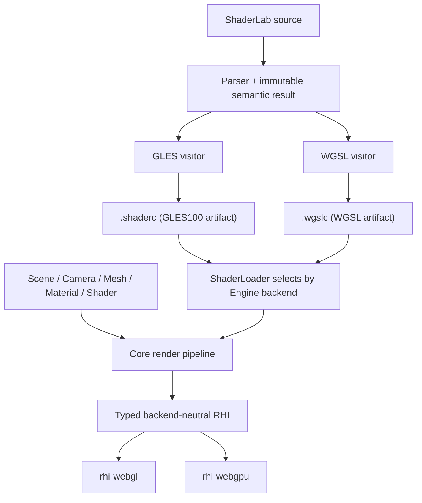
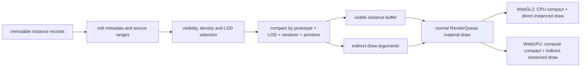

# Galacean WebGPU 多后端设计

状态：实现契约 v0.3
首批范围：`world-gallery/demos/terrain` 的地形、树木、天空、阴影、HDR 与后处理
默认后端：WebGL2

## 不变量

1. 用户只在初始化时选择后端：

   ```ts
   const engine = await WebGLEngine.create(configuration);
   const engine = await WebGPUEngine.create(configuration);
   ```

2. `Scene`、`Camera`、`Mesh`、`Material`、`Shader`、`ShaderData`、资源加载和 ShaderLab 源码不因后端改变。
3. 示例通过 `?backend=webgl2|webgpu` 选择 Engine，并刷新页面；不在同一个 canvas 上创建两个图形上下文。
4. ShaderLab 是唯一 shader 源。GLES 与 WGSL 都由 Galacean shader compiler 直接生成；不提交手写的第二份 WGSL，也不在生产路径调用外部 GLSL 翻译器。
5. WebGPU 初始化失败时返回带原因的错误，不自动回退 WebGL2。
6. 未实现能力必须在调用边界显式报错，不能静默降级、跳过 draw 或伪造成功。

这些约束来自 `/Users/shensi/Git/galacean/webgpu-upstream-research/RESEARCH_MATRIX.md` 中固定源码快照与当前 world 调用面的证据。

## 设计比较

### Engine 选择

| 方案 | 用户接口 | canvas 生命周期 | 结果 |
| --- | --- | --- | --- |
| 单个 `Engine.create({ backend })` | 每次创建都暴露 backend 配置 | 容易诱导同页热切换 | 不采用 |
| 一个 Engine 内同时持有 WebGL/WebGPU | 上层看似统一 | 同一 canvas 不能同时承载两个上下文，资源所有权也会分裂 | 不采用 |
| 独立 `WebGLEngine.create` / `WebGPUEngine.create` | 只有初始化类不同 | 一个页面、一个 canvas、一个 device | 采用 |

### Shader 产物

| 方案 | 优点 | 代价 | 结果 |
| --- | --- | --- | --- |
| Engine 创建时覆盖全局 target | 改动少 | 全局 Shader 与 Engine 生命周期耦合；预注册 built-in shader 早于 Engine | 不采用 |
| 运行时只保存 ShaderLab 源，每个 variant 重新 parse/codegen | 产物小 | 移动端首帧解析与 codegen 成本高；release 必须携带 compiler | 不作为默认 release 路径 |
| 一个 artifact 只保存一个 target；同一 ShaderLab 默认输出相邻的 `.shaderc` 与 `.wgslc` | API 不变；浏览器只请求当前后端产物；artifact 可独立缓存和审计 | 构建需要执行两次 target codegen；同页不可混用两种 Engine | 采用 |

运行时 `Shader.create(source)` 仍使用同一个入口；Engine 在创建时内部选择默认 codegen target，调用者不传 backend/target。构建脚本为每个 target 单独调用 compiler，并要求 GLES/WGSL visitor 对同一 ShaderLab 语义使用一致的 binding、stage IO 与可达性规则。

### 命令与 pass

| 方案 | 结果 |
| --- | --- |
| 在 core 中模拟 WebGL 的隐式 framebuffer/state machine | 无法表达 WebGPU attachment load/store、resolve 与 pipeline state，且继续泄漏 GL | 不采用 |
| 首期引入完整 RenderGraph | 超出 terrain 首批范围，增加资源生命周期与调度概念 | 暂不采用 |
| core 使用显式 frame/render-pass 边界，RHI 内部映射到 WebGL/WebGPU | 能表达 shadow → scene → post/final 的现有固定顺序 | 采用 |

## 模块边界



- core 只持有中立资源、pass、pipeline、binding 和 capability 语义。
- WebGL context、GL enum、texture unit、FBO、VAO、`WebGLProgram` 与 `WebGLUniformLocation` 只存在于 `rhi-webgl`。
- `GPUDevice`、`GPUTextureView`、`GPURenderPipeline`、`GPUBindGroup` 与 command encoder 只存在于 `rhi-webgpu`。
- target shader module、反射和宏 variant 是 ShaderPass 的内部产物，不增加用户 Shader API。

## Engine 与 device 生命周期

`WebGPUEngine.create` 的顺序固定为：

1. 解析 canvas。
2. 检查 `navigator.gpu`。
3. `requestAdapter`，再 `requestDevice`。
4. 获取并配置 `GPUCanvasContext`。
5. 构造 `Engine`，初始化 built-in resources 和默认 Scene。
6. 监听 `device.lost` 并进入现有 Engine device-lost 生命周期。

`WebGLGraphicDevice.init` 保持同步。`WebGPUGraphicDevice` 通过异步工厂先取得 device，再进入 Engine 的同步资源构造阶段，避免让所有 Engine 构造路径暴露异步半初始化状态。

## RHI 首批契约

### Device 与能力

- `backend`
- `capabilities` 与 `limits`
- `isDeviceLost`
- `beginFrame` / `endFrame`
- `resize` / presentation configure
- `destroy`

首批中立 capability 至少覆盖：

- depth texture
- texture array / cube texture
- float 与 half-float texture/filter/render attachment
- sRGB
- MSAA sample count
- Uint32 index
- instancing
- derivatives / explicit texture LOD
- compressed texture family
- maximum texture size、anisotropy、uniform binding size

### 资源

- Buffer：vertex、index、uniform；create、upload/update、destroy。
- Texture：2D、2D array、cube、depth；upload、sampler state、mipmap、view、destroy。
- RenderTarget：color/depth attachments、mip/cube face、MSAA resolve、destroy。
- Primitive：vertex/index layouts、indexed/non-indexed、instanced draw。

同步 GPU readback、transform feedback、compute、query、indirect draw 和 render bundle 不属于 terrain 首批运行依赖。WebGPU 路径调用这些接口时显式抛出 `UnsupportedError`；离线 ambient 烘焙继续使用 WebGL2，直到异步 readback API 单独设计。

### Render pass 与 pipeline

core 在一次 camera render 中显式打开/关闭 pass：

- attachment view
- load/store operation
- clear color/depth/stencil
- MSAA resolve target
- viewport/scissor
- color/depth format

pipeline key 至少包含：

- shader target + variant
- vertex layouts
- primitive topology
- color/depth formats
- sample count
- blend/depth/stencil/cull/front-face/depth-bias state

WebGL backend 在 `applyRenderState` 时执行状态变更；WebGPU backend 将同一中立 state 纳入 pipeline descriptor。core 不再直接调用 `gl.*`。

## Shader compiler

### Target artifact

`IPrecompiledShader` 保持单个 `platformTarget`；一个 artifact 只包含该 target 的 pass 产物：

- vertex/fragment instructions
- stage IO reflection
- uniform/texture/sampler binding reflection
- source hash 与 target

GLES 产物继续使用 `.shaderc`；WGSL 使用 `.wgslc`。precompile/rollup 默认从同一 `.shader` 生成两份相邻文件。`ShaderLoader` 接收逻辑 `.shaderc` URL 后，WebGL 加载该文件，WebGPU 加载同名 `.wgslc`；文件 target 不匹配必须报错。program/pipeline cache 继续归属于 Engine。

### WGSL lowering

WGSL visitor 必须覆盖 terrain 闭包中的真实语义：

- Attributes/Varyings/MRT 到 `@location` stage IO。
- `gl_Position`、`gl_FragCoord`、vertex/instance index 等 builtin。
- combined sampler 拆为 texture 与 sampler binding。
- 2D、2D array、cube、depth comparison texture。
- implicit、LOD、Grad、texelFetch 与 shadow comparison sampling。
- scalar/vector/matrix、int/uint、bit operation、array 与动态索引。
- `out/inout` 参数的合法 WGSL lowering。
- derivative、discard、动态循环、break、early return。
- GLES 与 WGSL 一致的 clip-space、Y 方向和 depth range。

运行时宏仍由 `ShaderMacroProcessor` 对 target instruction 执行。WGSL visitor 输出的所有 binding 使用稳定编号；variant 只能改变实际使用和数组长度，不能改变同名资源的 binding/type。

### Uniform 布局

首批使用一个 program 级 uniform block，字段来自 compiler reflection：

- WGSL struct 与 CPU packer 使用同一份类型/数组描述。
- offset、alignment、array stride 和 matrix stride 按 WGSL uniform address-space 规则计算。
- 每 draw 使用动态 offset，禁止在同一 command buffer 内让多次 draw 复用同一可写区间。
- 未设置属性从现有 BasicResources/default value 解析，行为与 WebGL ShaderUniform 保持一致。

纹理与 sampler 与 uniform block 位于稳定 bind-group layout；默认纹理由现有 `BasicResources` 提供。

## Terrain 首批闭包

| 场景能力 | 必须验证的后端能力 |
| --- | --- |
| Clipmap terrain | Uint32 index、144 segments、vertex texture sampling、2D array、uint control texture |
| Terrain material | 32 layers、Grad/LOD、derivative、matrix/int/bit operation、动态循环 |
| 树木 | glTF PBR、depth/shadow pass、automatic GPU instancing |
| 环境 | HDR cube、ambient light、skybox、direct light |
| 阴影 | depth texture、comparison sampler、four-cascade atlas、viewport/scissor、depth bias |
| Camera | 4x MSAA、HDR render target、resolve、post-process fullscreen blit、sRGB final output |

验收不能用 hello triangle 替代上述闭包；runtime raw Terrain ShaderLab 与 built-in precompiled PBR 两条路径必须同时通过。

## GPU-driven 地表阶段

### 本地上游代码事实

以下表格只记录固定本地快照中的代码结构，不据此宣称 Galacean 已获得同等性能。

| 引擎 | 本地源码 | 可复用的客观实现 |
| --- | --- | --- |
| Three.js | `/Users/shensi/Git/three.js/src/renderers/webgpu/WebGPUBackend.js` | 可写实例流使用 `STORAGE \| VERTEX`；间接参数使用 `STORAGE \| INDIRECT`；render object 可在同一 draw 分支选择 direct 或 indirect |
| Three.js | `/Users/shensi/Git/three.js/src/renderers/webgpu/utils/WebGPUPipelineUtils.js` | compute pipeline 由 shader module 与已有 bind-group layout 构造，pipeline 归 backend 缓存 |
| Babylon.js | `/Users/shensi/Git/Babylon.js/packages/dev/core/src/Engines/WebGPU/Extensions/engine.computeShader.ts` | render pass 在 dispatch 前结束；compute pass 统一绑定 pipeline/bind groups，并支持 direct/indirect dispatch |
| Babylon.js | `/Users/shensi/Git/Babylon.js/packages/dev/core/src/Engines/Extensions/engine.computeShader.ts` | 不支持 compute 的 ThinEngine 在调用边界抛出明确错误 |
| PlayCanvas | `/Users/shensi/Git/galacean/webgpu-upstream-research/playcanvas-current/src/platform/graphics/webgpu/webgpu-compute.js` | compute、bind group 更新与 dispatch 都封装在 graphics device 内；上层不持有原生 WebGPU 对象 |
| PlayCanvas | `/Users/shensi/Git/galacean/webgpu-upstream-research/playcanvas-current/src/platform/graphics/webgpu/webgpu-graphics-device.js` | indirect commands 是 graphics-device draw 的一种中立输入；当前 WebGPU 仍逐条编码，源码明确等待未来 multi-draw indirect |

### Grasslands 已测瓶颈

固定 1280×720 CSS、DPR 2、默认相机与默认画质的基线记录如下；FPS 仅用于定位，正式结论仍以重复采样和移动真机为准。

| 对象 | 可见实例增量 | draw 增量 | triangle 增量 | 阶段优先级 |
| --- | ---: | ---: | ---: | --- |
| 树木 | 14,878 | 1,180 | 607,116 | 第一批 |
| 岩石 | 3,129 | 675 | 717,140 | 第一批 |
| 灌木 | 492 | 109 | 30,234 | 第二批 |
| 草 | 136,466 | 47 | 2,016 | 第二批，重点验证实例筛选和 overdraw |
| 花 | 14,234 | 29 | 1,040 | 第二批 |

当前 `SurfaceWorld` 以 `cell × prototype × LOD × renderer × primitive` 创建实体、实例 buffer 和 draw。空间 cell 同时成为 draw 边界，Grasslands 默认画面因此有 1,411 个活动 renderer batch 和 2,141 次 draw。GPU-driven 阶段先解除这个结构耦合，再把 CPU compaction 替换为 WebGPU compute；不能直接在 demo 中调用 `GPUDevice` 绕过 Engine/RHI。

### 中立数据流



- cell 继续是 streaming、可见性、LOD 和诊断单位，不再强制成为 draw 单位。
- render batch key 固定为 `prototype + LOD + renderer + primitive + material + render state`。
- 默认 WebGL2 使用同一批次契约的 CPU compaction 和 direct instanced draw。
- WebGPU 使用 storage source、storage/vertex output 和 storage/indirect argument buffer。
- `SurfaceWorld`、shader/material 和 example 不读取 `GPUDevice`，也不提交手写 WGSL。
- compute shader 仍由 ShaderLab 语义树生成 WGSL；编译器未覆盖前，WebGPU GPU-driven capability 必须报告 unsupported，不能退化成隐藏的 raw WGSL demo。

### 分阶段接口

1. **中立批次边界**
   - 将有限地表从每 cell 一个 renderer 改为每 render batch 一个 renderer。
   - CPU compaction 保留 cell culling、density、LOD、cross-fade 和诊断结果。
   - 两个后端截图、实例计数与功能 E2E 一致后才进入 compute。
   - 第一个性能检查点只合并 WebGPU 的单 LOD 树木 impostor；WebGL2 保留原 cell renderer 作为对照。相机级
     compaction 不能替代 shadow cascade 的逐 pass 剔除，统一 WebGL2 路径前必须先补齐逐 pass
     compaction，不能用关闭阴影规避。
2. **RHI compute/storage/indirect**
   - 中立 buffer usage 覆盖 storage、vertex/storage 和 indirect/storage 组合。
   - 中立 compute pass 只接收 shader artifact、binding 和 dispatch；原生对象留在 `rhi-webgpu`。
   - WebGL backend 对 compute/indirect 调用显式抛出 unsupported；SurfaceWorld 的 WebGL 路径不调用它。
3. **ShaderLab compute target**
   - source parser、semantic/type check、WGSL codegen、reflection 和 `.wgslc` 构建产物共同支持 compute entry。
   - compute 与 render stage 共用 binding 分配、宏和 artifact target 校验。
4. **树木/岩石 GPU compaction**
   - 先清空各 batch counter/indirect instance count，再按 source range 执行 cull、density 和 LOD，写入 compacted instance stream。
   - indirect argument 的 index/vertex count 与 first index 来自普通 mesh/submesh，不在 shader 中复制模型常量。
5. **草地高实例数**
   - 在树木/岩石正确性闭包通过后复用相同能力；单独衡量 compute、vertex 与 fragment/overdraw 的占比。

### 树木 impostor 第一检查点

本地 Chromium headless shell 1217、Metal、1280×720 CSS、固定相机、关闭动画；基线
`133a229aa` 与候选 `a6b68509c` 交替运行三轮，每轮预热 1.8 秒后采样 3 秒。表格记录三轮中位数，
不外推为移动端结果。

| 后端与负载 | 基线活动批次 | 候选活动批次 | 基线 FPS | 候选 FPS | 基线/候选 p50 | 基线/候选 p95 |
| --- | ---: | ---: | ---: | ---: | ---: | ---: |
| WebGPU，DPR 2 | 1,411 | 842 | 41.25 | 41.61 | 25.0 / 25.0 ms | 33.3 / 33.3 ms |
| WebGL2，DPR 2 | 1,411 | 1,411 | 39.09 | 40.23 | 25.0 / 25.0 ms | 33.6 / 33.4 ms |
| WebGPU，DPR 1 辅助诊断 | 1,411 | 842 | 46.57 | 53.86 | 24.5 / 16.7 ms | 25.8 / 25.1 ms |

- DPR 2 下批次数减少 40.3%，FPS 与 frame-time 分位没有形成可区分的提升。
- DPR 1 下能观察到 CPU command 压力下降；DPR 2 结果表明默认画面已由像素、几何或阴影成本主导。
- WebGL2 保留相同 cell batch 路径，三轮波动只作为无明显回退检查，不记作性能收益。

### Indirect draw 检查点

本地 Chromium headless shell 1217、Metal、1280×720 CSS、DPR 2、固定相机、关闭动画；direct
基线 `1380ea58f` 与 indirect 候选 `403c395d1` 交替运行三轮，每轮预热 1.8 秒后采样 3 秒。
两组都使用已经压缩的 WebGPU 树木实例流，唯一变量是普通 instanced draw 与
`drawIndexedIndirect`。

| 提交方式 | 活动 renderer batch | indirect renderer batch | FPS 中位数 | p50 | p95 | GPU 诊断 |
| --- | ---: | ---: | ---: | ---: | ---: | --- |
| direct | 842 | 0 | 30.45 | 33.2 ms | 41.6 ms | 0 |
| indirect | 842 | 1 | 29.42 | 33.5 ms | 41.8 ms | 0 |

- 当前 indirect argument 由 CPU 更新 instance count；实例压缩、cell culling 和 density 选择仍在 CPU。
- 两组总活动 batch 相同，只有 1 个树木 renderer batch 改为 indirect；三轮数据没有显示性能收益。
- 该检查点只证明 storage/indirect buffer、renderer binding 和原生 WebGPU command encoding
  能在 Grasslands 真实材质、阴影和后处理路径中正确运行。
- compute 生成 instance stream 与 indirect argument 之前，不把 indirect draw 单独记作性能提升。

### 草地与花地表第二检查点

Grasslands 有 5 个单 LOD、无 cross-fade、无投影阴影的草/花 prototype，共 272,570 个实例和
290 个 cell range。候选 `cc6faaef7` 复用同一个 `SurfaceStaticBatcher`，没有新增 category
分支、shader 或材质。

本地 Chromium headless shell 1217、Metal、1280×720 CSS、DPR 2、固定相机、关闭场景动画；
树木 indirect 基线 `e289ffba5` 与草/花 indirect 候选交替运行三轮，每轮预热 1.8 秒后采样
3 秒。

| 提交范围 | 可见实例 | 活动 renderer batch | indirect renderer batch | FPS 中位数 | p50 | p95 | GPU 诊断 |
| --- | ---: | ---: | ---: | ---: | ---: | ---: | --- |
| 仅树木 | 169,199 | 842 | 1 | 40.55 | 25.0 ms | 33.4 ms | 0 |
| 树木 + 草/花 | 169,199 | 693 | 6 | 41.67 | 25.0 ms | 33.3 ms | 0 |

- 活动 renderer batch 减少 149（17.7%）；FPS 中位数增加 2.8%，p50/p95 未形成可区分变化。
- 双页面正确性对照关闭云影和 surface wind；grass、flower、tree、rock、shrub 可见计数逐项相同。
- 1280×720 截图降采样到 320×180 后，RGB 平均绝对通道差为 0.00025，通道差大于 2
  的像素比例为 0，最大通道差为 2。
- 该结果记录 CPU compaction 加中立批次边界的当前收益，不归因为 compute；每次可见性变化仍会
  由 CPU 重写 compacted instance stream。

### 多 LOD 地表第三检查点

候选将同一个 prototype 的 cell range 按 LOD 合并，树木、岩石和灌木与单 LOD 草/花共用
`SurfaceStaticBatcher`。cross-fade 的正负 fade 与 cell debug hue 编码在原 64-byte instance
record 的第四个 float 中；24-bit 整数保持 f32 精确表示，不增加移动端已达上限的 vertex buffer
数量。WebGL2 继续使用原 cell renderer 和 uniform fade。

本地 Chromium headless shell 1217、Metal、1280×720 CSS、DPR 2、固定相机、关闭场景动画；
候选在基线前后三轮运行，基线 `015f7e20c` 运行三轮。每轮预热 1.8 秒后采样 3 秒。

| 提交范围 | 可见实例 | 活动 renderer batch | indirect renderer batch | FPS 范围 | FPS 中位数 | p50 范围 | p95 范围 | GPU 诊断 |
| --- | ---: | ---: | ---: | ---: | ---: | ---: | ---: | --- |
| 单 LOD 草/花/假树合批 | 169,199 | 693 | 6 | 37.35–42.16 | 39.56 | 25.0 ms | 33.3–33.7 ms | 0 |
| 全部有限地表按 prototype + LOD 合批 | 169,199 | 76 | 76 | 42.88–45.40 | 44.68 | 24.7–25.0 ms | 25.9–33.4 ms | 0 |

- 活动 renderer batch 减少 617（89.0%）；六轮候选 FPS 中位数相对三轮基线增加 12.9%。
- LOD distance scale 每 400 ms 在 0.5/1.5 间切换的持续 churn 中，103 个 range 保持过渡：
  基线 825 batch、35.70–36.90 FPS（中位数 36.14），候选 89 batch、40.11–41.67 FPS
  （中位数 40.38，增加 11.7%）。
- 同一实时基线页面关闭云影和 surface wind 后，WebGL2 截图降采样的 RGB 平均绝对通道差为
  0.00007、通道差大于 2 的像素比例为 0、最大通道差为 1；WebGPU 分别为 0.00546、
  0.00694%、3。两后端的 category、LOD 和可见实例计数一致。
- E2E 覆盖 WebGL2 到 WebGPU 的刷新切换、settled LOD、双 LOD indirect 过渡、最终非零高 LOD
  计数及 GPU validation；不支持共享 canvas 上下文。
- 实例筛选、compaction、LOD 选择和 indirect argument 更新仍在 CPU。该检查点证明降低提交批次
  的收益，不代表 compute culling 或 GPU-generated indirect 已完成。

### GPU compaction 第四检查点

候选 `49d8f5b5e` 保留 CPU cell culling、density prefix 和 LOD 选择；ShaderLab compute pass
读取静态实例与可见 range command，在 GPU 上生成 compacted instance stream、cross-fade metadata
和所有 indirect instance count。WebGL2 路径不创建该 batcher，也不执行 compute。

同机 A/B 使用候选父提交 `b5ced1e89` 作为 CPU compaction 基线。Chromium 147.0.7727.15
（Playwright headless shell 1217）、Metal、1280×720 CSS、DPR 2、固定相机、关闭场景动画；
每组交替运行三轮，预热 1.8 秒后采样 3 秒。

| 场景 | compaction | 可见实例 | renderer batch | FPS 中位数 | p50 | p95 | GPU 诊断 |
| --- | --- | ---: | ---: | ---: | ---: | ---: | ---: |
| settled | CPU | 169,199 | 76 | 48.20 | 21.6 ms | 27.9 ms | 0 |
| settled | GPU | 169,199 | 76 | 48.25 | 21.7 ms | 27.0 ms | 0 |
| LOD churn | CPU | 214,943 | 89 | 45.45 | 22.2 ms | 30.6 ms | 0 |
| LOD churn | GPU | 214,943 | 89 | 44.52 | 22.9 ms | 30.9 ms | 0 |

- settled FPS 变化 +0.10%，未超出波动；LOD distance scale 每 400 ms 在 0.5/1.5 间切换时
  FPS -2.05%、p50 +3.15%、p95 +0.98%。当前数据不支持“GPU compaction 已提升总帧率”
  的结论，持续更新场景还有可复现回退。
- settled 的 1,208 个可见 range 全量变脏时，CPU instance upload 从 10,828,736 bytes
  降到 109 个 batcher header 加 range command 的 21,072 bytes，减少 99.81%；indirect
  instance count 不再由 CPU 上传。静态源实例另有一次性上传。
- 按显式分配量计算，新增静态 source storage 及其 WebGPU shadow 各 18.08 MiB；移除旧的
  per-LOD `_instanceOutput` 和 range data 引用后，host retained data 净减少约 17.77 MiB，
  GPU buffer memory 增加约 18.08 MiB。该项是分配量分析，不是设备峰值内存实测。
- 当前每个 `SurfaceStaticBatcher` 仍创建一个 compute pipeline，并独立 begin/end compute pass。
  在把 fine culling 或每帧 LOD 迁入 GPU 前，应先共享 pipeline 并合并连续 dispatch，再复测
  camera movement、host time 和 GPU timestamp。
- `world-gallery/demos/terrain/e2e/gpu-compaction-benchmark.mjs` 固化上述 A/B 顺序和采样窗口；
  `BASELINE_URL`、`CANDIDATE_URL` 可替换两台服务，`BENCHMARK_LOD_CHURN=1` 开启持续 LOD
  变化，`BENCHMARK_BROWSER_EXECUTABLE` 固定浏览器二进制。

### Compute pipeline 与 pass 复用第五检查点

候选 `01c1226e3` 不改变 `ComputePass`、terrain 或 ShaderLab 用户接口。`ShaderPass` 按 Engine
缓存设备限制解析后的 compute WGSL，WebGPU device 按完整生成源码缓存 pipeline 和 bind-group
layout；连续 dispatch 保持在同一个 native compute pass，遇到 render、flush、render target
切换或销毁边界时结束。

同机 A/B 使用 `6313a656b` 作为每 batcher 独立 pipeline/pass 的基线。浏览器、Metal、画布、
相机、预热和采样窗口与第四检查点相同；每组交替运行三轮。

| 场景 | 实现 | 可见实例 | renderer batch | ready 中位数 | FPS 中位数 | p50 | p95 | GPU 诊断 |
| --- | --- | ---: | ---: | ---: | ---: | ---: | ---: | --- |
| settled | 每 batcher pipeline/pass | 169,199 | 76 | 2,041 ms | 48.98 | 20.5 ms | 26.5 ms | 0 |
| settled | 共享 pipeline/pass | 169,199 | 76 | 2,098 ms | 49.30 | 19.9 ms | 25.8 ms | 0 |
| LOD churn | 每 batcher pipeline/pass | 214,943 | 89 | 2,084 ms | 45.53 | 22.3 ms | 30.9 ms | 0 |
| LOD churn | 共享 pipeline/pass | 214,943 | 89 | 2,128 ms | 45.50 | 22.6 ms | 31.6 ms | 0 |

- settled FPS 变化 +0.65%，LOD churn 变化 -0.08%，均未形成可区分收益。ready 中位数分别
  增加 2.83% 和 2.11%；当前数据不支持启动时间改善。
- 在相同 settled 场景中，对原生 WebGPU 接口计数：`createComputePipeline` 从 109 降到 1，
  `beginComputePass` 从 1,857 降到 24，`dispatchWorkgroups` 均为 1,857。计数时两个页面的
  可见实例、renderer batch 和 GPU 诊断相同。
- pipeline/pass 状态冗余已消除，但工作提交粒度没有改变。后续性能工作应减少每次可见性更新的
  109 个 dispatch，而不是继续优化 pipeline 创建；合并 dispatch 必须先解决不同 batcher
  storage range 的中立寻址和设备 buffer 上限。
- RHI 测试覆盖两个同源 `ComputePass` 共享 native pipeline/pass、flush 结束 pass 及两份
  storage 输出顺序正确；Grasslands E2E 覆盖刷新切换、类别、LOD、indirect、有效截图和零
  GPU validation error。

### Storage atlas 与 flattened dispatch 第六检查点

候选 `8c7414f78` 将 44 个 prototype、109 个 prototype LOD batcher 的 source、output、
command 和 indirect buffer 合并为一组 atlas。CPU 仍负责 cell culling、density prefix 和
LOD 选择；所有 dirty batch header 与 visible range copy command 由一个 ShaderLab compute
dispatch 消费。WebGL2 保持原 cell renderer 路径。

`VertexBufferBinding.offset` 是两个后端共用的字节偏移：WebGL2 将其加到 attribute pointer，
WebGPU 将其传给 `setVertexBuffer`。indirect argument 的 `firstInstance` 保持为 0，因此不要求
可选的 [`"indirect-first-instance"`](https://gpuweb.github.io/types/types/GPUFeatureName.html)
device feature，也不把 WebGPU 特例暴露给 surface mesh 或 example。

Atlas 创建前通过 `Engine.computeCapabilities` 校验每个 storage binding 与 dispatch 维度。
Grasslands 的 source binding 为 17.77 MiB、output binding 为 18.08 MiB，最大 dispatch 为
2,157 workgroups；均低于 WebGPU 规范的最低
[`maxStorageBufferBindingSize` 128 MiB 和 `maxComputeWorkgroupsPerDimension` 65,535](https://gpuweb.github.io/gpuweb/)。
当前不实现 paging；超过实际 device limit 时显式抛出 `RangeError`，不拆成隐藏的临时路径。

同机最终提交 A/B 使用父提交 `a20e02fe8` 作为每 batcher dispatch 基线。Chromium
140.0.7339.16、Metal、1280×720 CSS、DPR 2、固定相机、关闭场景动画；每组交替运行三轮，
预热 1.8 秒后采样 3 秒。

| 场景 | 实现 | ready 中位数 | FPS 中位数 | p50 | p95 | GPU 诊断 |
| --- | --- | ---: | ---: | ---: | ---: | --- |
| settled | 每 batcher dispatch | 1,855 ms | 46.48 | 23.0 ms | 33.3 ms | 0 |
| settled | flattened dispatch | 1,906 ms | 46.14 | 23.1 ms | 33.3 ms | 0 |
| LOD churn | 每 batcher dispatch | 1,844 ms | 41.66 | 24.8 ms | 33.4 ms | 0 |
| LOD churn | flattened dispatch | 1,880 ms | 43.21 | 23.7 ms | 33.2 ms | 0 |

- settled FPS 为 -0.74%，LOD churn 为 +3.73%；另一次 Chromium 147 六样本复测分别为
  +0.84% 和 +1.28%。不同运行的收益幅度不稳定，当前证据只记录整帧没有明显回退，不记录
  可泛化的 FPS 提升。
- ready 中位数分别增加 2.77% 和 1.94%；另一次复测增加 2.01% 和 4.71%。该实现没有启动
  时间收益。
- 在 settled 页面加载并继续运行一秒的相同窗口中，原生 `dispatchWorkgroups` 从 869 降到
  10（-98.85%）；`createComputePipeline` 均为 1，`beginComputePass` 为 11/10。两个页面均为
  169,199 个可见实例、76 个活动 indirect renderer batch。
- compaction 相关 storage buffer 从 436 个、37,958,184 bytes 降到 4 个、
  37,627,192 bytes：对象数 -99.08%，分配字节 -0.87%。减少的是 command/buffer 对象，
  不是实例容量。
- 五轮、每轮 40 次同步 LOD distance 切换中，host 总耗时中位数从 8.5 ms 降到 6.2 ms
  （-27.1%）；单次结果落在 0.1 ms 计时粒度附近，只把总量方向作为证据。
- 关闭 wind 与场景动画后，基线和候选的 category、LOD、可见实例逐项相同；截图 RGB 平均
  绝对通道差为 0.0089，通道差大于 2 的比例为 0，最大通道差为 2。最终 E2E 另行验证
  WebGL2→WebGPU 刷新、LOD 过渡、indirect、有效像素和零 validation diagnostic。
- 该检查点消除了 CPU command encoding 中的 per-batcher dispatch 循环，但可见性与 LOD
  决策仍在 CPU。将 cell culling/LOD 迁入 atlas compute 才能检验每帧 GPU-driven 收益；
  不能把本检查点描述为已经完成 GPU culling。

### 实例级精确裁剪第七阶段设计

本阶段只改变满足以下能力谓词的 finite prototype：只有一个 LOD、不启用 LOD cross-fade，且
所有 renderer 都不投影阴影。谓词来自渲染语义，不读取 `grass`、`flower` 等 category。多 LOD、
cross-fade 或 shadow caster 继续使用第六检查点的 range 级 CPU 选择与 GPU copy，避免相机裁剪
删除相机外但仍会进入 shadow cascade 的实例。

Grasslands 当前资产中，该谓词覆盖 3 个草、2 个花和 `tree-fake-tree`，共 6 个 prototype、
286,937 个候选实例、860 个 cell range。下表只统计草/花：按 demo authored camera 的实例位置
到相机距离离线计数，不加入 prototype radius 和视锥保守量时，当前 range 级选择与实例点距离
选择的差异如下。该表只说明这 5 个 prototype 的候选裁剪空间，不是最终可见数或性能结果。

| category | 总候选 | 当前 range 选择 | 实例点距离选择 | 相对当前减少 |
| --- | ---: | ---: | ---: | ---: |
| grass | 254,518 | 136,466 | 104,016 | 23.78% |
| flower | 18,052 | 14,234 | 13,101 | 7.96% |
| 合计 | 272,570 | 150,700 | 117,117 | 22.28% |

`tree-fake-tree` 另有 14,367 个候选实例、570 个 range，authored max distance 为 2,400。
固定相机下，CPU 视锥/range 选择保留的 3,898 个实例全部通过实例距离判定；它验证能力谓词不能
等同于“值得执行 fine cull”。是否执行由每帧 range 边界关系继续收窄。

实现沿用 atlas 与单次 flattened dispatch：

1. CPU 继续做 cell conservative culling、density prefix 和能力谓词判断；以 range placement
   radius、prototype sphere、最大实例 scale 和动态 category scale 计算 conservative farthest
   distance，将完全位于距离边界内的 range 直接复制为 output safe prefix。
2. 只有跨越距离边界的 range 才切成不超过实际 workgroup size 的 command tile；一个 workgroup
   消费一个 tile，每个 invocation 检查一个实例的位置、动态 category scale、prototype sphere
   与相机 max distance。
3. workgroup 内存中的 atomic counter 分配局部 survivor slot；leader 对该 render batch 的
   storage counter 每 tile 只执行一次全局 `atomicAdd`，counter 从 safe-prefix count 开始，随后
   survivor 追加到同一连续 output slice。
4. finalize ShaderLab compute pass 将 batch counter 写入对应 indirect record 的 instance
   count；没有边界 range 的 batch 只运行原有 copy。counter reset、fine cull 与 finalize 不读取
   或暴露原生 `GPUDevice`。

该算法直接参考 PlayCanvas
[`compute-gsplat-projector.js`](https://github.com/playcanvas/engine/blob/332a922d2dcf48bf3c774d296c999c69581d3d2c/src/scene/shader-lib/wgsl/chunks/gsplat/compute-gsplat-projector.js)
和
[`compute-gsplat-shadow-cull.js`](https://github.com/playcanvas/engine/blob/332a922d2dcf48bf3c774d296c999c69581d3d2c/src/scene/shader-lib/wgsl/chunks/gsplat/compute-gsplat-shadow-cull.js)
的 workgroup 聚合模式：局部 atomic compaction，每 workgroup 一次全局 atomic reservation；
后者还将 coarse candidate 和六平面 conservative fine cull 分为独立阶段。ShaderLab 先补
`shared int/uint` 的 `atomicAdd`、`atomicLoad`、`atomicStore` WGSL codegen 与 `.wgslc`，
terrain shader 才能使用该模式；不在 example 内嵌手写 WGSL。

首个落地切片只做 max-distance fine cull。相同 ShaderLab surface vertex 在 WebGL2 中把距离外
实例移出 clip space，WebGPU compute 使用同一 sphere 判定，因此两后端保持像素语义一致，
WebGPU 额外省去 survivor 之外的 vertex/primitive 工作。六平面 fine cull 暂缓：Grasslands
草/花存在 vertex wind deformation，当前 prototype contract 没有可证明的最大位移界；
在该界进入中立资产契约前直接使用静态 mesh sphere 会在视锥边缘产生假阴性。

固定相机真实 WebGPU 读回中，强制 6 个 prototype 的全部可见 range 执行 fine cull 时，一次
compaction flush 的 workgroup 分布为 copy/reset/fine/finalize = `646/1/1269/6`。加入上述
边界分流后为 `857/1/411/5`：fine-cull workgroup 减少 67.61%，四个 pass 合计减少 33.71%。
草/花的 5 个 counter 仍为 `5037/3469/44431/3193/4444`，`tree-fake-tree` 的 3,898 个实例
改走 direct copy，合计 survivor 仍为 64,472；浏览器未产生 WebGPU validation diagnostic。

Chromium 140 / Metal、1280×720 CSS、DPR 2、每项 3 秒采样、三轮交替顺序的整帧结果：

| 场景 | backend/实现 | FPS 中位数 | p50 | p95 | GPU 诊断 |
| --- | --- | ---: | ---: | ---: | --- |
| settled | 当前 WebGL2 cell batch | 37.00 | 25.7 ms | 34.3 ms | 0 |
| settled | 当前 WebGPU compact/indirect + fine cull | 49.65 | 17.5 ms | 26.5 ms | 0 |
| LOD churn | 当前 WebGL2 cell batch | 35.28 | 25.6 ms | 34.7 ms | 0 |
| LOD churn | 当前 WebGPU compact/indirect + fine cull | 42.00 | 24.9 ms | 33.3 ms | 0 |

同一分支跨 backend 的 settled FPS 为 +34.20%，LOD churn 为 +19.06%，但它同时包含前几阶段
WebGPU compact/indirect 合批与本阶段 fine cull，不能把全部差值归因于实例裁剪。以
`edd39d2a9` 的 WebGPU compact/indirect 为隔离基线时，两次 settled 复测一次为 +2.54%，
另一次为 -3.00%，方向相反；两次 LOD churn 分别为 -0.35% 和 -0.26%。本阶段目前只形成
明确的 workgroup/vertex 候选减少，没有形成可泛化的独立整帧收益。

新增 cull parameter 与 batch counter 后，compaction 同一 pass 最多绑定 6 个 storage buffer，
不超过 WebGPU 最低 `maxStorageBuffersPerShaderStage = 8`。workgroup size 继续由
`Engine.computeCapabilities` 和 `GALACEAN_COMPUTE_WORKGROUP_SIZE_X` 派生。range 数超过设备
`maxComputeWorkgroupsPerDimension` 或任何 atlas binding 超过实际 device limit 时显式失败；
本阶段不加入 paging、subgroup 或 prefix-sum fallback。

### 投影树木与岩石的距离裁剪设计

#### 本地源码事实

下表只记录本地仓库在对应 commit 的实现，不据此推断未出现于源码的能力。

| 引擎 | commit | 源码事实 | 对本阶段的约束 |
| --- | --- | --- | --- |
| Unity SRP Core | `4c8e8d3ed16eb59bdc6399f9beb12eb19a740f02` | `InstanceCuller.CullingJob` 接收 `BatchCullingViewType`，Camera 与 Light 分别执行 visibility/LOD；dither cross-fade 被量化后编码进 visible instance index | 逐 view 裁剪需要独立可见实例结果；cross-fade 属于实例流数据，不能在 compaction 时丢失 |
| PlayCanvas | `332a922d2dcf48bf3c774d296c999c69581d3d2c` | `GSplatShadowRenderer` 为每盏方向光维护独立 visible-index、atomic count、compute 与 indirect args；`MeshInstance.setIndirect(camera, ...)` 支持按 camera 取 draw command | 未来的 shadow frustum/occlusion 不能复用主相机 count；renderer/RHI 需要 per-view indirect binding |
| Three.js | `c6620cee323838ead14035b37008f401edbc2ea1` | `IndirectStorageBufferAttribute` 提供间接参数；`WebGPUBackend` 在已有 render object 上执行 `drawIndexedIndirect` / `drawIndirect`；本次检索未发现通用实例 LOD/逐 light compaction | 可参考间接参数的 backend 封装，不能把它当作逐 view culling 参考 |
| Babylon.js | `d9ae931f9eb24fc5a5c152b33923e5015311b0ad` | WebGPU draw context 持有 indirect buffer，compute extension 支持 indirect dispatch；本次检索到的通用 LOD 仍由 `ObjectRenderer` 按 camera 在 CPU 选择 | 可参考 indirect/compute command 接入，不能据此宣称已有通用 GPU instance LOD |

Grasslands finite surface 的资产构成是：岩石 3,129 个、真实树木 511 个、灌木 492 个；假树另有
14,367 个。真实岩石、树木和灌木都有 2–3 级 LOD、启用 cross-fade 且投影。当前 authored
camera 的 runtime 统计中，稀疏层主要已经落在 LOD1/2（约 3.2K / 915），因此单纯把现有
range LOD 计算搬到 GPU 不代表会减少几何量。

Galacean 当前 `MeshRenderer` 每个 submesh 只有一组 indirect buffer/offset，ShadowCaster 的
四级 cascade 与 Forward 会消费同一组实例流。直接对这组流做主相机六平面 fine cull，会删除
camera frustum 外但仍可能进入 shadow slice 的实例；该方案在补齐 per-view binding 前不成立。

当前 Surface Forward 与 ShadowCaster vertex pass 都用 `camera_Position` 和同一
`renderer_SurfaceFineCullDistance + instanceRadius` 判定 max distance。Shadow pass 只替换
view/projection matrix，不改写 `camera_Position`，所以该距离谓词始终以主相机为中心；WebGPU
compute 使用的也是同一个主相机位置、distance scale、prototype sphere 与实例 scale。与六平面
裁剪不同，这个谓词可以在 Forward/Shadow 共用的实例流上提前执行，而不改变现有像素语义。

#### 方案比较

| 方案 | 收益 | 语义与代价 | 决策 |
| --- | --- | --- | --- |
| 关闭岩石/树木阴影或 LOD cross-fade 后复用第七阶段 | 改动小 | 改变资产语义与画面，只为 benchmark 绕过约束 | 不采用 |
| 立即实现每 cascade/per-camera visible stream | 可继续做 frustum、occlusion、独立 shadow LOD | 需要扩展 RenderContext、renderer binding、compute 调度时机与 buffer 生命周期；不是一个可独立验收的小切片 | 后续 RHI 阶段 |
| 保留 range LOD 与 shadow 语义，只把共同的 max-distance predicate 扩到全部 finite prototype | 可提前删除距离外的高顶点岩石/树木及其所有 raster pass 工作 | fine-cull command 必须携带 LOD fade；不能加入 camera frustum 条件 | 本阶段采用 |

#### 第八阶段数据契约

1. CPU 继续决定 category、density、range frustum、LOD 与 transition；同一 transition range 仍同时
   写入 from/to 两个 LOD batch。
2. fine-cull command 的低 16 bit 保存 batch index，高 16 bit 保存该 range 的量化 signed LOD
   fade；batch metadata 标记该 prototype 是否使用 packed LOD metadata。batch 数超过 65,536
   时显式失败，不能静默截断。
3. compute survivor 写入 output 时，cross-fade prototype 按 direct-copy 路径相同的公式保留
   8-bit cell hue 与 16-bit LOD fade；非 cross-fade prototype 保留源 metadata。
4. only-boundary 策略不变：完全位于 max-distance 内的 range 直接复制，完全位于外部的 range
   由 CPU 拒绝，只有跨边界 range 逐实例执行 compute。
5. 相机移动只使当前含 boundary command 的 batch 失效；新进入或离开 boundary 的 batch 由
   `setRangeVisibleCount` 状态变化触发，避免让全部 109 个 LOD batch 每帧重做 compaction。
6. 本阶段不加入 camera/shadow frustum plane、occlusion、每实例 LOD 或新的资产阈值。

验收必须同时覆盖：

- settled 与 LOD transition 截图；WebGPU candidate 对修改前 WebGPU baseline 做像素比较。
- ShadowCaster 保持启用，树木/岩石/灌木类别与 LOD 计数和 baseline 一致。
- 至少一个 cross-fade boundary range 进入 fine-cull，生成的 output metadata 保留正负 fade。
- WebGPU validation/page error 为 0；WebGL2 仍为默认后端且行为不变。
- 修改前后 WebGPU 的 settled、LOD churn 与相机移动 A/B 分开报告；若帧率方向不稳定，只记录
  workload/vertex 候选减少，不宣称整帧收益。

验收分别报告：

- ShaderLab 生成源码、`.wgslc`、原生 WebGPU validation，以及至少两个 workgroup 的完整
  survivor 集合，证明不是只编译未执行。
- 固定相机的实例/category、renderer/indirect batch、截图像素差和 GPU diagnostics。
- 静态 settled 与连续相机移动的 WebGL2/WebGPU FPS、frame p50/p95、host update time、
  dispatch 数、全局 atomic 次数和实际输出实例数。
- 若减少实例仍没有形成稳定 frame-time 收益，保留正确性能力与数据，不把它描述为大世界
  性能提升。

#### 第八阶段实验检查点

上述“全部 finite prototype 共用 max-distance stream”的实现只作为未提交实验运行，随后已从
工作区撤销。Chromium 147.0.7727.15、Metal、1280×720 CSS、DPR 2；父提交
`63ba2ea8b` 与候选交替采样三轮，每轮预热后记录 3 秒：

| 场景 | 基线 FPS 中位数 | 候选 FPS 中位数 | 差值 | GPU 诊断 |
| --- | ---: | ---: | ---: | ---: |
| settled | 40.20 | 40.55 | +0.86% | 0 |
| LOD churn | 35.33 | 35.14 | -0.55% | 0 |

- 两个场景的方向相反，差值落在运行噪声内，没有形成可分离的整帧收益。
- 关闭 wind、cloud、cloud shadow、post-process 与 fog 后，候选相对父提交的 RGB 平均绝对
  通道差为 0.180，变化像素占 0.557%，最大通道差为 178。原因是候选让原先 range 级近似
  max-distance 的多 LOD prototype 改用逐实例精确边界；它不是零像素语义改动。
- Grasslands 的真实岩石、树木与灌木合计只有 4,132 个 finite 实例，且大部分已经处于低 LOD。
  在没有 per-view stream 的前提下，该实验增加 metadata packing 与更广的 compaction 范围，
  但不能做 camera/shadow 独立视锥裁剪。

因此本阶段只保留源码事实、数据契约与实测记录，不提交这份实现。per-view indirect stream
仍是投影实例继续做 frustum/occlusion 的前置 RHI 能力。

### 非投影密集地表的六平面实例裁剪设计

本切片继续使用第七阶段的能力谓词：单 LOD、无 cross-fade、所有 renderer 不投影。它不扩大到
真实树木、岩石或灌木，因此主相机 visible stream 仍不会删除 shadow cascade 所需实例。
Grasslands 中该谓词覆盖 286,937 个候选：草 254,518、花 18,052、假树 14,367。

CPU 对每个 range 使用现有 `BoundingFrustum` 和 `CollisionUtil.frustumContainsBox` 分类：

| range 关系 | 执行 |
| --- | --- |
| `Disjoint` | instance count 置 0，不生成 compute command |
| `Contains` 且完全位于 max-distance 内 | 继续走 atlas direct copy |
| `Intersects` 或跨越 max-distance | 按实际 workgroup size 切 tile，进入同一个 fine-cull pass |

fine-cull parameter storage 由一个 camera/distance `vec4` 扩为 8 个 `vec4`：camera position 与
distance scale、6 个单位化 world-space plane，以及 live wind magnitude/frustum enabled。
plane 使用 Galacean `Plane` 的 `dot(normal, point) + distance >= -radius` 约定。相机只旋转时
plane 也会变化，不能继续只用 camera position 判断 parameter 是否失效。

每个 batch 的第四个 float 记录风位移比例；负值表示该 batch 只允许 distance fine cull，不执行
frustum fine cull。保守球半径为：

```text
prototypeOriginRadius * max(abs(instanceScale)) * runtimeCategoryScale
+ abs(materialBaseWindForce * liveWindStrength)
```

该增量直接对应 `Surface.shader` 的现有位移：
`flow * windWeight * material_WindForce * 100 * material_GlobalWindForce`；当前
`flow = pow(noise, density) * 0.01`、global force 为 1。Grasslands 的 5 个草/花 glTF 经本地
GLB accessor 检查均无 `COLOR_0`，所以 `vertexWindWeight()` 恒为 1；假树虽有归一化
`COLOR_0.r = 1`，但材质 wind 关闭。为避免把尚未验证的 vertex-color 范围变成隐式资产契约，
未来“启用 wind 且含 `COLOR_0`”的 batch 保持 distance-only，不进入六平面裁剪。

本阶段不改变 Surface ShaderLab、WebGL2 renderer、阴影、LOD、density 或 category API。
WebGPU 只在 CPU 已认定为可见的边界 range 内减少 indirect survivor；无边界 command 时沿用
direct copy。验收必须对父提交交替测试 settled、相机连续旋转与移动，并报告：

- 相同 camera/category/LOD/runtime tuning 下的截图像素差和 GPU/page diagnostic；
- copy/fine workgroup 数、fine survivor 与 indirect batch 数；
- FPS、frame p50/p95；方向不稳定时不保留实现，只保留本检查点；
- WebGL2 默认路径的截图、可见计数和 E2E，证明 backend 切换仍通过刷新完成。

#### 六平面实验检查点

该设计已完成未提交实现并在 Chromium 147 / Metal 实际运行，随后从工作区撤销。固定 hero
相机下，6 个 prototype 的 indirect survivor 从 64,472 降到 35,611（-44.76%）；其中前
5 个草/花 batch 从 `5037/3469/44431/3193/4444` 降到
`3436/1756/23304/2176/2201`，假树从 3,898 降到 2,738。runtime ShaderLab compute
编译、dispatch、counter readback 和 indirect draw 均执行，GPU/page diagnostic 为 0。

关闭 wind、cloud、cloud shadow、post-process 与 fog 后，候选对父提交的 canvas 截图中，
通道差大于 2 的像素为 0.0032%，RGB 平均绝对通道差为 0.00044，最大通道差为 58。CPU
可见实例、category、LOD 与 renderer/indirect batch 计数逐项相同。

整帧 A/B 没有形成收益：

| 场景 | 基线 FPS 中位数 | 候选 FPS 中位数 | 差值 | 采样 |
| --- | ---: | ---: | ---: | --- |
| Grasslands settled | 24.13 | 23.66 | -1.96% | 三轮交替，每轮 3 秒 |
| 关闭非地表动画特效 | 24.96 | 24.00 | -3.85% | ABBA 顺序，四轮每项 3 秒 |

六平面只删除主相机外、原本不会进入 fragment 的实例；在本场景中，增加 boundary compaction
范围和重排实例流的成本高于被省去的 clip-stage vertex 工作。因此不提交该实现，也不把
survivor 降幅描述为性能提升。草地后续优化需要命中实际可见的 alpha overdraw、几何 LOD 或
遮挡工作量；投影树木/岩石仍应先补 per-view indirect stream，不能复用本实验的主相机流。

### Shadow cascade GPU stream 设计

#### Grasslands 瓶颈事实

关闭 cloud、cloud shadow、post-process、fog、wind 与场景动画后，同一 WebGPU 页面按
`shadow on/off/off/on/on/off` 顺序各采样 4.5 秒。shadow on 的 FPS 中位数为 43.09，
shadow off 为 49.78；关闭阴影为 +15.51%，三组 GPU/page diagnostic 均为 0。

prototype 级 manifest 拦截实验显示，关闭 14,367 个 12-index 假树后 FPS 基本不变；
关闭约 500 个真实树后从 42.4–43.2 FPS 提升到 45.0 FPS，关闭大部分真实岩石后提升到
46.3 FPS。该数据只用于定位高几何稀疏层，不把不同页面的单轮差值当作最终收益。

真实树、岩石与灌木共 4,132 个实例。按现有 `SurfaceWorld.selectLod` 与实际 glTF accessor
索引数离线复算，当前 cell LOD 的单次 raster 索引工作为 3,858,981；改成逐实例 LOD 只降到
3,698,970（-4.15%），且 4,132 个实例中只有 69 个改变 LOD。该方向在进入实现前淘汰，避免
为有限几何降幅改写 temporal cross-fade 语义。

当前 WebGPU static atlas 将每个 prototype LOD 的全部 range 合并成一个 renderer bounds。
`CascadedShadowCasterPass` 对每级 cascade 调用 `ShadowUtils.shadowCullFrustum`，它只能测试
这个全局 bounds；进入队列后，`MeshRenderer` 仍把 Forward 使用的同一 indirect buffer/count
写进 `RenderElement`。因此 renderer 级 shadow culling 无法剔除 cascade 外实例，每级
cascade 会重复消费主相机 stream 中的整批索引。

#### 方案比较

| 方案 | 结果 | 决策 |
| --- | --- | --- |
| 关闭树木/岩石阴影或降低 cascade 数 | 直接省时，但改变 world 资产与画质语义 | 不采用 |
| 按 cell 恢复 shadow renderer | 引擎现有 bounds culling 可用，但重新引入上千 draw/renderer | 不采用 |
| Forward stream 不变；四级 cascade 共用一个 shadow output，每级 compute 后立即 draw | shadow-only output 实测只有 595,456 B | 实测淘汰，见下方检查点 |
| Forward stream 不变；四级 cascade 使用四个长期驻留的 shadow-only slot | 4 份 output 共约 2.27 MiB；每级有独立参数、counter 与 indirect 区域，可缓存静止视图 | 实测淘汰，见下方检查点 |

实验方案沿用 Unity Camera/Light 分离 visibility 与 PlayCanvas per-light visible-index/count 的
源码结论，并只落地 Galacean directional cascade 所需的最小契约：

1. `Renderer` 增加 protected camera-view 与 shadow-view preparation hook。默认 renderer 行为不变；
   GPU-driven renderer 在 shadow queue 构建时得到 cascade index，以及引擎已经计算好的最多
   10 个 `ShadowSliceData.cullPlanes`。Engine 创建方式、材质、ShaderLab 和用户渲染 API 不变。
2. 新建等价 shadow-only renderer/primitive 的版本出现可见差异；最终实验复用原 Forward
   renderer 及其同一个 `Primitive`，只在 shadow preparation 时重绑 cascade instance-buffer
   offset 与 indirect-record offset，camera preparation 时恢复 Forward stream。WebGL2 保持
   原 renderer 路径。
3. CPU 仍决定 category、density、主相机 max-distance、cell LOD 与 temporal cross-fade。
   shadow command 只消费这些已选择 range 的 source prefix，因此首版不会扩大或缩小当前主
   相机可见集合；它只在每级 cascade 内按实例保守球再裁剪。
4. shadow sphere 使用 prototype-origin radius、instance scale、runtime category scale，
   再加实时 `abs(materialBaseWindForce * liveWindStrength)`。本地 34 个树/岩石/灌木 glTF 的
   90 个 `COLOR_0` accessor 均为 normalized `UNSIGNED_SHORT`，实际 red 最大值为 1；无
   vertex color 时 shader wind weight 也为 1。
5. 一个 ShaderLab compute 模块执行 counter reset、最多 10 平面 workgroup compaction 和
   indirect finalize。LOD fade 与 cell hue 使用 Forward direct-copy 相同的 packed metadata；
   不写原生 WGSL。
6. shadow output 只按 cast-shadow prototype LOD 容量分配。四级 cascade 在一个大 output
   buffer 和一个 indirect buffer 中各占固定区域，每级另有独立参数与 atomic counter buffer。
   同一 cascade 的 planes、CPU range generation、wind 与 renderer tuning 都未改变时，复用
   该 slot，不重复 dispatch。
7. 参数不能靠同一 frame 内连续 `GPUQueue.writeBuffer` 覆盖同一 buffer：这些写入发生在
   command buffer 执行前，四级 dispatch 会读到最终值。每级独立参数 buffer 是正确性约束，
   不是性能特例。
8. 任一 storage binding、workgroup 数或 batch 数超过实际 device limit 时显式失败，不退回
   隐藏的 per-cell 路径。

#### 单 output 检查点

第一版单 output 原型在实际产物中完成 ShaderLab runtime compile、四级
`reset → cull → finalize → indirect draw`，GPU/page diagnostic 为 0。修复 indirect
renderer 被 CPU instancing 吞掉的问题后，core 层 200 ms 内观察到 2,118 次
`drawPrimitiveIndirect`；相邻 indirect element 均不再合批。

`hero` 固定相机关闭云、雾、后处理、建筑、动画和风，只保留方向光、阴影、地形与地表。
shadow command 的 3,078 个候选最初被切成 344 个 workgroup；合并源地址连续且 fade 相同的
range 后降为 146 个（-57.56%）。最后一级 cascade survivor 为 1,523，剔除 50.52%，29 个
prototype/LOD batch 非零。shadow-only 资源实测如下：

| 资源 | 单 output 实测 | 四 slot 预算 |
| --- | ---: | ---: |
| instance output | 595,456 B | 2,381,824 B |
| indexed indirect | 2,960 B | 11,840 B |
| atomic counter | 412 B | 1,648 B |
| 参数 | 176 B | 704 B |

单 output 与父实现的 ABBA 稳定段约为 31.5 FPS 对 31 FPS，未形成稳定收益；Frame P95 约
50 ms 对 42.7 ms，compute/render pass 交替增加了尾延迟。更重要的是，同一参数 buffer 在
四级 cascade 间连续 `writeBuffer` 不提供逐 dispatch 参数快照，因此该原型不满足正确性门。
实现不以单 output 形态提交，后续实验改为四个长期驻留 slot。

#### 四 slot 检查点

新建等价 `BufferMesh`/`Primitive` 的 shadow-only renderer 即使逐 draw 的 shader、uniform、
texture、render state、vertex layout、indirect argument 与实例 multiset 均相同，截图仍有约
6.9% 像素超过 2% 通道差异。复用原 Forward renderer 与原 `Primitive`，仅重绑 instance stream
和 indirect record 后，`hero` 固定相机候选相对父提交的归一化 RGB RMSE 为 0.000338387，
921,600 个像素中 15 个超过 2% 通道差异；GPU/page diagnostic 为 0。该结果只证明重绑方式的
渲染等价性，不把未定位的 primitive identity/state 差异解释为具体引擎机制。

性能测试使用 Chromium 147、Metal ANGLE、1280×720 CSS viewport、device scale factor 2；
关闭建筑、云、云影、雾、后处理、风和场景动画，保留方向光、环境光、天空、四级阴影、地形
与地表。父提交与候选各交替采样三轮，每轮稳定后采 4.5 秒，Surface 快照均为 169,199 个可见
实例和 76 个 indirect renderer batch：

| 场景 | 父提交 FPS 中位数 | 候选 FPS 中位数 | FPS 差值 | 父提交 P95 | 候选 P95 |
| --- | ---: | ---: | ---: | ---: | ---: |
| `hero` 固定相机 | 35.96 | 36.67 | +1.98% | 40.2 ms | 33.9 ms |
| first-person 连续前移 | 37.55 | 35.05 | -6.68% | 33.5 ms | 50.1 ms |

12 次页面采样的 GPU/page diagnostic 均为 0。固定相机缓存能降低尾延迟，但相机移动会让四级 cascade
平面每帧变化，四组 `reset → cull → finalize` 无法复用；移动场景的整帧 FPS 与 P95 均退化。
该实现未通过性能门，代码撤销，仅保留本检查点。再次进入实现前必须先证明能够减少每帧
per-cascade compute/pass 提交成本，并保持四组参数在同一 command buffer 内的快照语义。

验收分三层：

- Core/RHI：默认 renderer 的 camera/shadow 队列不变；hook 收到每级实际 cull plane count。
- 功能：四级 cascade 各自读回 survivor/indirect count，LOD transition 正负 fade 保留；
  固定相机、移动相机和 wind 最大 inspector 值截图对父提交；GPU/page diagnostic 为 0。
- 性能：父提交/候选按 settled 与连续相机移动交替采样；同时报告每级 survivor、实际索引工作、
  dispatch、frame p50/p95。若整帧没有稳定收益，撤销实现并保留实验记录。

第一版不引入 occlusion culling、Hi-Z、mesh shader、多 draw indirect 或 render bundle。这些能力必须有独立设计、移动端限制检查和 benchmark 证据后再进入范围。

### Alpha-test vegetation range ordering 设计

#### Grasslands 上限与现状

`hero` 固定相机保持四级阴影，关闭建筑、云、云影、雾、后处理、风和动画；同一 WebGPU 页面
按 `on/off/off/on` 切换 category，每项稳定后采样 3 秒。关闭 136,466 个可见 grass 实例的
两组配对 FPS 分别从 39.99 到 54.33（+35.88%）、从 37.33 到 54.37（+45.64%）。关闭 tree、
rock、shrub 的两组配对分别为 65.31 到 89.66（+37.29%）、39.56 到 53.04（+34.09%）。
所有 GPU/page diagnostic 为 0。绝对 FPS 受连续采样期间系统负载影响，因此这里只把配对区间
作为整层成本上限，不归因为某一种 shader、vertex、fragment 或 shadow 工作。

Grasslands 的三个 grass prototype 共 136,466 个当前可见实例，均为单 LOD、不投影，材质
`alphaCutoff` 为 0.15 或 0.3，使用双面 vegetation pass。Forward fragment 先采 albedo 并
discard，再为存活 fragment 采 normal/metallic/occlusion 并执行直接光、IBL 和阴影接收。
WebGPU static atlas 已按 prototype LOD 合并为 indirect instanced draw，但 direct-copy command
仍按 manifest range 顺序写 output stream，batch 内没有相机相关的 near-to-far 顺序。

#### 业界源码边界

| 引擎 | 本地版本 | 客观实现 |
| --- | --- | --- |
| Three.js | `c6620cee323838ead14035b37008f401edbc2ea1` | `BatchedMesh.onBeforeRender` 默认按 object sphere 的 camera-space `z` 对 opaque range 升序，再更新 multi-draw start/count 与 indirect texture |
| Babylon.js | `d9ae931f9eb24fc5a5c152b33923e5015311b0ad` | `RenderingGroup.frontToBackSortCompare` 按 `_distanceToCamera` 升序；该距离由 bounding-sphere center 到 camera position 的欧氏距离生成 |
| PlayCanvas | `332a922d2dcf48bf3c774d296c999c69581d3d2c` | `Layer` 提供 `SORTMODE_FRONT2BACK`，按 draw bucket 与相机 forward 投影距离生成 dynamic sort key；opaque 默认仍是 material/mesh 排序 |
| Unity URP | `4c8e8d3ed16eb59bdc6399f9beb12eb19a740f02` | `UniversalRenderPipeline` 默认使用 `SortingCriteria.CommonOpaque`，但 GPU 声明 hidden-surface removal 时会去掉 front-to-back 标志 |

这些源码只证明前向排序是现成策略，也证明 tile/hidden-surface-removal GPU 不保证受益；不能直接
推导 Grasslands 或移动 WebGPU 会变快。

#### 本阶段实验契约

1. Engine、ShaderLab、材质和用户 API 不变；WebGL2 继续使用原 cell renderer。只重排 WebGPU
   已有 static compaction 的 source-range copy command，不增加 draw、dispatch、buffer 或
   shader variant。
2. 是否排序从 renderer 实际绑定的 `SurfaceMaterial.alphaCutoff > 0` 推导，不按 grass/tree
   category 写特例；同一 prototype LOD 只要有 alpha-test primitive，就共享同一实例顺序。
3. range 使用 manifest world bounds center 到当前 camera position 的平方距离升序，offset
   作为稳定 tie-breaker。只在 batch 因 visibility、density、LOD、tuning 或已有 fine-cull
   camera invalidation 而需要 compact 时重排；排序本身不额外触发 compaction。
4. visibility、density prefix、LOD 正负 fade、fine-cull boundary、indirect count 和 renderer
   bounds 不变。首版不做 per-instance sort、GPU radix sort、深度 prepass、alpha-to-coverage
   或额外 near/far draw bin。
5. 验收对父提交做固定相机与连续移动 ABBA；报告排序 range 数、CPU frame p50/p95、FPS 与
   GPU/page diagnostic。固定相机截图须保持像素等价，WebGL2 E2E 不变。若整帧无稳定收益或
   移动尾延迟退化，撤销实现并保留实验记录。

#### Range ordering 检查点

实验版本在 `hero` 相机排序 403 个 alpha-test range，first-person 连续前移时排序 355–356 个；
没有增加 draw、dispatch、buffer 或 shader variant。固定相机截图相对父提交的归一化 RGB RMSE
为 0.000237292，921,600 个像素中 6 个超过 2% 通道差异；实例、category、LOD 和 indirect
renderer count 相同。

Chromium 147、Metal ANGLE、1280×720 CSS viewport、device scale factor 2 下，父提交与候选
各交替采样三轮，每轮稳定后采 4.5 秒：

| 场景 | 父提交 FPS 中位数 | 候选 FPS 中位数 | FPS 差值 | 父提交 P95 | 候选 P95 |
| --- | ---: | ---: | ---: | ---: | ---: |
| `hero` 固定相机 | 38.67 | 38.15 | -1.33% | 33.6 ms | 34.6 ms |
| first-person 连续前移 | 38.75 | 38.44 | -0.78% | 33.6 ms | 33.7 ms |

12 次页面采样的 GPU/page diagnostic 均为 0。该设备上的 batch 内 range 顺序没有形成 hidden
surface removal 收益，排序本身也未改善整帧尾延迟；不能把 category 消融上限归因为可由排序
消除的 overdraw。实现未通过性能门，代码撤销，仅保留本检查点。

### 移动端约束与验收

- workgroup size、每批次容量、storage binding 数和 buffer 大小都从 `device.limits` 派生；不写适配桌面显卡的固定大值。
- 第一版允许每 render batch 一个 atomic append counter，但要记录 counter 竞争和 clear 成本；只有数据证明它成为瓶颈时才引入 prefix-sum 多 pass。
- camera、manifest、画质、可见 category、分辨率和采样窗口必须相同；切换 backend 仍通过 query 刷新页面。
- 功能门：实例/category/LOD 计数、cell/debug view、阴影、截图和零 validation error。
- 性能门：draw calls、CPU frame median/p95、FPS median/p5；设备支持 timestamp 时增加等价边界的 GPU time。
- 性能表同时报告 WebGL2 原始 cell batch、WebGL2 中立 compact batch、WebGPU 中立 compact batch、WebGPU compute/indirect，避免把通用合批收益错误归因于 WebGPU。

## Example 与测试契约

Terrain URL：

```text
/demos/terrain/?backend=webgl2
/demos/terrain/?backend=webgpu
```

选择器只更新 query 并刷新页面。页面暴露实际 backend identity，E2E 必须断言请求值、Engine 类型和实际 device 一致。

每个后端执行：

1. 捕获 `pageerror`、console error、uncaptured GPU error 和 device lost。
2. 等待 terrain debug API ready。
3. 固定 canvas、DPR、相机 pose、view、manifest 和 tree placement。
4. 验证 segment、树木实例和 draw 计数。
5. 截图并执行像素差；语义探针继续验证 height/control 数据。
6. 不允许空白画面、只清屏或跳过 shader/draw 仍判通过。

Benchmark 页面只显示：

- backend
- candidates slider

该页面位于 `examples/src/webgpu-benchmark.ts`，由现有 examples 构建流程生成
`/dist/webgpu-benchmark.html`，并出现在 `pnpm examples` 左栏的 `WebGPU / Benchmark`。
candidates 使用对数滑动条，可连续覆盖从流畅区间到 WebGL2 稳定低帧率区间；当前值写入 query。切换 WebGPU 时刷新页面并复用完全相同的 workload、相机和 candidates。页面只暴露上述两个控件；自动化接口记录 warm-up 后的 FPS median、frame time p95、instance 数和错误。只有支持 GPU timestamp 且测量边界等价时才记录 GPU time。

## 移动端性能门槛

- 默认 WebGL2 包体和启动路径不得依赖 WebGPU package。
- WebGPU package 按独立入口导出。
- 分别记录 `.shaderc` 与 `.wgslc` 的 raw/gzip 体积。
- 记录目标移动设备首次 shader/pipeline 创建时间、稳态 frame time、峰值 uniform ring 与 texture memory。
- pipeline、bind group、sampler 和 texture view 必须缓存；每帧创建 GPU pipeline 属于失败。
- WebGPU 相比 WebGL2 的性能结论只来自相同 workload 的真机数据。

## 分阶段完成定义

1. Engine/RHI 生命周期与 clear triangle 通过真实浏览器。
2. Buffer/texture/primitive 与基础 ShaderLab WGSL 通过。
3. render target、depth、MSAA、shadow 与 post-process 通过。
4. Terrain ShaderLab 全闭包通过。
5. built-in PBR 树木与 automatic instancing 通过。
6. terrain 页面双后端截图、像素差、错误审计和 benchmark 通过。
7. 最后按官方 `webgpu-samples` 的 sample ID 逐项扩展测试覆盖。
