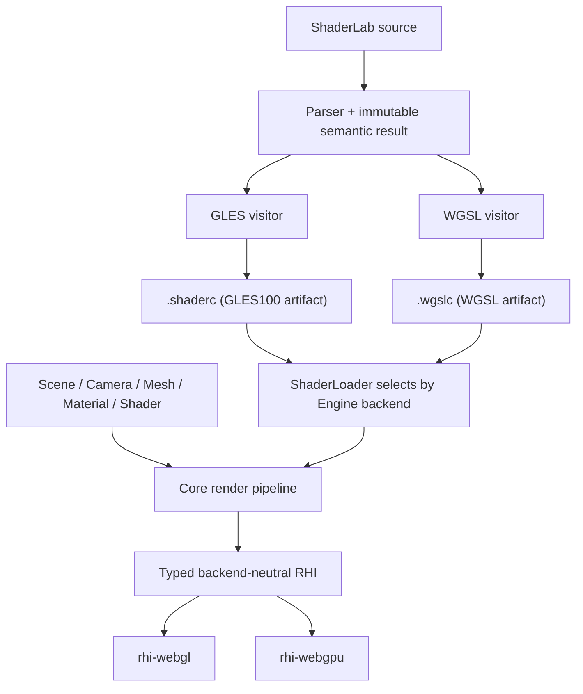
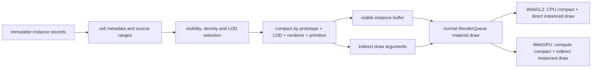

# Galacean WebGPU 多后端设计

状态：实现契约 v0.3
首批范围：`world-gallery/demos/terrain` 的地形、树木、天空、阴影、HDR 与后处理
默认后端：WebGL2

## 不变量

1. 用户只在初始化时选择后端：

   ```ts
   const engine = await WebGLEngine.create(configuration);
   const engine = await WebGPUEngine.create(configuration);
   ```

2. `Scene`、`Camera`、`Mesh`、`Material`、`Shader`、`ShaderData`、资源加载和 ShaderLab 源码不因后端改变。
3. 示例通过 `?backend=webgl2|webgpu` 选择 Engine，并刷新页面；不在同一个 canvas 上创建两个图形上下文。
4. ShaderLab 是唯一 shader 源。GLES 与 WGSL 都由 Galacean shader compiler 直接生成；不提交手写的第二份 WGSL，也不在生产路径调用外部 GLSL 翻译器。
5. WebGPU 初始化失败时返回带原因的错误，不自动回退 WebGL2。
6. 未实现能力必须在调用边界显式报错，不能静默降级、跳过 draw 或伪造成功。

这些约束来自 `/Users/shensi/Git/galacean/webgpu-upstream-research/RESEARCH_MATRIX.md` 中固定源码快照与当前 world 调用面的证据。

## 设计比较

### Engine 选择

| 方案 | 用户接口 | canvas 生命周期 | 结果 |
| --- | --- | --- | --- |
| 单个 `Engine.create({ backend })` | 每次创建都暴露 backend 配置 | 容易诱导同页热切换 | 不采用 |
| 一个 Engine 内同时持有 WebGL/WebGPU | 上层看似统一 | 同一 canvas 不能同时承载两个上下文，资源所有权也会分裂 | 不采用 |
| 独立 `WebGLEngine.create` / `WebGPUEngine.create` | 只有初始化类不同 | 一个页面、一个 canvas、一个 device | 采用 |

### Shader 产物

| 方案 | 优点 | 代价 | 结果 |
| --- | --- | --- | --- |
| Engine 创建时覆盖全局 target | 改动少 | 全局 Shader 与 Engine 生命周期耦合；预注册 built-in shader 早于 Engine | 不采用 |
| 运行时只保存 ShaderLab 源，每个 variant 重新 parse/codegen | 产物小 | 移动端首帧解析与 codegen 成本高；release 必须携带 compiler | 不作为默认 release 路径 |
| 一个 artifact 只保存一个 target；同一 ShaderLab 默认输出相邻的 `.shaderc` 与 `.wgslc` | API 不变；浏览器只请求当前后端产物；artifact 可独立缓存和审计 | 构建需要执行两次 target codegen；同页不可混用两种 Engine | 采用 |

运行时 `Shader.create(source)` 仍使用同一个入口；Engine 在创建时内部选择默认 codegen target，调用者不传 backend/target。构建脚本为每个 target 单独调用 compiler，并要求 GLES/WGSL visitor 对同一 ShaderLab 语义使用一致的 binding、stage IO 与可达性规则。

### 命令与 pass

| 方案 | 结果 |
| --- | --- |
| 在 core 中模拟 WebGL 的隐式 framebuffer/state machine | 无法表达 WebGPU attachment load/store、resolve 与 pipeline state，且继续泄漏 GL | 不采用 |
| 首期引入完整 RenderGraph | 超出 terrain 首批范围，增加资源生命周期与调度概念 | 暂不采用 |
| core 使用显式 frame/render-pass 边界，RHI 内部映射到 WebGL/WebGPU | 能表达 shadow → scene → post/final 的现有固定顺序 | 采用 |

## 模块边界



- core 只持有中立资源、pass、pipeline、binding 和 capability 语义。
- WebGL context、GL enum、texture unit、FBO、VAO、`WebGLProgram` 与 `WebGLUniformLocation` 只存在于 `rhi-webgl`。
- `GPUDevice`、`GPUTextureView`、`GPURenderPipeline`、`GPUBindGroup` 与 command encoder 只存在于 `rhi-webgpu`。
- target shader module、反射和宏 variant 是 ShaderPass 的内部产物，不增加用户 Shader API。

## Engine 与 device 生命周期

`WebGPUEngine.create` 的顺序固定为：

1. 解析 canvas。
2. 检查 `navigator.gpu`。
3. `requestAdapter`，再 `requestDevice`。
4. 获取并配置 `GPUCanvasContext`。
5. 构造 `Engine`，初始化 built-in resources 和默认 Scene。
6. 监听 `device.lost` 并进入现有 Engine device-lost 生命周期。

`WebGLGraphicDevice.init` 保持同步。`WebGPUGraphicDevice` 通过异步工厂先取得 device，再进入 Engine 的同步资源构造阶段，避免让所有 Engine 构造路径暴露异步半初始化状态。

## RHI 首批契约

### Device 与能力

- `backend`
- `capabilities` 与 `limits`
- `isDeviceLost`
- `beginFrame` / `endFrame`
- `resize` / presentation configure
- `destroy`

首批中立 capability 至少覆盖：

- depth texture
- texture array / cube texture
- float 与 half-float texture/filter/render attachment
- sRGB
- MSAA sample count
- Uint32 index
- instancing
- derivatives / explicit texture LOD
- compressed texture family
- maximum texture size、anisotropy、uniform binding size

### 资源

- Buffer：vertex、index、uniform；create、upload/update、destroy。
- Texture：2D、2D array、cube、depth；upload、sampler state、mipmap、view、destroy。
- RenderTarget：color/depth attachments、mip/cube face、MSAA resolve、destroy。
- Primitive：vertex/index layouts、indexed/non-indexed、instanced draw。

同步 GPU readback、transform feedback、compute、query、indirect draw 和 render bundle 不属于 terrain 首批运行依赖。WebGPU 路径调用这些接口时显式抛出 `UnsupportedError`；离线 ambient 烘焙继续使用 WebGL2，直到异步 readback API 单独设计。

### Render pass 与 pipeline

core 在一次 camera render 中显式打开/关闭 pass：

- attachment view
- load/store operation
- clear color/depth/stencil
- MSAA resolve target
- viewport/scissor
- color/depth format

pipeline key 至少包含：

- shader target + variant
- vertex layouts
- primitive topology
- color/depth formats
- sample count
- blend/depth/stencil/cull/front-face/depth-bias state

WebGL backend 在 `applyRenderState` 时执行状态变更；WebGPU backend 将同一中立 state 纳入 pipeline descriptor。core 不再直接调用 `gl.*`。

## Shader compiler

### Target artifact

`IPrecompiledShader` 保持单个 `platformTarget`；一个 artifact 只包含该 target 的 pass 产物：

- vertex/fragment instructions
- stage IO reflection
- uniform/texture/sampler binding reflection
- source hash 与 target

GLES 产物继续使用 `.shaderc`；WGSL 使用 `.wgslc`。precompile/rollup 默认从同一 `.shader` 生成两份相邻文件。`ShaderLoader` 接收逻辑 `.shaderc` URL 后，WebGL 加载该文件，WebGPU 加载同名 `.wgslc`；文件 target 不匹配必须报错。program/pipeline cache 继续归属于 Engine。

### WGSL lowering

WGSL visitor 必须覆盖 terrain 闭包中的真实语义：

- Attributes/Varyings/MRT 到 `@location` stage IO。
- `gl_Position`、`gl_FragCoord`、vertex/instance index 等 builtin。
- combined sampler 拆为 texture 与 sampler binding。
- 2D、2D array、cube、depth comparison texture。
- implicit、LOD、Grad、texelFetch 与 shadow comparison sampling。
- scalar/vector/matrix、int/uint、bit operation、array 与动态索引。
- `out/inout` 参数的合法 WGSL lowering。
- derivative、discard、动态循环、break、early return。
- GLES 与 WGSL 一致的 clip-space、Y 方向和 depth range。

运行时宏仍由 `ShaderMacroProcessor` 对 target instruction 执行。WGSL visitor 输出的所有 binding 使用稳定编号；variant 只能改变实际使用和数组长度，不能改变同名资源的 binding/type。

### Uniform 布局

首批使用一个 program 级 uniform block，字段来自 compiler reflection：

- WGSL struct 与 CPU packer 使用同一份类型/数组描述。
- offset、alignment、array stride 和 matrix stride 按 WGSL uniform address-space 规则计算。
- 每 draw 使用动态 offset，禁止在同一 command buffer 内让多次 draw 复用同一可写区间。
- 未设置属性从现有 BasicResources/default value 解析，行为与 WebGL ShaderUniform 保持一致。

纹理与 sampler 与 uniform block 位于稳定 bind-group layout；默认纹理由现有 `BasicResources` 提供。

## Terrain 首批闭包

| 场景能力 | 必须验证的后端能力 |
| --- | --- |
| Clipmap terrain | Uint32 index、144 segments、vertex texture sampling、2D array、uint control texture |
| Terrain material | 32 layers、Grad/LOD、derivative、matrix/int/bit operation、动态循环 |
| 树木 | glTF PBR、depth/shadow pass、automatic GPU instancing |
| 环境 | HDR cube、ambient light、skybox、direct light |
| 阴影 | depth texture、comparison sampler、four-cascade atlas、viewport/scissor、depth bias |
| Camera | 4x MSAA、HDR render target、resolve、post-process fullscreen blit、sRGB final output |

验收不能用 hello triangle 替代上述闭包；runtime raw Terrain ShaderLab 与 built-in precompiled PBR 两条路径必须同时通过。

## GPU-driven 地表阶段

### 本地上游代码事实

以下表格只记录固定本地快照中的代码结构，不据此宣称 Galacean 已获得同等性能。

| 引擎 | 本地源码 | 可复用的客观实现 |
| --- | --- | --- |
| Three.js | `/Users/shensi/Git/three.js/src/renderers/webgpu/WebGPUBackend.js` | 可写实例流使用 `STORAGE \| VERTEX`；间接参数使用 `STORAGE \| INDIRECT`；render object 可在同一 draw 分支选择 direct 或 indirect |
| Three.js | `/Users/shensi/Git/three.js/src/renderers/webgpu/utils/WebGPUPipelineUtils.js` | compute pipeline 由 shader module 与已有 bind-group layout 构造，pipeline 归 backend 缓存 |
| Babylon.js | `/Users/shensi/Git/Babylon.js/packages/dev/core/src/Engines/WebGPU/Extensions/engine.computeShader.ts` | render pass 在 dispatch 前结束；compute pass 统一绑定 pipeline/bind groups，并支持 direct/indirect dispatch |
| Babylon.js | `/Users/shensi/Git/Babylon.js/packages/dev/core/src/Engines/Extensions/engine.computeShader.ts` | 不支持 compute 的 ThinEngine 在调用边界抛出明确错误 |
| PlayCanvas | `/Users/shensi/Git/galacean/webgpu-upstream-research/playcanvas-current/src/platform/graphics/webgpu/webgpu-compute.js` | compute、bind group 更新与 dispatch 都封装在 graphics device 内；上层不持有原生 WebGPU 对象 |
| PlayCanvas | `/Users/shensi/Git/galacean/webgpu-upstream-research/playcanvas-current/src/platform/graphics/webgpu/webgpu-graphics-device.js` | indirect commands 是 graphics-device draw 的一种中立输入；当前 WebGPU 仍逐条编码，源码明确等待未来 multi-draw indirect |

### Grasslands 已测瓶颈

固定 1280×720 CSS、DPR 2、默认相机与默认画质的基线记录如下；FPS 仅用于定位，正式结论仍以重复采样和移动真机为准。

| 对象 | 可见实例增量 | draw 增量 | triangle 增量 | 阶段优先级 |
| --- | ---: | ---: | ---: | --- |
| 树木 | 14,878 | 1,180 | 607,116 | 第一批 |
| 岩石 | 3,129 | 675 | 717,140 | 第一批 |
| 灌木 | 492 | 109 | 30,234 | 第二批 |
| 草 | 136,466 | 47 | 2,016 | 第二批，重点验证实例筛选和 overdraw |
| 花 | 14,234 | 29 | 1,040 | 第二批 |

当前 `SurfaceWorld` 以 `cell × prototype × LOD × renderer × primitive` 创建实体、实例 buffer 和 draw。空间 cell 同时成为 draw 边界，Grasslands 默认画面因此有 1,411 个活动 renderer batch 和 2,141 次 draw。GPU-driven 阶段先解除这个结构耦合，再把 CPU compaction 替换为 WebGPU compute；不能直接在 demo 中调用 `GPUDevice` 绕过 Engine/RHI。

### 中立数据流



- cell 继续是 streaming、可见性、LOD 和诊断单位，不再强制成为 draw 单位。
- render batch key 固定为 `prototype + LOD + renderer + primitive + material + render state`。
- 默认 WebGL2 使用同一批次契约的 CPU compaction 和 direct instanced draw。
- WebGPU 使用 storage source、storage/vertex output 和 storage/indirect argument buffer。
- `SurfaceWorld`、shader/material 和 example 不读取 `GPUDevice`，也不提交手写 WGSL。
- compute shader 仍由 ShaderLab 语义树生成 WGSL；编译器未覆盖前，WebGPU GPU-driven capability 必须报告 unsupported，不能退化成隐藏的 raw WGSL demo。

### 分阶段接口

1. **中立批次边界**
   - 将有限地表从每 cell 一个 renderer 改为每 render batch 一个 renderer。
   - CPU compaction 保留 cell culling、density、LOD、cross-fade 和诊断结果。
   - 两个后端截图、实例计数与功能 E2E 一致后才进入 compute。
   - 第一个性能检查点只合并 WebGPU 的单 LOD 树木 impostor；WebGL2 保留原 cell renderer 作为对照。相机级
     compaction 不能替代 shadow cascade 的逐 pass 剔除，统一 WebGL2 路径前必须先补齐逐 pass
     compaction，不能用关闭阴影规避。
2. **RHI compute/storage/indirect**
   - 中立 buffer usage 覆盖 storage、vertex/storage 和 indirect/storage 组合。
   - 中立 compute pass 只接收 shader artifact、binding 和 dispatch；原生对象留在 `rhi-webgpu`。
   - WebGL backend 对 compute/indirect 调用显式抛出 unsupported；SurfaceWorld 的 WebGL 路径不调用它。
3. **ShaderLab compute target**
   - source parser、semantic/type check、WGSL codegen、reflection 和 `.wgslc` 构建产物共同支持 compute entry。
   - compute 与 render stage 共用 binding 分配、宏和 artifact target 校验。
4. **树木/岩石 GPU compaction**
   - 先清空各 batch counter/indirect instance count，再按 source range 执行 cull、density 和 LOD，写入 compacted instance stream。
   - indirect argument 的 index/vertex count 与 first index 来自普通 mesh/submesh，不在 shader 中复制模型常量。
5. **草地高实例数**
   - 在树木/岩石正确性闭包通过后复用相同能力；单独衡量 compute、vertex 与 fragment/overdraw 的占比。

### 树木 impostor 第一检查点

本地 Chromium headless shell 1217、Metal、1280×720 CSS、固定相机、关闭动画；基线
`133a229aa` 与候选 `a6b68509c` 交替运行三轮，每轮预热 1.8 秒后采样 3 秒。表格记录三轮中位数，
不外推为移动端结果。

| 后端与负载 | 基线活动批次 | 候选活动批次 | 基线 FPS | 候选 FPS | 基线/候选 p50 | 基线/候选 p95 |
| --- | ---: | ---: | ---: | ---: | ---: | ---: |
| WebGPU，DPR 2 | 1,411 | 842 | 41.25 | 41.61 | 25.0 / 25.0 ms | 33.3 / 33.3 ms |
| WebGL2，DPR 2 | 1,411 | 1,411 | 39.09 | 40.23 | 25.0 / 25.0 ms | 33.6 / 33.4 ms |
| WebGPU，DPR 1 辅助诊断 | 1,411 | 842 | 46.57 | 53.86 | 24.5 / 16.7 ms | 25.8 / 25.1 ms |

- DPR 2 下批次数减少 40.3%，FPS 与 frame-time 分位没有形成可区分的提升。
- DPR 1 下能观察到 CPU command 压力下降；DPR 2 结果表明默认画面已由像素、几何或阴影成本主导。
- WebGL2 保留相同 cell batch 路径，三轮波动只作为无明显回退检查，不记作性能收益。

### Indirect draw 检查点

本地 Chromium headless shell 1217、Metal、1280×720 CSS、DPR 2、固定相机、关闭动画；direct
基线 `1380ea58f` 与 indirect 候选 `403c395d1` 交替运行三轮，每轮预热 1.8 秒后采样 3 秒。
两组都使用已经压缩的 WebGPU 树木实例流，唯一变量是普通 instanced draw 与
`drawIndexedIndirect`。

| 提交方式 | 活动 renderer batch | indirect renderer batch | FPS 中位数 | p50 | p95 | GPU 诊断 |
| --- | ---: | ---: | ---: | ---: | ---: | --- |
| direct | 842 | 0 | 30.45 | 33.2 ms | 41.6 ms | 0 |
| indirect | 842 | 1 | 29.42 | 33.5 ms | 41.8 ms | 0 |

- 当前 indirect argument 由 CPU 更新 instance count；实例压缩、cell culling 和 density 选择仍在 CPU。
- 两组总活动 batch 相同，只有 1 个树木 renderer batch 改为 indirect；三轮数据没有显示性能收益。
- 该检查点只证明 storage/indirect buffer、renderer binding 和原生 WebGPU command encoding
  能在 Grasslands 真实材质、阴影和后处理路径中正确运行。
- compute 生成 instance stream 与 indirect argument 之前，不把 indirect draw 单独记作性能提升。

### 草地与花地表第二检查点

Grasslands 有 5 个单 LOD、无 cross-fade、无投影阴影的草/花 prototype，共 272,570 个实例和
290 个 cell range。候选 `cc6faaef7` 复用同一个 `SurfaceStaticBatcher`，没有新增 category
分支、shader 或材质。

本地 Chromium headless shell 1217、Metal、1280×720 CSS、DPR 2、固定相机、关闭场景动画；
树木 indirect 基线 `e289ffba5` 与草/花 indirect 候选交替运行三轮，每轮预热 1.8 秒后采样
3 秒。

| 提交范围 | 可见实例 | 活动 renderer batch | indirect renderer batch | FPS 中位数 | p50 | p95 | GPU 诊断 |
| --- | ---: | ---: | ---: | ---: | ---: | ---: | --- |
| 仅树木 | 169,199 | 842 | 1 | 40.55 | 25.0 ms | 33.4 ms | 0 |
| 树木 + 草/花 | 169,199 | 693 | 6 | 41.67 | 25.0 ms | 33.3 ms | 0 |

- 活动 renderer batch 减少 149（17.7%）；FPS 中位数增加 2.8%，p50/p95 未形成可区分变化。
- 双页面正确性对照关闭云影和 surface wind；grass、flower、tree、rock、shrub 可见计数逐项相同。
- 1280×720 截图降采样到 320×180 后，RGB 平均绝对通道差为 0.00025，通道差大于 2
  的像素比例为 0，最大通道差为 2。
- 该结果记录 CPU compaction 加中立批次边界的当前收益，不归因为 compute；每次可见性变化仍会
  由 CPU 重写 compacted instance stream。

第一版不引入 occlusion culling、Hi-Z、mesh shader、多 draw indirect 或 render bundle。这些能力必须有独立设计、移动端限制检查和 benchmark 证据后再进入范围。

### 移动端约束与验收

- workgroup size、每批次容量、storage binding 数和 buffer 大小都从 `device.limits` 派生；不写适配桌面显卡的固定大值。
- 第一版允许每 render batch 一个 atomic append counter，但要记录 counter 竞争和 clear 成本；只有数据证明它成为瓶颈时才引入 prefix-sum 多 pass。
- camera、manifest、画质、可见 category、分辨率和采样窗口必须相同；切换 backend 仍通过 query 刷新页面。
- 功能门：实例/category/LOD 计数、cell/debug view、阴影、截图和零 validation error。
- 性能门：draw calls、CPU frame median/p95、FPS median/p5；设备支持 timestamp 时增加等价边界的 GPU time。
- 性能表同时报告 WebGL2 原始 cell batch、WebGL2 中立 compact batch、WebGPU 中立 compact batch、WebGPU compute/indirect，避免把通用合批收益错误归因于 WebGPU。

## Example 与测试契约

Terrain URL：

```text
/demos/terrain/?backend=webgl2
/demos/terrain/?backend=webgpu
```

选择器只更新 query 并刷新页面。页面暴露实际 backend identity，E2E 必须断言请求值、Engine 类型和实际 device 一致。

每个后端执行：

1. 捕获 `pageerror`、console error、uncaptured GPU error 和 device lost。
2. 等待 terrain debug API ready。
3. 固定 canvas、DPR、相机 pose、view、manifest 和 tree placement。
4. 验证 segment、树木实例和 draw 计数。
5. 截图并执行像素差；语义探针继续验证 height/control 数据。
6. 不允许空白画面、只清屏或跳过 shader/draw 仍判通过。

Benchmark 页面只显示：

- backend
- candidates slider

该页面位于 `examples/src/webgpu-benchmark.ts`，由现有 examples 构建流程生成
`/dist/webgpu-benchmark.html`，并出现在 `pnpm examples` 左栏的 `WebGPU / Benchmark`。
candidates 使用对数滑动条，可连续覆盖从流畅区间到 WebGL2 稳定低帧率区间；当前值写入 query。切换 WebGPU 时刷新页面并复用完全相同的 workload、相机和 candidates。页面只暴露上述两个控件；自动化接口记录 warm-up 后的 FPS median、frame time p95、instance 数和错误。只有支持 GPU timestamp 且测量边界等价时才记录 GPU time。

## 移动端性能门槛

- 默认 WebGL2 包体和启动路径不得依赖 WebGPU package。
- WebGPU package 按独立入口导出。
- 分别记录 `.shaderc` 与 `.wgslc` 的 raw/gzip 体积。
- 记录目标移动设备首次 shader/pipeline 创建时间、稳态 frame time、峰值 uniform ring 与 texture memory。
- pipeline、bind group、sampler 和 texture view 必须缓存；每帧创建 GPU pipeline 属于失败。
- WebGPU 相比 WebGL2 的性能结论只来自相同 workload 的真机数据。

## 分阶段完成定义

1. Engine/RHI 生命周期与 clear triangle 通过真实浏览器。
2. Buffer/texture/primitive 与基础 ShaderLab WGSL 通过。
3. render target、depth、MSAA、shadow 与 post-process 通过。
4. Terrain ShaderLab 全闭包通过。
5. built-in PBR 树木与 automatic instancing 通过。
6. terrain 页面双后端截图、像素差、错误审计和 benchmark 通过。
7. 最后按官方 `webgpu-samples` 的 sample ID 逐项扩展测试覆盖。
